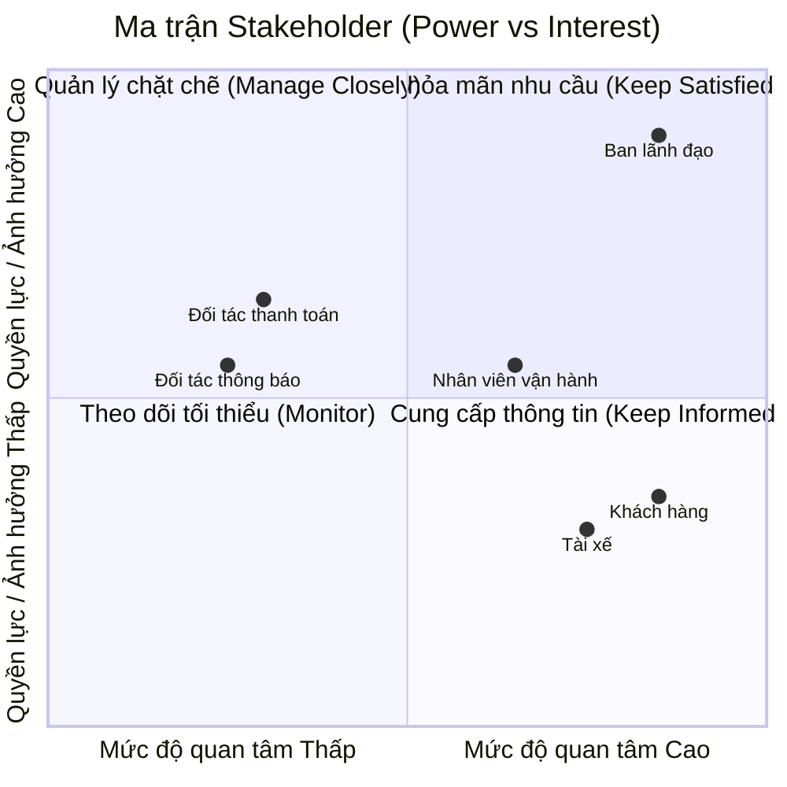
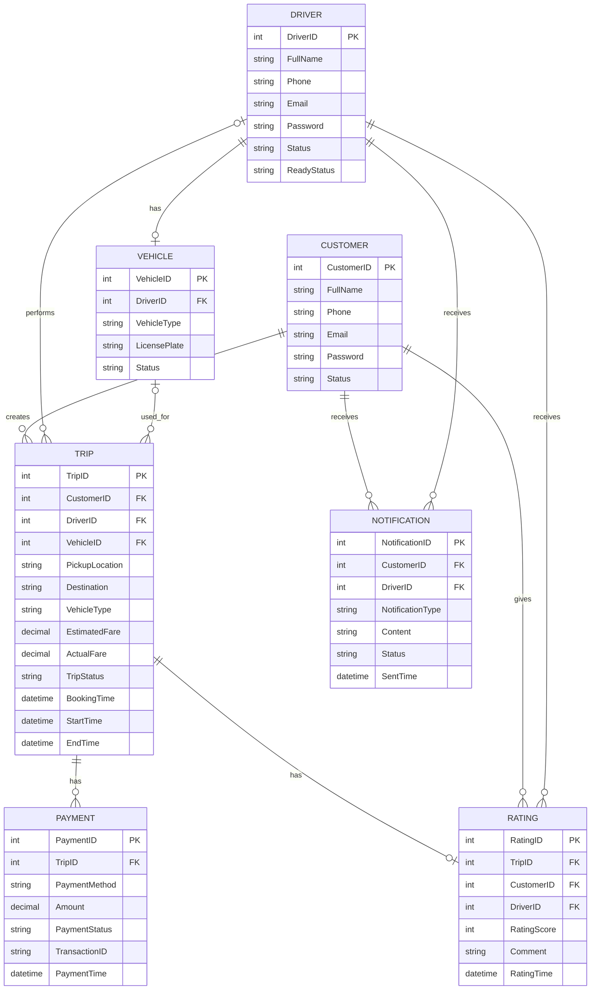
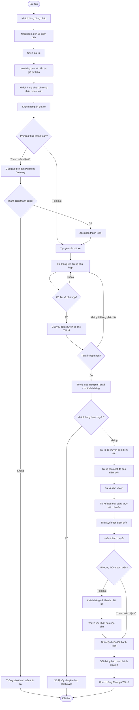
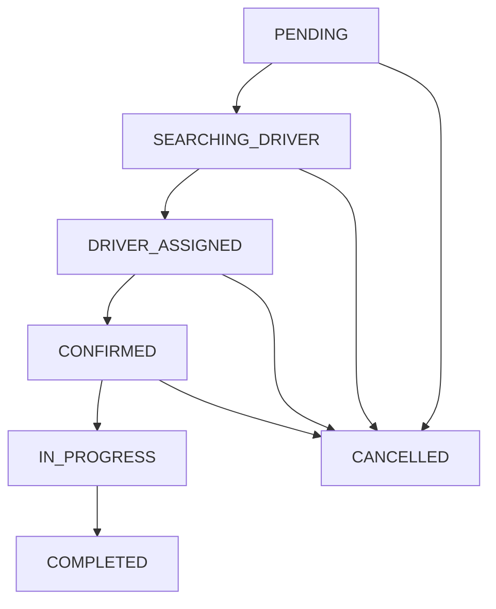
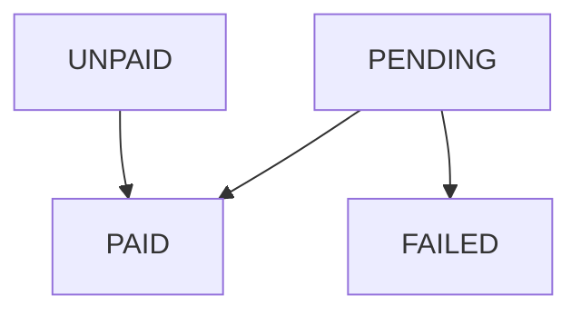
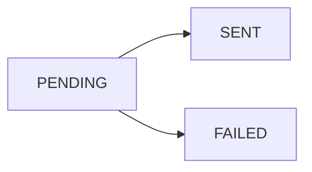

# Software Requirements Specification (SRS) - CAB System
# 1. STAKEHOLDERS

Stakeholders của hệ thống CAB System gồm các bên có liên quan trực tiếp
đến việc sử dụng, vận hành, quản lý và cung cấp dịch vụ cho hệ thống.

| STT | Stakeholder | Vai trò / Mối quan tâm |
|---|---|---|
| 1 | Khách hàng | Đăng ký tài khoản, đặt xe, theo dõi chuyến đi, thanh toán và đánh giá tài xế. |
| 2 | Tài xế | Nhận và thực hiện chuyến xe, cập nhật trạng thái chuyến, thông tin phương tiện và vị trí. |
| 3 | Nhân viên vận hành | Quản lý khách hàng, tài xế, phương tiện và chuyến đi; theo dõi và xử lý các trường hợp phát sinh. |
| 4 | Ban lãnh đạo Công ty ABC | Theo dõi doanh thu, số lượng chuyến, tỷ lệ hoàn thành, tỷ lệ hủy và hiệu quả hoạt động của tài xế. |
| 5 | Nhà cung cấp thanh toán | Xử lý các giao dịch thanh toán điện tử cho hệ thống CAB. |
| 6 | Nhà cung cấp dịch vụ thông báo | Cung cấp các kênh gửi thông báo đến khách hàng và tài xế. |
## 2. STAKEHOLDER MATRIX (Ma trận Bên liên quan)

## 3. BUSINESS GOALS (Mục tiêu Kinh doanh)

| STT | Business Goal | Mục tiêu |
|---|---|---|
| 1 | **Nâng cao trải nghiệm đặt xe** | Xây dựng nền tảng CAB giúp khách hàng dễ dàng đăng ký, đặt xe, theo dõi chuyến đi, thanh toán và đánh giá tài xế. |
| 2 | **Tự động hóa việc tìm và phân công tài xế** | Tự động tìm tài xế phù hợp dựa trên vị trí, trạng thái sẵn sàng và các tiêu chí vận hành; tiếp tục tìm tài xế khác khi tài xế được đề xuất không phản hồi hoặc từ chối. |
| 3 | **Nâng cao hiệu quả vận hành** | Cung cấp công cụ để nhân viên vận hành quản lý khách hàng, tài xế, phương tiện và chuyến đi; theo dõi và xử lý các trường hợp phát sinh. |
| 4 | **Quản lý thanh toán và doanh thu** | Hỗ trợ tính cước và thanh toán bằng tiền mặt hoặc phương thức điện tử, đồng thời quản lý thông tin giao dịch và doanh thu. |
| 5 | **Cung cấp thông tin và theo dõi hoạt động** | Cung cấp thông báo về trạng thái chuyến đi, thanh toán và các sự kiện liên quan; hỗ trợ báo cáo về số chuyến, doanh thu, tỷ lệ hoàn thành, tỷ lệ hủy và hiệu quả tài xế. |
| 6 | **Đảm bảo khả năng mở rộng của nền tảng** | Xây dựng hệ thống có khả năng phục vụ số lượng lớn khách hàng và tài xế, cho phép mở rộng từng thành phần và bổ sung chức năng mới trong tương lai. |
| 7 | **Đảm bảo an toàn và bảo mật** | Bảo vệ thông tin cá nhân, thông tin phương tiện, dữ liệu vị trí và dữ liệu giao dịch; kiểm soát quyền truy cập và lưu vết các thao tác quan trọng. |
| 8 | **Đảm bảo tính ổn định và liên tục của hệ thống** | Hạn chế việc lỗi ở một thành phần như thanh toán hoặc thông báo làm ảnh hưởng đến toàn bộ nền tảng đặt xe. |
## 4. MINIMUM VIABLE PRODUCT (MVP) MODULES

| STT | Module | Mô tả |
|---|---|---|
| 1 | Quản lý tài khoản & hồ sơ | Đăng ký, đăng nhập, cập nhật thông tin cá nhân cho Khách hàng và Tài xế; Tài xế cập nhật hồ sơ phương tiện. |
| 2 | Đặt xe & Theo dõi chuyến | Nhập điểm đón, điểm đến, chọn loại xe, gửi yêu cầu đặt xe; theo dõi trạng thái chuyến theo thời gian thực; xem lịch sử chuyến đi. |
| 3 | Tìm & Phân công tài xế | Tự động tìm tài xế phù hợp theo vị trí và trạng thái sẵn sàng; xử lý khi tài xế không phản hồi/từ chối; thông báo khi không tìm được tài xế. |
| 4 | Thực hiện chuyến đi | Tài xế cập nhật trạng thái chuyến: đã đến điểm đón, đã đón khách, đang di chuyển, hoàn thành chuyến. |
| 5 | Tính cước & Thanh toán | Tính cước sau khi hoàn thành chuyến; thanh toán bằng tiền mặt hoặc tích hợp thanh toán điện tử bên ngoài; xử lý khi giao dịch thất bại. |
| 6 | Thông báo | Gửi thông báo cho khách hàng và tài xế theo các sự kiện của chuyến đi. |
| 7 | Đánh giá tài xế | Khách hàng đánh giá tài xế sau khi hoàn thành chuyến. |
| 8 | Quản trị vận hành | Giao diện cho Nhân viên vận hành quản lý khách hàng, tài xế, phương tiện, chuyến đi và xem báo cáo. |
## 5. ACTORS

| STT | Actor | Mô tả |
|---|---|---|
| 1 | Khách hàng (Customer) | Đăng ký/đăng nhập, cập nhật hồ sơ, tạo yêu cầu đặt xe, theo dõi chuyến, xem lịch sử, thanh toán và đánh giá tài xế. |
| 2 | Tài xế (Driver) | Đăng ký/cập nhật hồ sơ và phương tiện, chuyển trạng thái sẵn sàng, nhận/từ chối chuyến, cập nhật trạng thái chuyến và vị trí. |
| 3 | Nhân viên vận hành (Operator) | Quản lý khách hàng, tài xế, phương tiện, chuyến đi; xử lý sự cố; tra cứu lịch sử và xem báo cáo. |
| 4 | Ban lãnh đạo (Manager) | Xem báo cáo doanh thu, số chuyến, tỷ lệ hoàn thành/hủy và hiệu quả tài xế. |

| 5 | Nhà cung cấp thanh toán (Payment Gateway) | Xử lý giao dịch thanh toán điện tử và trả kết quả giao dịch về hệ thống CAB. |
| 6 | Nhà cung cấp dịch vụ thông báo (Notification Provider) | Gửi thông báo đến khách hàng và tài xế theo yêu cầu của hệ thống. |
## 7. BUSINESS REQUIREMENTS

| ID | Business Requirement | Mô tả |
|---|---|---|
| BR-01 | Quản lý tài khoản khách hàng | Hệ thống phải cho phép Khách hàng đăng ký, đăng nhập và quản lý thông tin cá nhân để sử dụng dịch vụ đặt xe. |
| BR-02 | Tạo yêu cầu đặt xe | Hệ thống phải cho phép Khách hàng tạo yêu cầu đặt xe bằng cách cung cấp điểm đón, điểm đến và loại xe. |
| BR-03 | Tự động tìm và phân công tài xế | Hệ thống phải tự động tìm và phân công Tài xế phù hợp dựa trên vị trí và trạng thái sẵn sàng. |
| BR-04 | Xử lý từ chối hoặc không phản hồi | Hệ thống phải tiếp tục tìm Tài xế khác khi Tài xế được đề xuất không phản hồi hoặc từ chối chuyến. |
| BR-05 | Theo dõi và cập nhật chuyến đi | Hệ thống phải cho phép Khách hàng và Tài xế theo dõi và cập nhật trạng thái chuyến đi trong suốt quá trình thực hiện. |
| BR-06 | Tính cước và thanh toán | Hệ thống phải tính cước chuyến đi và hỗ trợ thanh toán bằng tiền mặt hoặc phương thức thanh toán điện tử. |
| BR-07 | Tích hợp thanh toán điện tử | Hệ thống phải tích hợp với nhà cung cấp thanh toán để xử lý giao dịch và phản hồi kết quả thanh toán. |
| BR-08 | Thông báo sự kiện chuyến đi | Hệ thống phải gửi thông báo đến Khách hàng và Tài xế khi xảy ra các sự kiện quan trọng của chuyến đi. |
| BR-09 | Đánh giá tài xế | Hệ thống phải cho phép Khách hàng đánh giá Tài xế sau khi chuyến đi hoàn thành. |
| BR-10 | Quản lý vận hành | Hệ thống phải cung cấp cho Nhân viên vận hành các chức năng quản lý khách hàng, tài xế, phương tiện và chuyến đi. |
| BR-11 | Báo cáo hoạt động | Hệ thống phải cung cấp báo cáo về số chuyến, doanh thu, tỷ lệ hoàn thành, tỷ lệ hủy và hiệu quả hoạt động của Tài xế. |
| BR-12 | Báo cáo cho ban lãnh đạo | Hệ thống phải cho phép Ban lãnh đạo truy cập các báo cáo cần thiết để theo dõi và đánh giá hoạt động kinh doanh. |
| BR-13 | Bảo vệ dữ liệu | Hệ thống phải bảo vệ thông tin cá nhân, dữ liệu vị trí và thông tin giao dịch của người dùng. |
| BR-14 | Khả năng mở rộng | Hệ thống phải có khả năng mở rộng để đáp ứng số lượng lớn Khách hàng và Tài xế trong tương lai. |
| BR-15 | Quản lý hồ sơ tài xế | Hệ thống phải cho phép Tài xế cập nhật thông tin cá nhân, thông tin phương tiện và trạng thái sẵn sàng nhận chuyến. |
| BR-16 | Theo dõi và xử lý sự cố | Hệ thống phải cho phép Nhân viên vận hành theo dõi các chuyến đang diễn ra và xử lý các trường hợp phát sinh trong quá trình vận hành. |
| BR-17 | Thông báo khi không tìm được tài xế | Hệ thống phải thông báo cho Khách hàng khi không tìm được Tài xế phù hợp cho yêu cầu đặt xe. |
| BR-18 | Xử lý thanh toán thất bại | Hệ thống phải xử lý trường hợp giao dịch thanh toán điện tử thất bại và thông báo kết quả cho Khách hàng. |
## 8. BUSINESS PROCESS MODELING

Quy trình đặt xe của CAB System được xây dựng theo mô hình đặt xe trực tuyến thực tế. Khách hàng nhập thông tin hành trình, lựa chọn loại xe, hệ thống tính và hiển thị giá dự kiến, sau đó khách hàng lựa chọn phương thức thanh toán và xác nhận đặt xe. Hệ thống tiếp nhận yêu cầu, tìm và phân công Tài xế. Sau khi Tài xế chấp nhận, chuyến xe được thực hiện. Đối với thanh toán tiền mặt, Khách hàng thanh toán cho Tài xế sau khi hoàn thành chuyến. Đối với thanh toán điện tử, giao dịch được thực hiện ngay sau khi Khách hàng xác nhận đặt xe. Cuối cùng, Khách hàng có thể đánh giá Tài xế.

## 9. FUNCTIONAL REQUIREMENTS

### 9.1. Quản lý tài khoản và hồ sơ

| ID | Functional Requirement | Mô tả |
|---|---|---|
| FR-01 | Đăng ký tài khoản | Hệ thống phải cho phép Khách hàng và Tài xế đăng ký tài khoản để sử dụng hệ thống. |
| FR-02 | Đăng nhập | Hệ thống phải cho phép Khách hàng, Tài xế và Nhân viên vận hành đăng nhập bằng tài khoản hợp lệ. |
| FR-03 | Quản lý thông tin cá nhân | Hệ thống phải cho phép người dùng xem và cập nhật thông tin cá nhân. |
| FR-04 | Quản lý hồ sơ Tài xế | Hệ thống phải cho phép Tài xế cập nhật thông tin phương tiện và trạng thái sẵn sàng nhận chuyến. |

### 9.2. Đặt xe và theo dõi chuyến

| ID | Functional Requirement | Mô tả |
|---|---|---|
| FR-05 | Nhập thông tin chuyến xe | Hệ thống phải cho phép Khách hàng nhập điểm đón, điểm đến và lựa chọn loại xe. |
| FR-06 | Tính giá dự kiến | Hệ thống phải tính và hiển thị giá dự kiến của chuyến xe trước khi Khách hàng xác nhận đặt xe. |
| FR-07 | Chọn phương thức thanh toán | Hệ thống phải cho phép Khách hàng lựa chọn phương thức thanh toán tiền mặt hoặc thanh toán điện tử trước khi đặt xe. |
| FR-08 | Xác nhận đặt xe | Hệ thống phải tiếp nhận yêu cầu khi Khách hàng ấn Đặt xe và xử lý theo phương thức thanh toán đã chọn. |
| FR-09 | Theo dõi trạng thái chuyến | Hệ thống phải cho phép Khách hàng theo dõi trạng thái chuyến xe từ khi tìm Tài xế đến khi hoàn thành chuyến. |
| FR-10 | Xem lịch sử chuyến | Hệ thống phải cho phép Khách hàng xem lịch sử các chuyến xe đã thực hiện. |

### 9.3. Tìm và phân công Tài xế

| ID | Functional Requirement | Mô tả |
|---|---|---|
| FR-11 | Tìm Tài xế phù hợp | Hệ thống phải tự động tìm Tài xế phù hợp dựa trên vị trí và trạng thái sẵn sàng nhận chuyến. |
| FR-12 | Gửi yêu cầu chuyến xe | Hệ thống phải gửi yêu cầu chuyến xe đến Tài xế phù hợp. |
| FR-13 | Tiếp tục tìm Tài xế | Hệ thống phải tiếp tục tìm Tài xế khác khi chưa tìm được Tài xế phù hợp và không kết thúc yêu cầu đặt xe. |
| FR-14 | Xử lý Tài xế từ chối hoặc không phản hồi | Hệ thống phải tiếp tục tìm Tài xế khác khi Tài xế được gửi yêu cầu từ chối hoặc không phản hồi. |
| FR-15 | Thông báo thông tin Tài xế | Hệ thống phải thông báo thông tin Tài xế cho Khách hàng sau khi Tài xế chấp nhận chuyến. |

### 9.4. Thực hiện chuyến đi

| ID | Functional Requirement | Mô tả |
|---|---|---|
| FR-16 | Cập nhật trạng thái chuyến | Hệ thống phải cho phép Tài xế cập nhật trạng thái chuyến gồm: đã đến điểm đón, đã đón khách, đang thực hiện chuyến và hoàn thành chuyến. |
| FR-17 | Cập nhật vị trí Tài xế | Hệ thống phải cập nhật vị trí của Tài xế để Khách hàng theo dõi trong quá trình thực hiện chuyến. |
| FR-18 | Hủy chuyến | Hệ thống phải cho phép Khách hàng hủy chuyến và xử lý việc hủy theo chính sách của doanh nghiệp. |
| FR-19 | Ghi nhận hoàn thành chuyến | Hệ thống phải ghi nhận chuyến xe hoàn thành khi Tài xế kết thúc chuyến. |

### 9.5. Tính cước và thanh toán

| ID | Functional Requirement | Mô tả |
|---|---|---|
| FR-20 | Tính cước thực tế | Hệ thống phải tính cước thực tế của chuyến xe sau khi chuyến xe hoàn thành. |
| FR-21 | Thanh toán tiền mặt | Hệ thống phải cho phép Khách hàng thanh toán tiền mặt cho Tài xế sau khi hoàn thành chuyến. |
| FR-22 | Xác nhận thanh toán tiền mặt | Hệ thống phải cho phép Tài xế xác nhận đã nhận tiền từ Khách hàng. |
| FR-23 | Gửi yêu cầu thanh toán điện tử | Hệ thống phải gửi giao dịch đến Payment Gateway khi Khách hàng chọn thanh toán điện tử và ấn Đặt xe. |
| FR-24 | Xử lý kết quả thanh toán điện tử | Hệ thống phải kiểm tra và ghi nhận kết quả thanh toán điện tử thành công hoặc thất bại. |
| FR-25 | Xử lý thanh toán thất bại | Hệ thống phải thông báo cho Khách hàng khi thanh toán điện tử thất bại và không tạo yêu cầu đặt xe. |
| FR-26 | Ghi nhận thanh toán | Hệ thống phải ghi nhận trạng thái thanh toán của chuyến xe sau khi thanh toán được hoàn tất. |

### 9.6. Thông báo

| ID | Functional Requirement | Mô tả |
|---|---|---|
| FR-27 | Thông báo đang tìm Tài xế | Hệ thống phải thông báo cho Khách hàng khi chưa tìm được Tài xế và hệ thống đang tiếp tục tìm kiếm. |
| FR-28 | Thông báo Tài xế nhận chuyến | Hệ thống phải thông báo cho Khách hàng thông tin Tài xế khi Tài xế chấp nhận chuyến. |
| FR-29 | Thông báo kết quả thanh toán | Hệ thống phải thông báo cho Khách hàng kết quả thanh toán điện tử thành công hoặc thất bại. |
| FR-30 | Thông báo hoàn thành chuyến | Hệ thống phải thông báo cho Khách hàng khi chuyến xe hoàn thành. |

### 9.7. Đánh giá Tài xế

| ID | Functional Requirement | Mô tả |
|---|---|---|
| FR-31 | Đánh giá Tài xế | Hệ thống phải cho phép Khách hàng đánh giá Tài xế sau khi chuyến xe hoàn thành. |
| FR-32 | Lưu đánh giá | Hệ thống phải lưu kết quả đánh giá gắn với chuyến xe tương ứng. |

### 9.8. Quản trị vận hành

| ID | Functional Requirement | Mô tả |
|---|---|---|
| FR-33 | Quản lý Khách hàng | Hệ thống phải cho phép Nhân viên vận hành tra cứu và quản lý thông tin Khách hàng. |
| FR-34 | Quản lý Tài xế | Hệ thống phải cho phép Nhân viên vận hành tra cứu và quản lý thông tin Tài xế. |
| FR-35 | Quản lý phương tiện | Hệ thống phải cho phép Nhân viên vận hành tra cứu và quản lý thông tin phương tiện. |
| FR-36 | Quản lý chuyến đi | Hệ thống phải cho phép Nhân viên vận hành tra cứu và theo dõi thông tin chuyến đi. |
| FR-37 | Xử lý sự cố | Hệ thống phải hỗ trợ Nhân viên vận hành theo dõi và xử lý các trường hợp phát sinh trong quá trình vận hành. |
| FR-38 | Báo cáo hoạt động | Hệ thống phải cung cấp báo cáo về số chuyến, doanh thu, tỷ lệ hoàn thành, tỷ lệ hủy và hiệu quả hoạt động của Tài xế. |
| FR-39 | Xem báo cáo quản lý | Hệ thống phải cho phép Ban lãnh đạo xem các báo cáo phục vụ theo dõi và đánh giá hoạt động kinh doanh. |
### 9.9. Mapping Business Requirements và Functional Requirements

| BR ID | Business Requirement | Functional Requirements liên quan |
|---|---|---|
| BR-01 | Quản lý tài khoản khách hàng | FR-01, FR-02, FR-03 |
| BR-02 | Tạo yêu cầu đặt xe | FR-05, FR-06, FR-07, FR-08 |
| BR-03 | Tự động tìm và phân công tài xế | FR-11, FR-12 |
| BR-04 | Xử lý từ chối hoặc không phản hồi | FR-14 |
| BR-05 | Theo dõi và cập nhật chuyến đi | FR-09, FR-16, FR-17, FR-19 |
| BR-06 | Tính cước và thanh toán | FR-20, FR-21, FR-22, FR-26 |
| BR-07 | Tích hợp thanh toán điện tử | FR-23, FR-24 |
| BR-08 | Thông báo sự kiện chuyến đi | FR-27, FR-28, FR-29, FR-30 |
| BR-09 | Đánh giá tài xế | FR-31, FR-32 |
| BR-10 | Quản lý vận hành | FR-33, FR-34, FR-35, FR-36, FR-37 |
| BR-11 | Báo cáo hoạt động | FR-38 |
| BR-12 | Báo cáo cho ban lãnh đạo | FR-39 |
| BR-13 | Bảo vệ dữ liệu | FR-02, FR-03 |
| BR-14 | Khả năng mở rộng | Yêu cầu phi chức năng, không ánh xạ trực tiếp đến FR |
| BR-15 | Quản lý hồ sơ tài xế | FR-03, FR-04 |
| BR-16 | Theo dõi và xử lý sự cố | FR-36, FR-37 |
| BR-17 | Thông báo khi không tìm được tài xế | FR-13, FR-27 |
| BR-18 | Xử lý thanh toán thất bại | FR-24, FR-25, FR-29 |
## 10. BUSINESS RULES

### 10.1. Quản lý tài khoản và quyền

| ID | Business Rule | Mô tả |
|---|---|---|
| BRL-01 | Đăng nhập trước khi đặt xe | Khách hàng phải đăng nhập vào hệ thống trước khi có thể tạo yêu cầu đặt xe. |
| BRL-02 | Quản lý trạng thái Tài xế | Tài xế phải cập nhật trạng thái sẵn sàng nhận chuyến trước khi có thể nhận yêu cầu đặt xe. |
| BRL-03 | Phân quyền người dùng | Người dùng chỉ được thực hiện các chức năng phù hợp với vai trò và quyền được cấp. |
| BRL-04 | Bảo vệ thông tin người dùng | Hệ thống phải bảo vệ thông tin cá nhân, dữ liệu vị trí và thông tin giao dịch của Khách hàng và Tài xế. |

### 10.2. Đặt xe và tìm Tài xế

| ID | Business Rule | Mô tả |
|---|---|---|
| BRL-05 | Thông tin đặt xe bắt buộc | Khách hàng phải cung cấp điểm đón, điểm đến và loại xe trước khi đặt xe. |
| BRL-06 | Hiển thị giá dự kiến | Hệ thống phải tính và hiển thị giá dự kiến cho Khách hàng trước khi xác nhận đặt xe. |
| BRL-07 | Chọn phương thức thanh toán | Khách hàng phải lựa chọn phương thức thanh toán tiền mặt hoặc thanh toán điện tử trước khi ấn Đặt xe. |
| BRL-08 | Tạo yêu cầu đặt xe bằng tiền mặt | Nếu Khách hàng chọn tiền mặt, hệ thống phải tạo yêu cầu đặt xe ngay sau khi Khách hàng ấn Đặt xe. |
| BRL-09 | Thanh toán điện tử trước khi tìm Tài xế | Nếu Khách hàng chọn thanh toán điện tử, hệ thống phải gửi giao dịch đến Payment Gateway ngay sau khi Khách hàng ấn Đặt xe và chỉ tạo yêu cầu đặt xe khi thanh toán thành công. |
| BRL-10 | Thanh toán điện tử thất bại | Nếu giao dịch thanh toán điện tử thất bại, hệ thống phải thông báo cho Khách hàng và không tạo yêu cầu đặt xe. |
| BRL-11 | Tìm Tài xế phù hợp | Hệ thống chỉ gửi yêu cầu chuyến xe đến Tài xế đang ở trạng thái sẵn sàng và phù hợp với yêu cầu đặt xe. |
| BRL-12 | Tiếp tục tìm Tài xế | Nếu chưa tìm được Tài xế phù hợp, hệ thống phải tiếp tục tìm kiếm cho đến khi có Tài xế phù hợp hoặc yêu cầu đặt xe bị hủy. |
| BRL-13 | Tài xế từ chối hoặc không phản hồi | Nếu Tài xế từ chối hoặc không phản hồi yêu cầu, hệ thống phải tiếp tục tìm Tài xế khác. |
| BRL-14 | Xác nhận chuyến | Chuyến xe chỉ được xác nhận khi có Tài xế chấp nhận yêu cầu. |

### 10.3. Thực hiện và hủy chuyến

| ID | Business Rule | Mô tả |
|---|---|---|
| BRL-15 | Hủy chuyến | Khách hàng được phép hủy chuyến và việc hủy chuyến phải được xử lý theo chính sách của Công ty ABC. |
| BRL-16 | Cập nhật trạng thái chuyến | Tài xế phải cập nhật trạng thái chuyến theo trình tự: đã đến điểm đón → đã đón khách → đang thực hiện chuyến → hoàn thành chuyến. |
| BRL-17 | Cập nhật vị trí Tài xế | Vị trí của Tài xế phải được cập nhật trong quá trình thực hiện chuyến để Khách hàng có thể theo dõi. |
| BRL-18 | Ghi nhận hoàn thành chuyến | Hệ thống phải ghi nhận chuyến xe hoàn thành khi Tài xế kết thúc chuyến. |

### 10.4. Tính cước và thanh toán

| ID | Business Rule | Mô tả |
|---|---|---|
| BRL-19 | Tính cước thực tế | Sau khi chuyến xe hoàn thành, hệ thống phải tính và ghi nhận cước thực tế của chuyến xe. |
| BRL-20 | Thanh toán tiền mặt sau chuyến | Với phương thức tiền mặt, Khách hàng phải thanh toán cho Tài xế sau khi chuyến xe hoàn thành. |
| BRL-21 | Xác nhận thanh toán tiền mặt | Tài xế phải xác nhận đã nhận tiền từ Khách hàng sau khi thanh toán tiền mặt. |
| BRL-22 | Ghi nhận thanh toán điện tử | Với phương thức thanh toán điện tử, hệ thống phải ghi nhận giao dịch đã thanh toán sau khi Payment Gateway trả về kết quả thành công. |
| BRL-23 | Ghi nhận trạng thái thanh toán | Hệ thống phải ghi nhận trạng thái thanh toán của từng chuyến xe. |

### 10.5. Thông báo và đánh giá

| ID | Business Rule | Mô tả |
|---|---|---|
| BRL-24 | Thông báo sự kiện chuyến đi | Hệ thống phải gửi thông báo cho Khách hàng và Tài xế khi xảy ra các sự kiện quan trọng như đang tìm Tài xế, Tài xế nhận chuyến, thanh toán và hoàn thành chuyến. |
| BRL-25 | Đánh giá sau chuyến | Khách hàng chỉ được đánh giá Tài xế sau khi chuyến xe đã hoàn thành. |
## 11. NON-FUNCTIONAL REQUIREMENTS

### 11.1. Hiệu năng (Performance)

| ID | Non-Functional Requirement | Mô tả |
|---|---|---|
| NFR-01 | Thời gian phản hồi | Hệ thống phải phản hồi các thao tác thông thường của người dùng trong thời gian hợp lý và không gây gián đoạn quá trình sử dụng. |
| NFR-02 | Tốc độ xử lý đặt xe | Hệ thống phải xử lý yêu cầu đặt xe nhanh chóng sau khi Khách hàng xác nhận đặt xe, ngoại trừ thời gian phụ thuộc vào các dịch vụ bên ngoài như Payment Gateway. |
| NFR-03 | Cập nhật trạng thái chuyến | Hệ thống phải cập nhật trạng thái chuyến kịp thời để Khách hàng và Tài xế nhận biết được trạng thái hiện tại của chuyến xe. |
| NFR-04 | Cập nhật vị trí | Hệ thống phải cập nhật vị trí Tài xế định kỳ trong quá trình thực hiện chuyến để hỗ trợ Khách hàng theo dõi hành trình. |

### 11.2. Tính khả dụng và ổn định (Availability & Reliability)

| ID | Non-Functional Requirement | Mô tả |
|---|---|---|
| NFR-05 | Hoạt động liên tục | Hệ thống phải có khả năng hoạt động liên tục để phục vụ việc đặt xe và theo dõi chuyến. |
| NFR-06 | Xử lý lỗi | Khi một chức năng hoặc dịch vụ gặp lỗi, hệ thống phải thông báo trạng thái phù hợp và hạn chế ảnh hưởng đến các chức năng khác. |
| NFR-07 | Không mất dữ liệu | Hệ thống phải đảm bảo dữ liệu tài khoản, chuyến xe và giao dịch không bị mất trong quá trình xử lý thông thường. |
| NFR-08 | Phục hồi sau sự cố | Hệ thống phải có cơ chế sao lưu và phục hồi dữ liệu khi xảy ra sự cố hệ thống hoặc cơ sở dữ liệu. |
| NFR-09 | Xử lý giao dịch an toàn | Hệ thống phải đảm bảo một giao dịch thanh toán hoặc yêu cầu đặt xe không bị ghi nhận trùng khi xảy ra lỗi kết nối hoặc người dùng gửi lại yêu cầu. |

### 11.3. Bảo mật (Security)

| ID | Non-Functional Requirement | Mô tả |
|---|---|---|
| NFR-10 | Xác thực người dùng | Hệ thống phải xác thực người dùng trước khi cho phép truy cập các chức năng yêu cầu đăng nhập. |
| NFR-11 | Phân quyền truy cập | Hệ thống phải kiểm soát quyền truy cập dựa trên vai trò của Khách hàng, Tài xế, Nhân viên vận hành và Ban lãnh đạo. |
| NFR-12 | Bảo vệ mật khẩu | Mật khẩu người dùng phải được bảo vệ bằng cơ chế lưu trữ an toàn và không được lưu dưới dạng văn bản thuần. |
| NFR-13 | Bảo vệ dữ liệu truyền tải | Dữ liệu trao đổi giữa ứng dụng và máy chủ phải được truyền qua kết nối an toàn. |
| NFR-14 | Bảo vệ dữ liệu cá nhân | Hệ thống phải bảo vệ thông tin cá nhân, thông tin phương tiện và dữ liệu vị trí của Khách hàng và Tài xế khỏi truy cập trái phép. |
| NFR-15 | Bảo vệ dữ liệu thanh toán | Hệ thống phải hạn chế lưu trữ thông tin thanh toán nhạy cảm và phải xử lý dữ liệu thanh toán thông qua Payment Gateway phù hợp. |
| NFR-16 | Nhật ký hoạt động | Hệ thống phải ghi nhận các thao tác quan trọng để phục vụ kiểm tra, theo dõi và truy vết khi cần thiết. |

### 11.4. Khả năng mở rộng (Scalability)

| ID | Non-Functional Requirement | Mô tả |
|---|---|---|
| NFR-17 | Mở rộng người dùng | Hệ thống phải có khả năng đáp ứng số lượng Khách hàng và Tài xế tăng lên trong tương lai mà không cần xây dựng lại toàn bộ hệ thống. |
| NFR-18 | Mở rộng chức năng | Hệ thống phải cho phép bổ sung các chức năng mới mà hạn chế ảnh hưởng đến các chức năng hiện có. |
| NFR-19 | Mở rộng dịch vụ tích hợp | Hệ thống phải có khả năng tích hợp thêm các nhà cung cấp thanh toán, thông báo hoặc dịch vụ hỗ trợ khác trong tương lai. |

### 11.5. Khả năng sử dụng (Usability)

| ID | Non-Functional Requirement | Mô tả |
|---|---|---|
| NFR-20 | Giao diện dễ sử dụng | Giao diện phải rõ ràng, trực quan và phù hợp với người dùng phổ thông. |
| NFR-21 | Quy trình đặt xe rõ ràng | Các bước đặt xe phải được trình bày theo trình tự dễ hiểu: nhập thông tin hành trình → chọn loại xe → xem giá dự kiến → chọn phương thức thanh toán → đặt xe. |
| NFR-22 | Hiển thị trạng thái rõ ràng | Hệ thống phải hiển thị rõ trạng thái chuyến xe, trạng thái tìm Tài xế và trạng thái thanh toán để người dùng dễ theo dõi. |
| NFR-23 | Thông báo lỗi dễ hiểu | Khi xảy ra lỗi, hệ thống phải hiển thị thông báo rõ ràng và dễ hiểu, giúp người dùng biết nguyên nhân hoặc hướng xử lý phù hợp. |

### 11.6. Khả năng bảo trì (Maintainability)

| ID | Non-Functional Requirement | Mô tả |
|---|---|---|
| NFR-24 | Dễ bảo trì và nâng cấp | Hệ thống phải được thiết kế theo các thành phần có chức năng rõ ràng để thuận tiện cho việc sửa lỗi, bảo trì và nâng cấp. |
| NFR-25 | Tài liệu kỹ thuật | Các thành phần chính của hệ thống như cơ sở dữ liệu, API và các module phải có tài liệu kỹ thuật cần thiết để hỗ trợ bảo trì và phát triển. |

### 11.7. Tương thích và tích hợp (Compatibility & Integration)

| ID | Non-Functional Requirement | Mô tả |
|---|---|---|
| NFR-26 | Tương thích thiết bị | Hệ thống phải có giao diện phù hợp với các thiết bị phổ biến mà Khách hàng và Tài xế sử dụng. |
| NFR-27 | Tương thích trình duyệt | Giao diện quản trị phải hoạt động ổn định trên các trình duyệt web phổ biến. |
| NFR-28 | Tích hợp Payment Gateway | Hệ thống phải hỗ trợ kết nối với Payment Gateway để gửi yêu cầu thanh toán và nhận kết quả giao dịch. |
| NFR-29 | Tích hợp Notification Provider | Hệ thống phải hỗ trợ kết nối với nhà cung cấp dịch vụ thông báo để gửi thông báo đến Khách hàng và Tài xế. |
## 11.8 TỔNG HỢP NON-FUNCTIONAL REQUIREMENTS
| Nhóm | Các NFR |
|---|---|
| **Hiệu năng (Performance)** | NFR-01, NFR-02, NFR-03, NFR-04 |
| **Tính khả dụng và ổn định (Availability & Reliability)** | NFR-05, NFR-06, NFR-07, NFR-08, NFR-09 |
| **Bảo mật (Security)** | NFR-10, NFR-11, NFR-12, NFR-13, NFR-14, NFR-15, NFR-16 |
| **Khả năng mở rộng (Scalability)** | NFR-17, NFR-18, NFR-19 |
| **Khả năng sử dụng (Usability)** | NFR-20, NFR-21, NFR-22, NFR-23 |
| **Khả năng bảo trì (Maintainability)** | NFR-24, NFR-25 |
| **Tương thích và tích hợp (Compatibility & Integration)** | NFR-26, NFR-27, NFR-28, NFR-29 |
## 12. EXCEPTION CASES

Exception Cases mô tả các tình huống bất thường có thể xảy ra trong quá trình
đặt xe, tìm và phân công Tài xế, thực hiện chuyến, thanh toán, thông báo và
đánh giá trong hệ thống CAB.

### 12.1. Đặt xe

| ID | Exception Case | Điều kiện xảy ra | Hệ thống xử lý |
|---|---|---|---|
| EC-01 | Thông tin đặt xe không hợp lệ | Khách hàng chưa nhập đầy đủ điểm đón, điểm đến hoặc chưa chọn loại xe. | Hệ thống thông báo thông tin chưa hợp lệ và yêu cầu Khách hàng bổ sung hoặc chỉnh sửa thông tin trước khi tiếp tục đặt xe. |
| EC-02 | Không tính được giá dự kiến | Hệ thống không thể xác định giá dự kiến. | Hệ thống thông báo không thể tính giá dự kiến và không cho phép Khách hàng tiếp tục đặt xe cho đến khi giá được xác định. |

### 12.2. Thanh toán điện tử

| ID | Exception Case | Điều kiện xảy ra | Hệ thống xử lý |
|---|---|---|---|
| EC-03 | Thanh toán điện tử thất bại | Payment Gateway trả về kết quả giao dịch thất bại. | Hệ thống thông báo thanh toán thất bại cho Khách hàng và không tạo yêu cầu đặt xe. |
| EC-04 | Payment Gateway không phản hồi | Payment Gateway không trả về kết quả hoặc kết nối bị gián đoạn. | Hệ thống thông báo giao dịch chưa được xác nhận và không tạo yêu cầu đặt xe cho đến khi nhận được kết quả hợp lệ. |

### 12.3. Tìm và phân công Tài xế

| ID | Exception Case | Điều kiện xảy ra | Hệ thống xử lý |
|---|---|---|---|
| EC-05 | Không tìm được Tài xế | Không có Tài xế phù hợp tại thời điểm hệ thống tìm kiếm. | Hệ thống thông báo cho Khách hàng rằng đang tiếp tục tìm Tài xế và tiếp tục tìm kiếm cho đến khi có Tài xế phù hợp hoặc Khách hàng hủy yêu cầu. |
| EC-06 | Tài xế từ chối chuyến | Tài xế được gửi yêu cầu nhưng từ chối chuyến. | Hệ thống ghi nhận Tài xế từ chối và tiếp tục tìm Tài xế khác. |
| EC-07 | Tài xế không phản hồi | Tài xế được gửi yêu cầu nhưng không phản hồi trong thời gian xử lý của hệ thống. | Hệ thống kết thúc yêu cầu gửi đến Tài xế đó và tiếp tục tìm Tài xế khác. |

### 12.4. Thực hiện và hủy chuyến

| ID | Exception Case | Điều kiện xảy ra | Hệ thống xử lý |
|---|---|---|---|
| EC-08 | Khách hàng hủy chuyến | Khách hàng yêu cầu hủy chuyến sau khi Tài xế đã chấp nhận. | Hệ thống ghi nhận trạng thái hủy và xử lý việc hủy theo chính sách của Công ty ABC. |
| EC-09 | Tài xế mất kết nối trong chuyến | Tài xế mất kết nối khi chuyến xe đang được thực hiện. | Hệ thống lưu trạng thái và dữ liệu chuyến đã ghi nhận trước khi mất kết nối, đồng thời thông báo hoặc chuyển trường hợp cho Nhân viên vận hành xử lý khi cần. |
| EC-10 | Không cập nhật được vị trí Tài xế | Hệ thống không nhận được dữ liệu vị trí mới từ Tài xế. | Hệ thống giữ lại vị trí gần nhất đã nhận được và hiển thị trạng thái phù hợp cho Khách hàng. |
| EC-11 | Không cập nhật được trạng thái chuyến | Tài xế không thể cập nhật trạng thái chuyến do lỗi kết nối hoặc lỗi hệ thống. | Hệ thống giữ trạng thái gần nhất đã ghi nhận và cho phép cập nhật lại khi kết nối hoặc hệ thống hoạt động bình thường. |

### 12.5. Tính cước và thanh toán

| ID | Exception Case | Điều kiện xảy ra | Hệ thống xử lý |
|---|---|---|---|
| EC-12 | Không tính được cước thực tế | Hệ thống không thể tính cước sau khi chuyến xe hoàn thành. | Hệ thống ghi nhận chuyến đã hoàn thành, đánh dấu giao dịch cần xử lý và thông báo cho Nhân viên vận hành. |
| EC-13 | Khách hàng chưa thanh toán tiền mặt | Khách hàng chưa thanh toán cho Tài xế sau khi chuyến xe hoàn thành. | Hệ thống ghi nhận trạng thái thanh toán chưa hoàn tất và cho phép Nhân viên vận hành kiểm tra, xử lý theo chính sách của Công ty ABC. |
| EC-14 | Tài xế chưa xác nhận thanh toán tiền mặt | Tài xế chưa xác nhận đã nhận tiền từ Khách hàng. | Hệ thống giữ trạng thái thanh toán chưa hoàn tất và ghi nhận trường hợp cần kiểm tra. |

### 12.6. Thông báo và đánh giá

| ID | Exception Case | Điều kiện xảy ra | Hệ thống xử lý |
|---|---|---|---|
| EC-15 | Gửi thông báo thất bại | Notification Provider không thể gửi thông báo đến Khách hàng hoặc Tài xế. | Hệ thống ghi nhận lỗi gửi thông báo và thực hiện gửi lại khi dịch vụ hoạt động bình thường; không làm mất dữ liệu hoặc trạng thái chuyến. |
| EC-16 | Đánh giá không hợp lệ | Khách hàng cố gắng đánh giá khi chuyến chưa hoàn thành hoặc chuyến không thuộc tài khoản của Khách hàng. | Hệ thống từ chối yêu cầu đánh giá và thông báo lý do cho Khách hàng. |

### 12.7. Hệ thống và tài khoản

| ID | Exception Case | Điều kiện xảy ra | Hệ thống xử lý |
|---|---|---|---|
| EC-17 | Phiên đăng nhập hết hạn | Phiên đăng nhập của người dùng đã hết hạn trong quá trình sử dụng hệ thống. | Hệ thống yêu cầu người dùng đăng nhập lại trước khi tiếp tục thực hiện các chức năng yêu cầu xác thực. |
| EC-18 | Lỗi hệ thống | Xảy ra lỗi máy chủ, cơ sở dữ liệu hoặc thành phần hệ thống trong quá trình xử lý. | Hệ thống ghi nhận lỗi, thông báo phù hợp cho người dùng và bảo đảm dữ liệu đã được ghi nhận trước khi xảy ra lỗi không bị mất. |

### 12.8. Tổng hợp Exception Cases

| Nhóm | Các Exception Cases |
|---|---|
| **Đặt xe** | EC-01, EC-02 |
| **Thanh toán điện tử** | EC-03, EC-04 |
| **Tìm và phân công Tài xế** | EC-05, EC-06, EC-07 |
| **Thực hiện và hủy chuyến** | EC-08, EC-09, EC-10, EC-11 |
| **Tính cước và thanh toán** | EC-12, EC-13, EC-14 |
| **Thông báo và đánh giá** | EC-15, EC-16 |
| **Hệ thống và tài khoản** | EC-17, EC-18 |
## 13. OPEN QUESTIONS / TBD
| ID | Open Question / TBD | Liên quan | Nội dung cần xác định |
|---|---|---|---|
| TBD-01 | Công thức tính giá dự kiến | FR-06, BRL-06 | Cần xác định các yếu tố và công thức dùng để tính giá dự kiến trước khi Khách hàng đặt xe. |
| TBD-02 | Công thức tính cước thực tế | FR-20, BRL-19 | Cần xác định cách tính cước thực tế sau khi chuyến xe hoàn thành và các yếu tố có thể làm thay đổi cước. |
| TBD-03 | Mối quan hệ giữa giá dự kiến và thanh toán điện tử | FR-06, FR-20, FR-23, BRL-09, BRL-19 | Cần xác định khoản thanh toán điện tử thực hiện khi đặt xe là thanh toán theo giá dự kiến hay được điều chỉnh theo cước thực tế sau khi chuyến hoàn thành. |
| TBD-04 | Tiêu chí lựa chọn Tài xế | FR-11, BRL-11 | Cần xác định cụ thể tiêu chí hệ thống dùng để lựa chọn Tài xế phù hợp, ngoài điều kiện vị trí và trạng thái sẵn sàng. |
| TBD-05 | Thời gian chờ phản hồi của Tài xế | FR-14, BRL-13, EC-07 | Cần xác định khoảng thời gian Tài xế được phép phản hồi trước khi hệ thống chuyển sang tìm Tài xế khác. |
| TBD-06 | Chính sách hủy chuyến | FR-18, BRL-15, EC-08 | Cần xác định thời điểm Khách hàng được hủy chuyến, các trường hợp có thể phát sinh phí và cách xử lý tương ứng. |
| TBD-07 | Xử lý thanh toán điện tử khi chuyến bị hủy | BRL-09, BRL-15, EC-08 | Cần xác định cách xử lý giao dịch điện tử đã thành công nếu chuyến xe bị hủy sau khi thanh toán. |
| TBD-08 | Cơ chế cập nhật vị trí Tài xế | FR-17, BRL-17, NFR-04 | Cần xác định cách thức và tần suất cập nhật vị trí Tài xế trong quá trình thực hiện chuyến. |
| TBD-09 | Kênh gửi thông báo | FR-27, FR-28, FR-29, FR-30, NFR-29 | Cần xác định các kênh thông báo được sử dụng như Push Notification, SMS hoặc Email. |
| TBD-10 | Quy trình xử lý sự cố vận hành | BR-16, FR-37, EC-09, EC-12, EC-13 | Cần xác định cách Nhân viên vận hành tiếp nhận, xử lý và kết thúc các trường hợp phát sinh trong quá trình vận hành. |
# 14. ENTITY RELATIONSHIP DIAGRAM (MÔ HÌNH DỮ LIỆU ERD)
## 14.1. ERD

## 14.2. Mô tả các Entity chính

| Entity | Mô tả |
|---|---|
| CUSTOMER | Lưu thông tin tài khoản và hồ sơ của Khách hàng; dùng để tạo yêu cầu đặt xe, thực hiện thanh toán, nhận thông báo và đánh giá Tài xế. |
| DRIVER | Lưu thông tin tài khoản, hồ sơ và trạng thái sẵn sàng nhận chuyến của Tài xế. |
| VEHICLE | Lưu thông tin phương tiện do Tài xế quản lý, gồm loại xe, biển số và trạng thái phương tiện. |
| TRIP | Lưu thông tin yêu cầu đặt xe và quá trình thực hiện chuyến, gồm điểm đón, điểm đến, loại xe, giá dự kiến, cước thực tế và trạng thái chuyến. |
| PAYMENT | Lưu thông tin giao dịch thanh toán bằng tiền mặt hoặc thanh toán điện tử. |
| RATING | Lưu đánh giá của Khách hàng đối với Tài xế sau khi chuyến xe hoàn thành. |
| NOTIFICATION | Lưu các thông báo được gửi đến Khách hàng hoặc Tài xế về trạng thái chuyến đi, thanh toán và các sự kiện liên quan. |
# Software Requirements Specification (SRS) - CAB System
# 1. STAKEHOLDERS

Stakeholders của hệ thống CAB System gồm các bên có liên quan trực tiếp
đến việc sử dụng, vận hành, quản lý và cung cấp dịch vụ cho hệ thống.

| STT | Stakeholder | Vai trò / Mối quan tâm |
|---|---|---|
| 1 | Khách hàng | Đăng ký tài khoản, đặt xe, theo dõi chuyến đi, thanh toán và đánh giá tài xế. |
| 2 | Tài xế | Nhận và thực hiện chuyến xe, cập nhật trạng thái chuyến, thông tin phương tiện và vị trí. |
| 3 | Nhân viên vận hành | Quản lý khách hàng, tài xế, phương tiện và chuyến đi; theo dõi và xử lý các trường hợp phát sinh. |
| 4 | Ban lãnh đạo Công ty ABC | Theo dõi doanh thu, số lượng chuyến, tỷ lệ hoàn thành, tỷ lệ hủy và hiệu quả hoạt động của tài xế. |
| 5 | Nhà cung cấp thanh toán | Xử lý các giao dịch thanh toán điện tử cho hệ thống CAB. |
| 6 | Nhà cung cấp dịch vụ thông báo | Cung cấp các kênh gửi thông báo đến khách hàng và tài xế. |
## 2. STAKEHOLDER MATRIX (Ma trận Bên liên quan)

## 3. BUSINESS GOALS (Mục tiêu Kinh doanh)

| STT | Business Goal | Mục tiêu |
|---|---|---|
| 1 | **Nâng cao trải nghiệm đặt xe** | Xây dựng nền tảng CAB giúp khách hàng dễ dàng đăng ký, đặt xe, theo dõi chuyến đi, thanh toán và đánh giá tài xế. |
| 2 | **Tự động hóa việc tìm và phân công tài xế** | Tự động tìm tài xế phù hợp dựa trên vị trí, trạng thái sẵn sàng và các tiêu chí vận hành; tiếp tục tìm tài xế khác khi tài xế được đề xuất không phản hồi hoặc từ chối. |
| 3 | **Nâng cao hiệu quả vận hành** | Cung cấp công cụ để nhân viên vận hành quản lý khách hàng, tài xế, phương tiện và chuyến đi; theo dõi và xử lý các trường hợp phát sinh. |
| 4 | **Quản lý thanh toán và doanh thu** | Hỗ trợ tính cước và thanh toán bằng tiền mặt hoặc phương thức điện tử, đồng thời quản lý thông tin giao dịch và doanh thu. |
| 5 | **Cung cấp thông tin và theo dõi hoạt động** | Cung cấp thông báo về trạng thái chuyến đi, thanh toán và các sự kiện liên quan; hỗ trợ báo cáo về số chuyến, doanh thu, tỷ lệ hoàn thành, tỷ lệ hủy và hiệu quả tài xế. |
| 6 | **Đảm bảo khả năng mở rộng của nền tảng** | Xây dựng hệ thống có khả năng phục vụ số lượng lớn khách hàng và tài xế, cho phép mở rộng từng thành phần và bổ sung chức năng mới trong tương lai. |
| 7 | **Đảm bảo an toàn và bảo mật** | Bảo vệ thông tin cá nhân, thông tin phương tiện, dữ liệu vị trí và dữ liệu giao dịch; kiểm soát quyền truy cập và lưu vết các thao tác quan trọng. |
| 8 | **Đảm bảo tính ổn định và liên tục của hệ thống** | Hạn chế việc lỗi ở một thành phần như thanh toán hoặc thông báo làm ảnh hưởng đến toàn bộ nền tảng đặt xe. |
## 4. MINIMUM VIABLE PRODUCT (MVP) MODULES

| STT | Module | Mô tả |
|---|---|---|
| 1 | Quản lý tài khoản & hồ sơ | Đăng ký, đăng nhập, cập nhật thông tin cá nhân cho Khách hàng và Tài xế; Tài xế cập nhật hồ sơ phương tiện. |
| 2 | Đặt xe & Theo dõi chuyến | Nhập điểm đón, điểm đến, chọn loại xe, gửi yêu cầu đặt xe; theo dõi trạng thái chuyến theo thời gian thực; xem lịch sử chuyến đi. |
| 3 | Tìm & Phân công tài xế | Tự động tìm tài xế phù hợp theo vị trí và trạng thái sẵn sàng; xử lý khi tài xế không phản hồi/từ chối; thông báo khi không tìm được tài xế. |
| 4 | Thực hiện chuyến đi | Tài xế cập nhật trạng thái chuyến: đã đến điểm đón, đã đón khách, đang di chuyển, hoàn thành chuyến. |
| 5 | Tính cước & Thanh toán | Tính cước sau khi hoàn thành chuyến; thanh toán bằng tiền mặt hoặc tích hợp thanh toán điện tử bên ngoài; xử lý khi giao dịch thất bại. |
| 6 | Thông báo | Gửi thông báo cho khách hàng và tài xế theo các sự kiện của chuyến đi. |
| 7 | Đánh giá tài xế | Khách hàng đánh giá tài xế sau khi hoàn thành chuyến. |
| 8 | Quản trị vận hành | Giao diện cho Nhân viên vận hành quản lý khách hàng, tài xế, phương tiện, chuyến đi và xem báo cáo. |
## 5. ACTORS

| STT | Actor | Mô tả |
|---|---|---|
| 1 | Khách hàng (Customer) | Đăng ký/đăng nhập, cập nhật hồ sơ, tạo yêu cầu đặt xe, theo dõi chuyến, xem lịch sử, thanh toán và đánh giá tài xế. |
| 2 | Tài xế (Driver) | Đăng ký/cập nhật hồ sơ và phương tiện, chuyển trạng thái sẵn sàng, nhận/từ chối chuyến, cập nhật trạng thái chuyến và vị trí. |
| 3 | Nhân viên vận hành (Operator) | Quản lý khách hàng, tài xế, phương tiện, chuyến đi; xử lý sự cố; tra cứu lịch sử và xem báo cáo. |
| 4 | Ban lãnh đạo (Manager) | Xem báo cáo doanh thu, số chuyến, tỷ lệ hoàn thành/hủy và hiệu quả tài xế. |

| 5 | Nhà cung cấp thanh toán (Payment Gateway) | Xử lý giao dịch thanh toán điện tử và trả kết quả giao dịch về hệ thống CAB. |
| 6 | Nhà cung cấp dịch vụ thông báo (Notification Provider) | Gửi thông báo đến khách hàng và tài xế theo yêu cầu của hệ thống. |
## 7. BUSINESS REQUIREMENTS

| ID | Business Requirement | Mô tả |
|---|---|---|
| BR-01 | Quản lý tài khoản khách hàng | Hệ thống phải cho phép Khách hàng đăng ký, đăng nhập và quản lý thông tin cá nhân để sử dụng dịch vụ đặt xe. |
| BR-02 | Tạo yêu cầu đặt xe | Hệ thống phải cho phép Khách hàng tạo yêu cầu đặt xe bằng cách cung cấp điểm đón, điểm đến và loại xe. |
| BR-03 | Tự động tìm và phân công tài xế | Hệ thống phải tự động tìm và phân công Tài xế phù hợp dựa trên vị trí và trạng thái sẵn sàng. |
| BR-04 | Xử lý từ chối hoặc không phản hồi | Hệ thống phải tiếp tục tìm Tài xế khác khi Tài xế được đề xuất không phản hồi hoặc từ chối chuyến. |
| BR-05 | Theo dõi và cập nhật chuyến đi | Hệ thống phải cho phép Khách hàng và Tài xế theo dõi và cập nhật trạng thái chuyến đi trong suốt quá trình thực hiện. |
| BR-06 | Tính cước và thanh toán | Hệ thống phải tính cước chuyến đi và hỗ trợ thanh toán bằng tiền mặt hoặc phương thức thanh toán điện tử. |
| BR-07 | Tích hợp thanh toán điện tử | Hệ thống phải tích hợp với nhà cung cấp thanh toán để xử lý giao dịch và phản hồi kết quả thanh toán. |
| BR-08 | Thông báo sự kiện chuyến đi | Hệ thống phải gửi thông báo đến Khách hàng và Tài xế khi xảy ra các sự kiện quan trọng của chuyến đi. |
| BR-09 | Đánh giá tài xế | Hệ thống phải cho phép Khách hàng đánh giá Tài xế sau khi chuyến đi hoàn thành. |
| BR-10 | Quản lý vận hành | Hệ thống phải cung cấp cho Nhân viên vận hành các chức năng quản lý khách hàng, tài xế, phương tiện và chuyến đi. |
| BR-11 | Báo cáo hoạt động | Hệ thống phải cung cấp báo cáo về số chuyến, doanh thu, tỷ lệ hoàn thành, tỷ lệ hủy và hiệu quả hoạt động của Tài xế. |
| BR-12 | Báo cáo cho ban lãnh đạo | Hệ thống phải cho phép Ban lãnh đạo truy cập các báo cáo cần thiết để theo dõi và đánh giá hoạt động kinh doanh. |
| BR-13 | Bảo vệ dữ liệu | Hệ thống phải bảo vệ thông tin cá nhân, dữ liệu vị trí và thông tin giao dịch của người dùng. |
| BR-14 | Khả năng mở rộng | Hệ thống phải có khả năng mở rộng để đáp ứng số lượng lớn Khách hàng và Tài xế trong tương lai. |
| BR-15 | Quản lý hồ sơ tài xế | Hệ thống phải cho phép Tài xế cập nhật thông tin cá nhân, thông tin phương tiện và trạng thái sẵn sàng nhận chuyến. |
| BR-16 | Theo dõi và xử lý sự cố | Hệ thống phải cho phép Nhân viên vận hành theo dõi các chuyến đang diễn ra và xử lý các trường hợp phát sinh trong quá trình vận hành. |
| BR-17 | Thông báo khi không tìm được tài xế | Hệ thống phải thông báo cho Khách hàng khi không tìm được Tài xế phù hợp cho yêu cầu đặt xe. |
| BR-18 | Xử lý thanh toán thất bại | Hệ thống phải xử lý trường hợp giao dịch thanh toán điện tử thất bại và thông báo kết quả cho Khách hàng. |
## 8. BUSINESS PROCESS MODELING

Quy trình đặt xe của CAB System được xây dựng theo mô hình đặt xe trực tuyến thực tế. Khách hàng nhập thông tin hành trình, lựa chọn loại xe, hệ thống tính và hiển thị giá dự kiến, sau đó khách hàng lựa chọn phương thức thanh toán và xác nhận đặt xe. Hệ thống tiếp nhận yêu cầu, tìm và phân công Tài xế. Sau khi Tài xế chấp nhận, chuyến xe được thực hiện. Đối với thanh toán tiền mặt, Khách hàng thanh toán cho Tài xế sau khi hoàn thành chuyến. Đối với thanh toán điện tử, giao dịch được thực hiện ngay sau khi Khách hàng xác nhận đặt xe. Cuối cùng, Khách hàng có thể đánh giá Tài xế.

## 9. FUNCTIONAL REQUIREMENTS

### 9.1. Quản lý tài khoản và hồ sơ

| ID | Functional Requirement | Mô tả |
|---|---|---|
| FR-01 | Đăng ký tài khoản | Hệ thống phải cho phép Khách hàng và Tài xế đăng ký tài khoản để sử dụng hệ thống. |
| FR-02 | Đăng nhập | Hệ thống phải cho phép Khách hàng, Tài xế và Nhân viên vận hành đăng nhập bằng tài khoản hợp lệ. |
| FR-03 | Quản lý thông tin cá nhân | Hệ thống phải cho phép người dùng xem và cập nhật thông tin cá nhân. |
| FR-04 | Quản lý hồ sơ Tài xế | Hệ thống phải cho phép Tài xế cập nhật thông tin phương tiện và trạng thái sẵn sàng nhận chuyến. |

### 9.2. Đặt xe và theo dõi chuyến

| ID | Functional Requirement | Mô tả |
|---|---|---|
| FR-05 | Nhập thông tin chuyến xe | Hệ thống phải cho phép Khách hàng nhập điểm đón, điểm đến và lựa chọn loại xe. |
| FR-06 | Tính giá dự kiến | Hệ thống phải tính và hiển thị giá dự kiến của chuyến xe trước khi Khách hàng xác nhận đặt xe. |
| FR-07 | Chọn phương thức thanh toán | Hệ thống phải cho phép Khách hàng lựa chọn phương thức thanh toán tiền mặt hoặc thanh toán điện tử trước khi đặt xe. |
| FR-08 | Xác nhận đặt xe | Hệ thống phải tiếp nhận yêu cầu khi Khách hàng ấn Đặt xe và xử lý theo phương thức thanh toán đã chọn. |
| FR-09 | Theo dõi trạng thái chuyến | Hệ thống phải cho phép Khách hàng theo dõi trạng thái chuyến xe từ khi tìm Tài xế đến khi hoàn thành chuyến. |
| FR-10 | Xem lịch sử chuyến | Hệ thống phải cho phép Khách hàng xem lịch sử các chuyến xe đã thực hiện. |

### 9.3. Tìm và phân công Tài xế

| ID | Functional Requirement | Mô tả |
|---|---|---|
| FR-11 | Tìm Tài xế phù hợp | Hệ thống phải tự động tìm Tài xế phù hợp dựa trên vị trí và trạng thái sẵn sàng nhận chuyến. |
| FR-12 | Gửi yêu cầu chuyến xe | Hệ thống phải gửi yêu cầu chuyến xe đến Tài xế phù hợp. |
| FR-13 | Tiếp tục tìm Tài xế | Hệ thống phải tiếp tục tìm Tài xế khác khi chưa tìm được Tài xế phù hợp và không kết thúc yêu cầu đặt xe. |
| FR-14 | Xử lý Tài xế từ chối hoặc không phản hồi | Hệ thống phải tiếp tục tìm Tài xế khác khi Tài xế được gửi yêu cầu từ chối hoặc không phản hồi. |
| FR-15 | Thông báo thông tin Tài xế | Hệ thống phải thông báo thông tin Tài xế cho Khách hàng sau khi Tài xế chấp nhận chuyến. |

### 9.4. Thực hiện chuyến đi

| ID | Functional Requirement | Mô tả |
|---|---|---|
| FR-16 | Cập nhật trạng thái chuyến | Hệ thống phải cho phép Tài xế cập nhật trạng thái chuyến gồm: đã đến điểm đón, đã đón khách, đang thực hiện chuyến và hoàn thành chuyến. |
| FR-17 | Cập nhật vị trí Tài xế | Hệ thống phải cập nhật vị trí của Tài xế để Khách hàng theo dõi trong quá trình thực hiện chuyến. |
| FR-18 | Hủy chuyến | Hệ thống phải cho phép Khách hàng hủy chuyến và xử lý việc hủy theo chính sách của doanh nghiệp. |
| FR-19 | Ghi nhận hoàn thành chuyến | Hệ thống phải ghi nhận chuyến xe hoàn thành khi Tài xế kết thúc chuyến. |

### 9.5. Tính cước và thanh toán

| ID | Functional Requirement | Mô tả |
|---|---|---|
| FR-20 | Tính cước thực tế | Hệ thống phải tính cước thực tế của chuyến xe sau khi chuyến xe hoàn thành. |
| FR-21 | Thanh toán tiền mặt | Hệ thống phải cho phép Khách hàng thanh toán tiền mặt cho Tài xế sau khi hoàn thành chuyến. |
| FR-22 | Xác nhận thanh toán tiền mặt | Hệ thống phải cho phép Tài xế xác nhận đã nhận tiền từ Khách hàng. |
| FR-23 | Gửi yêu cầu thanh toán điện tử | Hệ thống phải gửi giao dịch đến Payment Gateway khi Khách hàng chọn thanh toán điện tử và ấn Đặt xe. |
| FR-24 | Xử lý kết quả thanh toán điện tử | Hệ thống phải kiểm tra và ghi nhận kết quả thanh toán điện tử thành công hoặc thất bại. |
| FR-25 | Xử lý thanh toán thất bại | Hệ thống phải thông báo cho Khách hàng khi thanh toán điện tử thất bại và không tạo yêu cầu đặt xe. |
| FR-26 | Ghi nhận thanh toán | Hệ thống phải ghi nhận trạng thái thanh toán của chuyến xe sau khi thanh toán được hoàn tất. |

### 9.6. Thông báo

| ID | Functional Requirement | Mô tả |
|---|---|---|
| FR-27 | Thông báo đang tìm Tài xế | Hệ thống phải thông báo cho Khách hàng khi chưa tìm được Tài xế và hệ thống đang tiếp tục tìm kiếm. |
| FR-28 | Thông báo Tài xế nhận chuyến | Hệ thống phải thông báo cho Khách hàng thông tin Tài xế khi Tài xế chấp nhận chuyến. |
| FR-29 | Thông báo kết quả thanh toán | Hệ thống phải thông báo cho Khách hàng kết quả thanh toán điện tử thành công hoặc thất bại. |
| FR-30 | Thông báo hoàn thành chuyến | Hệ thống phải thông báo cho Khách hàng khi chuyến xe hoàn thành. |

### 9.7. Đánh giá Tài xế

| ID | Functional Requirement | Mô tả |
|---|---|---|
| FR-31 | Đánh giá Tài xế | Hệ thống phải cho phép Khách hàng đánh giá Tài xế sau khi chuyến xe hoàn thành. |
| FR-32 | Lưu đánh giá | Hệ thống phải lưu kết quả đánh giá gắn với chuyến xe tương ứng. |

### 9.8. Quản trị vận hành

| ID | Functional Requirement | Mô tả |
|---|---|---|
| FR-33 | Quản lý Khách hàng | Hệ thống phải cho phép Nhân viên vận hành tra cứu và quản lý thông tin Khách hàng. |
| FR-34 | Quản lý Tài xế | Hệ thống phải cho phép Nhân viên vận hành tra cứu và quản lý thông tin Tài xế. |
| FR-35 | Quản lý phương tiện | Hệ thống phải cho phép Nhân viên vận hành tra cứu và quản lý thông tin phương tiện. |
| FR-36 | Quản lý chuyến đi | Hệ thống phải cho phép Nhân viên vận hành tra cứu và theo dõi thông tin chuyến đi. |
| FR-37 | Xử lý sự cố | Hệ thống phải hỗ trợ Nhân viên vận hành theo dõi và xử lý các trường hợp phát sinh trong quá trình vận hành. |
| FR-38 | Báo cáo hoạt động | Hệ thống phải cung cấp báo cáo về số chuyến, doanh thu, tỷ lệ hoàn thành, tỷ lệ hủy và hiệu quả hoạt động của Tài xế. |
| FR-39 | Xem báo cáo quản lý | Hệ thống phải cho phép Ban lãnh đạo xem các báo cáo phục vụ theo dõi và đánh giá hoạt động kinh doanh. |
### 9.9. Mapping Business Requirements và Functional Requirements

| BR ID | Business Requirement | Functional Requirements liên quan |
|---|---|---|
| BR-01 | Quản lý tài khoản khách hàng | FR-01, FR-02, FR-03 |
| BR-02 | Tạo yêu cầu đặt xe | FR-05, FR-06, FR-07, FR-08 |
| BR-03 | Tự động tìm và phân công tài xế | FR-11, FR-12 |
| BR-04 | Xử lý từ chối hoặc không phản hồi | FR-14 |
| BR-05 | Theo dõi và cập nhật chuyến đi | FR-09, FR-16, FR-17, FR-19 |
| BR-06 | Tính cước và thanh toán | FR-20, FR-21, FR-22, FR-26 |
| BR-07 | Tích hợp thanh toán điện tử | FR-23, FR-24 |
| BR-08 | Thông báo sự kiện chuyến đi | FR-27, FR-28, FR-29, FR-30 |
| BR-09 | Đánh giá tài xế | FR-31, FR-32 |
| BR-10 | Quản lý vận hành | FR-33, FR-34, FR-35, FR-36, FR-37 |
| BR-11 | Báo cáo hoạt động | FR-38 |
| BR-12 | Báo cáo cho ban lãnh đạo | FR-39 |
| BR-13 | Bảo vệ dữ liệu | FR-02, FR-03 |
| BR-14 | Khả năng mở rộng | Yêu cầu phi chức năng, không ánh xạ trực tiếp đến FR |
| BR-15 | Quản lý hồ sơ tài xế | FR-03, FR-04 |
| BR-16 | Theo dõi và xử lý sự cố | FR-36, FR-37 |
| BR-17 | Thông báo khi không tìm được tài xế | FR-13, FR-27 |
| BR-18 | Xử lý thanh toán thất bại | FR-24, FR-25, FR-29 |
## 10. BUSINESS RULES

### 10.1. Quản lý tài khoản và quyền

| ID | Business Rule | Mô tả |
|---|---|---|
| BRL-01 | Đăng nhập trước khi đặt xe | Khách hàng phải đăng nhập vào hệ thống trước khi có thể tạo yêu cầu đặt xe. |
| BRL-02 | Quản lý trạng thái Tài xế | Tài xế phải cập nhật trạng thái sẵn sàng nhận chuyến trước khi có thể nhận yêu cầu đặt xe. |
| BRL-03 | Phân quyền người dùng | Người dùng chỉ được thực hiện các chức năng phù hợp với vai trò và quyền được cấp. |
| BRL-04 | Bảo vệ thông tin người dùng | Hệ thống phải bảo vệ thông tin cá nhân, dữ liệu vị trí và thông tin giao dịch của Khách hàng và Tài xế. |

### 10.2. Đặt xe và tìm Tài xế

| ID | Business Rule | Mô tả |
|---|---|---|
| BRL-05 | Thông tin đặt xe bắt buộc | Khách hàng phải cung cấp điểm đón, điểm đến và loại xe trước khi đặt xe. |
| BRL-06 | Hiển thị giá dự kiến | Hệ thống phải tính và hiển thị giá dự kiến cho Khách hàng trước khi xác nhận đặt xe. |
| BRL-07 | Chọn phương thức thanh toán | Khách hàng phải lựa chọn phương thức thanh toán tiền mặt hoặc thanh toán điện tử trước khi ấn Đặt xe. |
| BRL-08 | Tạo yêu cầu đặt xe bằng tiền mặt | Nếu Khách hàng chọn tiền mặt, hệ thống phải tạo yêu cầu đặt xe ngay sau khi Khách hàng ấn Đặt xe. |
| BRL-09 | Thanh toán điện tử trước khi tìm Tài xế | Nếu Khách hàng chọn thanh toán điện tử, hệ thống phải gửi giao dịch đến Payment Gateway ngay sau khi Khách hàng ấn Đặt xe và chỉ tạo yêu cầu đặt xe khi thanh toán thành công. |
| BRL-10 | Thanh toán điện tử thất bại | Nếu giao dịch thanh toán điện tử thất bại, hệ thống phải thông báo cho Khách hàng và không tạo yêu cầu đặt xe. |
| BRL-11 | Tìm Tài xế phù hợp | Hệ thống chỉ gửi yêu cầu chuyến xe đến Tài xế đang ở trạng thái sẵn sàng và phù hợp với yêu cầu đặt xe. |
| BRL-12 | Tiếp tục tìm Tài xế | Nếu chưa tìm được Tài xế phù hợp, hệ thống phải tiếp tục tìm kiếm cho đến khi có Tài xế phù hợp hoặc yêu cầu đặt xe bị hủy. |
| BRL-13 | Tài xế từ chối hoặc không phản hồi | Nếu Tài xế từ chối hoặc không phản hồi yêu cầu, hệ thống phải tiếp tục tìm Tài xế khác. |
| BRL-14 | Xác nhận chuyến | Chuyến xe chỉ được xác nhận khi có Tài xế chấp nhận yêu cầu. |

### 10.3. Thực hiện và hủy chuyến

| ID | Business Rule | Mô tả |
|---|---|---|
| BRL-15 | Hủy chuyến | Khách hàng được phép hủy chuyến và việc hủy chuyến phải được xử lý theo chính sách của Công ty ABC. |
| BRL-16 | Cập nhật trạng thái chuyến | Tài xế phải cập nhật trạng thái chuyến theo trình tự: đã đến điểm đón → đã đón khách → đang thực hiện chuyến → hoàn thành chuyến. |
| BRL-17 | Cập nhật vị trí Tài xế | Vị trí của Tài xế phải được cập nhật trong quá trình thực hiện chuyến để Khách hàng có thể theo dõi. |
| BRL-18 | Ghi nhận hoàn thành chuyến | Hệ thống phải ghi nhận chuyến xe hoàn thành khi Tài xế kết thúc chuyến. |

### 10.4. Tính cước và thanh toán

| ID | Business Rule | Mô tả |
|---|---|---|
| BRL-19 | Tính cước thực tế | Sau khi chuyến xe hoàn thành, hệ thống phải tính và ghi nhận cước thực tế của chuyến xe. |
| BRL-20 | Thanh toán tiền mặt sau chuyến | Với phương thức tiền mặt, Khách hàng phải thanh toán cho Tài xế sau khi chuyến xe hoàn thành. |
| BRL-21 | Xác nhận thanh toán tiền mặt | Tài xế phải xác nhận đã nhận tiền từ Khách hàng sau khi thanh toán tiền mặt. |
| BRL-22 | Ghi nhận thanh toán điện tử | Với phương thức thanh toán điện tử, hệ thống phải ghi nhận giao dịch đã thanh toán sau khi Payment Gateway trả về kết quả thành công. |
| BRL-23 | Ghi nhận trạng thái thanh toán | Hệ thống phải ghi nhận trạng thái thanh toán của từng chuyến xe. |

### 10.5. Thông báo và đánh giá

| ID | Business Rule | Mô tả |
|---|---|---|
| BRL-24 | Thông báo sự kiện chuyến đi | Hệ thống phải gửi thông báo cho Khách hàng và Tài xế khi xảy ra các sự kiện quan trọng như đang tìm Tài xế, Tài xế nhận chuyến, thanh toán và hoàn thành chuyến. |
| BRL-25 | Đánh giá sau chuyến | Khách hàng chỉ được đánh giá Tài xế sau khi chuyến xe đã hoàn thành. |
## 11. NON-FUNCTIONAL REQUIREMENTS

### 11.1. Hiệu năng (Performance)

| ID | Non-Functional Requirement | Mô tả |
|---|---|---|
| NFR-01 | Thời gian phản hồi | Hệ thống phải phản hồi các thao tác thông thường của người dùng trong thời gian hợp lý và không gây gián đoạn quá trình sử dụng. |
| NFR-02 | Tốc độ xử lý đặt xe | Hệ thống phải xử lý yêu cầu đặt xe nhanh chóng sau khi Khách hàng xác nhận đặt xe, ngoại trừ thời gian phụ thuộc vào các dịch vụ bên ngoài như Payment Gateway. |
| NFR-03 | Cập nhật trạng thái chuyến | Hệ thống phải cập nhật trạng thái chuyến kịp thời để Khách hàng và Tài xế nhận biết được trạng thái hiện tại của chuyến xe. |
| NFR-04 | Cập nhật vị trí | Hệ thống phải cập nhật vị trí Tài xế định kỳ trong quá trình thực hiện chuyến để hỗ trợ Khách hàng theo dõi hành trình. |

### 11.2. Tính khả dụng và ổn định (Availability & Reliability)

| ID | Non-Functional Requirement | Mô tả |
|---|---|---|
| NFR-05 | Hoạt động liên tục | Hệ thống phải có khả năng hoạt động liên tục để phục vụ việc đặt xe và theo dõi chuyến. |
| NFR-06 | Xử lý lỗi | Khi một chức năng hoặc dịch vụ gặp lỗi, hệ thống phải thông báo trạng thái phù hợp và hạn chế ảnh hưởng đến các chức năng khác. |
| NFR-07 | Không mất dữ liệu | Hệ thống phải đảm bảo dữ liệu tài khoản, chuyến xe và giao dịch không bị mất trong quá trình xử lý thông thường. |
| NFR-08 | Phục hồi sau sự cố | Hệ thống phải có cơ chế sao lưu và phục hồi dữ liệu khi xảy ra sự cố hệ thống hoặc cơ sở dữ liệu. |
| NFR-09 | Xử lý giao dịch an toàn | Hệ thống phải đảm bảo một giao dịch thanh toán hoặc yêu cầu đặt xe không bị ghi nhận trùng khi xảy ra lỗi kết nối hoặc người dùng gửi lại yêu cầu. |

### 11.3. Bảo mật (Security)

| ID | Non-Functional Requirement | Mô tả |
|---|---|---|
| NFR-10 | Xác thực người dùng | Hệ thống phải xác thực người dùng trước khi cho phép truy cập các chức năng yêu cầu đăng nhập. |
| NFR-11 | Phân quyền truy cập | Hệ thống phải kiểm soát quyền truy cập dựa trên vai trò của Khách hàng, Tài xế, Nhân viên vận hành và Ban lãnh đạo. |
| NFR-12 | Bảo vệ mật khẩu | Mật khẩu người dùng phải được bảo vệ bằng cơ chế lưu trữ an toàn và không được lưu dưới dạng văn bản thuần. |
| NFR-13 | Bảo vệ dữ liệu truyền tải | Dữ liệu trao đổi giữa ứng dụng và máy chủ phải được truyền qua kết nối an toàn. |
| NFR-14 | Bảo vệ dữ liệu cá nhân | Hệ thống phải bảo vệ thông tin cá nhân, thông tin phương tiện và dữ liệu vị trí của Khách hàng và Tài xế khỏi truy cập trái phép. |
| NFR-15 | Bảo vệ dữ liệu thanh toán | Hệ thống phải hạn chế lưu trữ thông tin thanh toán nhạy cảm và phải xử lý dữ liệu thanh toán thông qua Payment Gateway phù hợp. |
| NFR-16 | Nhật ký hoạt động | Hệ thống phải ghi nhận các thao tác quan trọng để phục vụ kiểm tra, theo dõi và truy vết khi cần thiết. |

### 11.4. Khả năng mở rộng (Scalability)

| ID | Non-Functional Requirement | Mô tả |
|---|---|---|
| NFR-17 | Mở rộng người dùng | Hệ thống phải có khả năng đáp ứng số lượng Khách hàng và Tài xế tăng lên trong tương lai mà không cần xây dựng lại toàn bộ hệ thống. |
| NFR-18 | Mở rộng chức năng | Hệ thống phải cho phép bổ sung các chức năng mới mà hạn chế ảnh hưởng đến các chức năng hiện có. |
| NFR-19 | Mở rộng dịch vụ tích hợp | Hệ thống phải có khả năng tích hợp thêm các nhà cung cấp thanh toán, thông báo hoặc dịch vụ hỗ trợ khác trong tương lai. |

### 11.5. Khả năng sử dụng (Usability)

| ID | Non-Functional Requirement | Mô tả |
|---|---|---|
| NFR-20 | Giao diện dễ sử dụng | Giao diện phải rõ ràng, trực quan và phù hợp với người dùng phổ thông. |
| NFR-21 | Quy trình đặt xe rõ ràng | Các bước đặt xe phải được trình bày theo trình tự dễ hiểu: nhập thông tin hành trình → chọn loại xe → xem giá dự kiến → chọn phương thức thanh toán → đặt xe. |
| NFR-22 | Hiển thị trạng thái rõ ràng | Hệ thống phải hiển thị rõ trạng thái chuyến xe, trạng thái tìm Tài xế và trạng thái thanh toán để người dùng dễ theo dõi. |
| NFR-23 | Thông báo lỗi dễ hiểu | Khi xảy ra lỗi, hệ thống phải hiển thị thông báo rõ ràng và dễ hiểu, giúp người dùng biết nguyên nhân hoặc hướng xử lý phù hợp. |

### 11.6. Khả năng bảo trì (Maintainability)

| ID | Non-Functional Requirement | Mô tả |
|---|---|---|
| NFR-24 | Dễ bảo trì và nâng cấp | Hệ thống phải được thiết kế theo các thành phần có chức năng rõ ràng để thuận tiện cho việc sửa lỗi, bảo trì và nâng cấp. |
| NFR-25 | Tài liệu kỹ thuật | Các thành phần chính của hệ thống như cơ sở dữ liệu, API và các module phải có tài liệu kỹ thuật cần thiết để hỗ trợ bảo trì và phát triển. |

### 11.7. Tương thích và tích hợp (Compatibility & Integration)

| ID | Non-Functional Requirement | Mô tả |
|---|---|---|
| NFR-26 | Tương thích thiết bị | Hệ thống phải có giao diện phù hợp với các thiết bị phổ biến mà Khách hàng và Tài xế sử dụng. |
| NFR-27 | Tương thích trình duyệt | Giao diện quản trị phải hoạt động ổn định trên các trình duyệt web phổ biến. |
| NFR-28 | Tích hợp Payment Gateway | Hệ thống phải hỗ trợ kết nối với Payment Gateway để gửi yêu cầu thanh toán và nhận kết quả giao dịch. |
| NFR-29 | Tích hợp Notification Provider | Hệ thống phải hỗ trợ kết nối với nhà cung cấp dịch vụ thông báo để gửi thông báo đến Khách hàng và Tài xế. |
## 11.8 TỔNG HỢP NON-FUNCTIONAL REQUIREMENTS
| Nhóm | Các NFR |
|---|---|
| **Hiệu năng (Performance)** | NFR-01, NFR-02, NFR-03, NFR-04 |
| **Tính khả dụng và ổn định (Availability & Reliability)** | NFR-05, NFR-06, NFR-07, NFR-08, NFR-09 |
| **Bảo mật (Security)** | NFR-10, NFR-11, NFR-12, NFR-13, NFR-14, NFR-15, NFR-16 |
| **Khả năng mở rộng (Scalability)** | NFR-17, NFR-18, NFR-19 |
| **Khả năng sử dụng (Usability)** | NFR-20, NFR-21, NFR-22, NFR-23 |
| **Khả năng bảo trì (Maintainability)** | NFR-24, NFR-25 |
| **Tương thích và tích hợp (Compatibility & Integration)** | NFR-26, NFR-27, NFR-28, NFR-29 |
## 12. EXCEPTION CASES

Exception Cases mô tả các tình huống bất thường có thể xảy ra trong quá trình
đặt xe, tìm và phân công Tài xế, thực hiện chuyến, thanh toán, thông báo và
đánh giá trong hệ thống CAB.

### 12.1. Đặt xe

| ID | Exception Case | Điều kiện xảy ra | Hệ thống xử lý |
|---|---|---|---|
| EC-01 | Thông tin đặt xe không hợp lệ | Khách hàng chưa nhập đầy đủ điểm đón, điểm đến hoặc chưa chọn loại xe. | Hệ thống thông báo thông tin chưa hợp lệ và yêu cầu Khách hàng bổ sung hoặc chỉnh sửa thông tin trước khi tiếp tục đặt xe. |
| EC-02 | Không tính được giá dự kiến | Hệ thống không thể xác định giá dự kiến. | Hệ thống thông báo không thể tính giá dự kiến và không cho phép Khách hàng tiếp tục đặt xe cho đến khi giá được xác định. |

### 12.2. Thanh toán điện tử

| ID | Exception Case | Điều kiện xảy ra | Hệ thống xử lý |
|---|---|---|---|
| EC-03 | Thanh toán điện tử thất bại | Payment Gateway trả về kết quả giao dịch thất bại. | Hệ thống thông báo thanh toán thất bại cho Khách hàng và không tạo yêu cầu đặt xe. |
| EC-04 | Payment Gateway không phản hồi | Payment Gateway không trả về kết quả hoặc kết nối bị gián đoạn. | Hệ thống thông báo giao dịch chưa được xác nhận và không tạo yêu cầu đặt xe cho đến khi nhận được kết quả hợp lệ. |

### 12.3. Tìm và phân công Tài xế

| ID | Exception Case | Điều kiện xảy ra | Hệ thống xử lý |
|---|---|---|---|
| EC-05 | Không tìm được Tài xế | Không có Tài xế phù hợp tại thời điểm hệ thống tìm kiếm. | Hệ thống thông báo cho Khách hàng rằng đang tiếp tục tìm Tài xế và tiếp tục tìm kiếm cho đến khi có Tài xế phù hợp hoặc Khách hàng hủy yêu cầu. |
| EC-06 | Tài xế từ chối chuyến | Tài xế được gửi yêu cầu nhưng từ chối chuyến. | Hệ thống ghi nhận Tài xế từ chối và tiếp tục tìm Tài xế khác. |
| EC-07 | Tài xế không phản hồi | Tài xế được gửi yêu cầu nhưng không phản hồi trong thời gian xử lý của hệ thống. | Hệ thống kết thúc yêu cầu gửi đến Tài xế đó và tiếp tục tìm Tài xế khác. |

### 12.4. Thực hiện và hủy chuyến

| ID | Exception Case | Điều kiện xảy ra | Hệ thống xử lý |
|---|---|---|---|
| EC-08 | Khách hàng hủy chuyến | Khách hàng yêu cầu hủy chuyến sau khi Tài xế đã chấp nhận. | Hệ thống ghi nhận trạng thái hủy và xử lý việc hủy theo chính sách của Công ty ABC. |
| EC-09 | Tài xế mất kết nối trong chuyến | Tài xế mất kết nối khi chuyến xe đang được thực hiện. | Hệ thống lưu trạng thái và dữ liệu chuyến đã ghi nhận trước khi mất kết nối, đồng thời thông báo hoặc chuyển trường hợp cho Nhân viên vận hành xử lý khi cần. |
| EC-10 | Không cập nhật được vị trí Tài xế | Hệ thống không nhận được dữ liệu vị trí mới từ Tài xế. | Hệ thống giữ lại vị trí gần nhất đã nhận được và hiển thị trạng thái phù hợp cho Khách hàng. |
| EC-11 | Không cập nhật được trạng thái chuyến | Tài xế không thể cập nhật trạng thái chuyến do lỗi kết nối hoặc lỗi hệ thống. | Hệ thống giữ trạng thái gần nhất đã ghi nhận và cho phép cập nhật lại khi kết nối hoặc hệ thống hoạt động bình thường. |

### 12.5. Tính cước và thanh toán

| ID | Exception Case | Điều kiện xảy ra | Hệ thống xử lý |
|---|---|---|---|
| EC-12 | Không tính được cước thực tế | Hệ thống không thể tính cước sau khi chuyến xe hoàn thành. | Hệ thống ghi nhận chuyến đã hoàn thành, đánh dấu giao dịch cần xử lý và thông báo cho Nhân viên vận hành. |
| EC-13 | Khách hàng chưa thanh toán tiền mặt | Khách hàng chưa thanh toán cho Tài xế sau khi chuyến xe hoàn thành. | Hệ thống ghi nhận trạng thái thanh toán chưa hoàn tất và cho phép Nhân viên vận hành kiểm tra, xử lý theo chính sách của Công ty ABC. |
| EC-14 | Tài xế chưa xác nhận thanh toán tiền mặt | Tài xế chưa xác nhận đã nhận tiền từ Khách hàng. | Hệ thống giữ trạng thái thanh toán chưa hoàn tất và ghi nhận trường hợp cần kiểm tra. |

### 12.6. Thông báo và đánh giá

| ID | Exception Case | Điều kiện xảy ra | Hệ thống xử lý |
|---|---|---|---|
| EC-15 | Gửi thông báo thất bại | Notification Provider không thể gửi thông báo đến Khách hàng hoặc Tài xế. | Hệ thống ghi nhận lỗi gửi thông báo và thực hiện gửi lại khi dịch vụ hoạt động bình thường; không làm mất dữ liệu hoặc trạng thái chuyến. |
| EC-16 | Đánh giá không hợp lệ | Khách hàng cố gắng đánh giá khi chuyến chưa hoàn thành hoặc chuyến không thuộc tài khoản của Khách hàng. | Hệ thống từ chối yêu cầu đánh giá và thông báo lý do cho Khách hàng. |

### 12.7. Hệ thống và tài khoản

| ID | Exception Case | Điều kiện xảy ra | Hệ thống xử lý |
|---|---|---|---|
| EC-17 | Phiên đăng nhập hết hạn | Phiên đăng nhập của người dùng đã hết hạn trong quá trình sử dụng hệ thống. | Hệ thống yêu cầu người dùng đăng nhập lại trước khi tiếp tục thực hiện các chức năng yêu cầu xác thực. |
| EC-18 | Lỗi hệ thống | Xảy ra lỗi máy chủ, cơ sở dữ liệu hoặc thành phần hệ thống trong quá trình xử lý. | Hệ thống ghi nhận lỗi, thông báo phù hợp cho người dùng và bảo đảm dữ liệu đã được ghi nhận trước khi xảy ra lỗi không bị mất. |

### 12.8. Tổng hợp Exception Cases

| Nhóm | Các Exception Cases |
|---|---|
| **Đặt xe** | EC-01, EC-02 |
| **Thanh toán điện tử** | EC-03, EC-04 |
| **Tìm và phân công Tài xế** | EC-05, EC-06, EC-07 |
| **Thực hiện và hủy chuyến** | EC-08, EC-09, EC-10, EC-11 |
| **Tính cước và thanh toán** | EC-12, EC-13, EC-14 |
| **Thông báo và đánh giá** | EC-15, EC-16 |
| **Hệ thống và tài khoản** | EC-17, EC-18 |
## 13. OPEN QUESTIONS / TBD
| ID | Open Question / TBD | Liên quan | Nội dung cần xác định |
|---|---|---|---|
| TBD-01 | Công thức tính giá dự kiến | FR-06, BRL-06 | Cần xác định các yếu tố và công thức dùng để tính giá dự kiến trước khi Khách hàng đặt xe. |
| TBD-02 | Công thức tính cước thực tế | FR-20, BRL-19 | Cần xác định cách tính cước thực tế sau khi chuyến xe hoàn thành và các yếu tố có thể làm thay đổi cước. |
| TBD-03 | Mối quan hệ giữa giá dự kiến và thanh toán điện tử | FR-06, FR-20, FR-23, BRL-09, BRL-19 | Cần xác định khoản thanh toán điện tử thực hiện khi đặt xe là thanh toán theo giá dự kiến hay được điều chỉnh theo cước thực tế sau khi chuyến hoàn thành. |
| TBD-04 | Tiêu chí lựa chọn Tài xế | FR-11, BRL-11 | Cần xác định cụ thể tiêu chí hệ thống dùng để lựa chọn Tài xế phù hợp, ngoài điều kiện vị trí và trạng thái sẵn sàng. |
| TBD-05 | Thời gian chờ phản hồi của Tài xế | FR-14, BRL-13, EC-07 | Cần xác định khoảng thời gian Tài xế được phép phản hồi trước khi hệ thống chuyển sang tìm Tài xế khác. |
| TBD-06 | Chính sách hủy chuyến | FR-18, BRL-15, EC-08 | Cần xác định thời điểm Khách hàng được hủy chuyến, các trường hợp có thể phát sinh phí và cách xử lý tương ứng. |
| TBD-07 | Xử lý thanh toán điện tử khi chuyến bị hủy | BRL-09, BRL-15, EC-08 | Cần xác định cách xử lý giao dịch điện tử đã thành công nếu chuyến xe bị hủy sau khi thanh toán. |
| TBD-08 | Cơ chế cập nhật vị trí Tài xế | FR-17, BRL-17, NFR-04 | Cần xác định cách thức và tần suất cập nhật vị trí Tài xế trong quá trình thực hiện chuyến. |
| TBD-09 | Kênh gửi thông báo | FR-27, FR-28, FR-29, FR-30, NFR-29 | Cần xác định các kênh thông báo được sử dụng như Push Notification, SMS hoặc Email. |
| TBD-10 | Quy trình xử lý sự cố vận hành | BR-16, FR-37, EC-09, EC-12, EC-13 | Cần xác định cách Nhân viên vận hành tiếp nhận, xử lý và kết thúc các trường hợp phát sinh trong quá trình vận hành. |
# 14. ENTITY RELATIONSHIP DIAGRAM (MÔ HÌNH DỮ LIỆU ERD)
## 14.1. ERD

## 14.2. Mô tả các Entity chính

| Entity | Mô tả |
|---|---|
| CUSTOMER | Lưu thông tin tài khoản và hồ sơ của Khách hàng; dùng để tạo yêu cầu đặt xe, thực hiện thanh toán, nhận thông báo và đánh giá Tài xế. |
| DRIVER | Lưu thông tin tài khoản, hồ sơ và trạng thái sẵn sàng nhận chuyến của Tài xế. |
| VEHICLE | Lưu thông tin phương tiện do Tài xế quản lý, gồm loại xe, biển số và trạng thái phương tiện. |
| TRIP | Lưu thông tin yêu cầu đặt xe và quá trình thực hiện chuyến, gồm điểm đón, điểm đến, loại xe, giá dự kiến, cước thực tế và trạng thái chuyến. |
| PAYMENT | Lưu thông tin giao dịch thanh toán bằng tiền mặt hoặc thanh toán điện tử. |
| RATING | Lưu đánh giá của Khách hàng đối với Tài xế sau khi chuyến xe hoàn thành. |
| NOTIFICATION | Lưu các thông báo được gửi đến Khách hàng hoặc Tài xế về trạng thái chuyến đi, thanh toán và các sự kiện liên quan. |
# Software Requirements Specification (SRS) - CAB System
# 1. STAKEHOLDERS

Stakeholders của hệ thống CAB System gồm các bên có liên quan trực tiếp
đến việc sử dụng, vận hành, quản lý và cung cấp dịch vụ cho hệ thống.

| STT | Stakeholder | Vai trò / Mối quan tâm |
|---|---|---|
| 1 | Khách hàng | Đăng ký tài khoản, đặt xe, theo dõi chuyến đi, thanh toán và đánh giá tài xế. |
| 2 | Tài xế | Nhận và thực hiện chuyến xe, cập nhật trạng thái chuyến, thông tin phương tiện và vị trí. |
| 3 | Nhân viên vận hành | Quản lý khách hàng, tài xế, phương tiện và chuyến đi; theo dõi và xử lý các trường hợp phát sinh. |
| 4 | Ban lãnh đạo Công ty ABC | Theo dõi doanh thu, số lượng chuyến, tỷ lệ hoàn thành, tỷ lệ hủy và hiệu quả hoạt động của tài xế. |
| 5 | Nhà cung cấp thanh toán | Xử lý các giao dịch thanh toán điện tử cho hệ thống CAB. |
| 6 | Nhà cung cấp dịch vụ thông báo | Cung cấp các kênh gửi thông báo đến khách hàng và tài xế. |
## 2. STAKEHOLDER MATRIX (Ma trận Bên liên quan)

## 3. BUSINESS GOALS (Mục tiêu Kinh doanh)

| STT | Business Goal | Mục tiêu |
|---|---|---|
| 1 | **Nâng cao trải nghiệm đặt xe** | Xây dựng nền tảng CAB giúp khách hàng dễ dàng đăng ký, đặt xe, theo dõi chuyến đi, thanh toán và đánh giá tài xế. |
| 2 | **Tự động hóa việc tìm và phân công tài xế** | Tự động tìm tài xế phù hợp dựa trên vị trí, trạng thái sẵn sàng và các tiêu chí vận hành; tiếp tục tìm tài xế khác khi tài xế được đề xuất không phản hồi hoặc từ chối. |
| 3 | **Nâng cao hiệu quả vận hành** | Cung cấp công cụ để nhân viên vận hành quản lý khách hàng, tài xế, phương tiện và chuyến đi; theo dõi và xử lý các trường hợp phát sinh. |
| 4 | **Quản lý thanh toán và doanh thu** | Hỗ trợ tính cước và thanh toán bằng tiền mặt hoặc phương thức điện tử, đồng thời quản lý thông tin giao dịch và doanh thu. |
| 5 | **Cung cấp thông tin và theo dõi hoạt động** | Cung cấp thông báo về trạng thái chuyến đi, thanh toán và các sự kiện liên quan; hỗ trợ báo cáo về số chuyến, doanh thu, tỷ lệ hoàn thành, tỷ lệ hủy và hiệu quả tài xế. |
| 6 | **Đảm bảo khả năng mở rộng của nền tảng** | Xây dựng hệ thống có khả năng phục vụ số lượng lớn khách hàng và tài xế, cho phép mở rộng từng thành phần và bổ sung chức năng mới trong tương lai. |
| 7 | **Đảm bảo an toàn và bảo mật** | Bảo vệ thông tin cá nhân, thông tin phương tiện, dữ liệu vị trí và dữ liệu giao dịch; kiểm soát quyền truy cập và lưu vết các thao tác quan trọng. |
| 8 | **Đảm bảo tính ổn định và liên tục của hệ thống** | Hạn chế việc lỗi ở một thành phần như thanh toán hoặc thông báo làm ảnh hưởng đến toàn bộ nền tảng đặt xe. |
## 4. MINIMUM VIABLE PRODUCT (MVP) MODULES

| STT | Module | Mô tả |
|---|---|---|
| 1 | Quản lý tài khoản & hồ sơ | Đăng ký, đăng nhập, cập nhật thông tin cá nhân cho Khách hàng và Tài xế; Tài xế cập nhật hồ sơ phương tiện. |
| 2 | Đặt xe & Theo dõi chuyến | Nhập điểm đón, điểm đến, chọn loại xe, gửi yêu cầu đặt xe; theo dõi trạng thái chuyến theo thời gian thực; xem lịch sử chuyến đi. |
| 3 | Tìm & Phân công tài xế | Tự động tìm tài xế phù hợp theo vị trí và trạng thái sẵn sàng; xử lý khi tài xế không phản hồi/từ chối; thông báo khi không tìm được tài xế. |
| 4 | Thực hiện chuyến đi | Tài xế cập nhật trạng thái chuyến: đã đến điểm đón, đã đón khách, đang di chuyển, hoàn thành chuyến. |
| 5 | Tính cước & Thanh toán | Tính cước sau khi hoàn thành chuyến; thanh toán bằng tiền mặt hoặc tích hợp thanh toán điện tử bên ngoài; xử lý khi giao dịch thất bại. |
| 6 | Thông báo | Gửi thông báo cho khách hàng và tài xế theo các sự kiện của chuyến đi. |
| 7 | Đánh giá tài xế | Khách hàng đánh giá tài xế sau khi hoàn thành chuyến. |
| 8 | Quản trị vận hành | Giao diện cho Nhân viên vận hành quản lý khách hàng, tài xế, phương tiện, chuyến đi và xem báo cáo. |
## 5. ACTORS

| STT | Actor | Mô tả |
|---|---|---|
| 1 | Khách hàng (Customer) | Đăng ký/đăng nhập, cập nhật hồ sơ, tạo yêu cầu đặt xe, theo dõi chuyến, xem lịch sử, thanh toán và đánh giá tài xế. |
| 2 | Tài xế (Driver) | Đăng ký/cập nhật hồ sơ và phương tiện, chuyển trạng thái sẵn sàng, nhận/từ chối chuyến, cập nhật trạng thái chuyến và vị trí. |
| 3 | Nhân viên vận hành (Operator) | Quản lý khách hàng, tài xế, phương tiện, chuyến đi; xử lý sự cố; tra cứu lịch sử và xem báo cáo. |
| 4 | Ban lãnh đạo (Manager) | Xem báo cáo doanh thu, số chuyến, tỷ lệ hoàn thành/hủy và hiệu quả tài xế. |

| 5 | Nhà cung cấp thanh toán (Payment Gateway) | Xử lý giao dịch thanh toán điện tử và trả kết quả giao dịch về hệ thống CAB. |
| 6 | Nhà cung cấp dịch vụ thông báo (Notification Provider) | Gửi thông báo đến khách hàng và tài xế theo yêu cầu của hệ thống. |
## 7. BUSINESS REQUIREMENTS

| ID | Business Requirement | Mô tả |
|---|---|---|
| BR-01 | Quản lý tài khoản khách hàng | Hệ thống phải cho phép Khách hàng đăng ký, đăng nhập và quản lý thông tin cá nhân để sử dụng dịch vụ đặt xe. |
| BR-02 | Tạo yêu cầu đặt xe | Hệ thống phải cho phép Khách hàng tạo yêu cầu đặt xe bằng cách cung cấp điểm đón, điểm đến và loại xe. |
| BR-03 | Tự động tìm và phân công tài xế | Hệ thống phải tự động tìm và phân công Tài xế phù hợp dựa trên vị trí và trạng thái sẵn sàng. |
| BR-04 | Xử lý từ chối hoặc không phản hồi | Hệ thống phải tiếp tục tìm Tài xế khác khi Tài xế được đề xuất không phản hồi hoặc từ chối chuyến. |
| BR-05 | Theo dõi và cập nhật chuyến đi | Hệ thống phải cho phép Khách hàng và Tài xế theo dõi và cập nhật trạng thái chuyến đi trong suốt quá trình thực hiện. |
| BR-06 | Tính cước và thanh toán | Hệ thống phải tính cước chuyến đi và hỗ trợ thanh toán bằng tiền mặt hoặc phương thức thanh toán điện tử. |
| BR-07 | Tích hợp thanh toán điện tử | Hệ thống phải tích hợp với nhà cung cấp thanh toán để xử lý giao dịch và phản hồi kết quả thanh toán. |
| BR-08 | Thông báo sự kiện chuyến đi | Hệ thống phải gửi thông báo đến Khách hàng và Tài xế khi xảy ra các sự kiện quan trọng của chuyến đi. |
| BR-09 | Đánh giá tài xế | Hệ thống phải cho phép Khách hàng đánh giá Tài xế sau khi chuyến đi hoàn thành. |
| BR-10 | Quản lý vận hành | Hệ thống phải cung cấp cho Nhân viên vận hành các chức năng quản lý khách hàng, tài xế, phương tiện và chuyến đi. |
| BR-11 | Báo cáo hoạt động | Hệ thống phải cung cấp báo cáo về số chuyến, doanh thu, tỷ lệ hoàn thành, tỷ lệ hủy và hiệu quả hoạt động của Tài xế. |
| BR-12 | Báo cáo cho ban lãnh đạo | Hệ thống phải cho phép Ban lãnh đạo truy cập các báo cáo cần thiết để theo dõi và đánh giá hoạt động kinh doanh. |
| BR-13 | Bảo vệ dữ liệu | Hệ thống phải bảo vệ thông tin cá nhân, dữ liệu vị trí và thông tin giao dịch của người dùng. |
| BR-14 | Khả năng mở rộng | Hệ thống phải có khả năng mở rộng để đáp ứng số lượng lớn Khách hàng và Tài xế trong tương lai. |
| BR-15 | Quản lý hồ sơ tài xế | Hệ thống phải cho phép Tài xế cập nhật thông tin cá nhân, thông tin phương tiện và trạng thái sẵn sàng nhận chuyến. |
| BR-16 | Theo dõi và xử lý sự cố | Hệ thống phải cho phép Nhân viên vận hành theo dõi các chuyến đang diễn ra và xử lý các trường hợp phát sinh trong quá trình vận hành. |
| BR-17 | Thông báo khi không tìm được tài xế | Hệ thống phải thông báo cho Khách hàng khi không tìm được Tài xế phù hợp cho yêu cầu đặt xe. |
| BR-18 | Xử lý thanh toán thất bại | Hệ thống phải xử lý trường hợp giao dịch thanh toán điện tử thất bại và thông báo kết quả cho Khách hàng. |
## 8. BUSINESS PROCESS MODELING

Quy trình đặt xe của CAB System được xây dựng theo mô hình đặt xe trực tuyến thực tế. Khách hàng nhập thông tin hành trình, lựa chọn loại xe, hệ thống tính và hiển thị giá dự kiến, sau đó khách hàng lựa chọn phương thức thanh toán và xác nhận đặt xe. Hệ thống tiếp nhận yêu cầu, tìm và phân công Tài xế. Sau khi Tài xế chấp nhận, chuyến xe được thực hiện. Đối với thanh toán tiền mặt, Khách hàng thanh toán cho Tài xế sau khi hoàn thành chuyến. Đối với thanh toán điện tử, giao dịch được thực hiện ngay sau khi Khách hàng xác nhận đặt xe. Cuối cùng, Khách hàng có thể đánh giá Tài xế.

## 9. FUNCTIONAL REQUIREMENTS

### 9.1. Quản lý tài khoản và hồ sơ

| ID | Functional Requirement | Mô tả |
|---|---|---|
| FR-01 | Đăng ký tài khoản | Hệ thống phải cho phép Khách hàng và Tài xế đăng ký tài khoản để sử dụng hệ thống. |
| FR-02 | Đăng nhập | Hệ thống phải cho phép Khách hàng, Tài xế và Nhân viên vận hành đăng nhập bằng tài khoản hợp lệ. |
| FR-03 | Quản lý thông tin cá nhân | Hệ thống phải cho phép người dùng xem và cập nhật thông tin cá nhân. |
| FR-04 | Quản lý hồ sơ Tài xế | Hệ thống phải cho phép Tài xế cập nhật thông tin phương tiện và trạng thái sẵn sàng nhận chuyến. |

### 9.2. Đặt xe và theo dõi chuyến

| ID | Functional Requirement | Mô tả |
|---|---|---|
| FR-05 | Nhập thông tin chuyến xe | Hệ thống phải cho phép Khách hàng nhập điểm đón, điểm đến và lựa chọn loại xe. |
| FR-06 | Tính giá dự kiến | Hệ thống phải tính và hiển thị giá dự kiến của chuyến xe trước khi Khách hàng xác nhận đặt xe. |
| FR-07 | Chọn phương thức thanh toán | Hệ thống phải cho phép Khách hàng lựa chọn phương thức thanh toán tiền mặt hoặc thanh toán điện tử trước khi đặt xe. |
| FR-08 | Xác nhận đặt xe | Hệ thống phải tiếp nhận yêu cầu khi Khách hàng ấn Đặt xe và xử lý theo phương thức thanh toán đã chọn. |
| FR-09 | Theo dõi trạng thái chuyến | Hệ thống phải cho phép Khách hàng theo dõi trạng thái chuyến xe từ khi tìm Tài xế đến khi hoàn thành chuyến. |
| FR-10 | Xem lịch sử chuyến | Hệ thống phải cho phép Khách hàng xem lịch sử các chuyến xe đã thực hiện. |

### 9.3. Tìm và phân công Tài xế

| ID | Functional Requirement | Mô tả |
|---|---|---|
| FR-11 | Tìm Tài xế phù hợp | Hệ thống phải tự động tìm Tài xế phù hợp dựa trên vị trí và trạng thái sẵn sàng nhận chuyến. |
| FR-12 | Gửi yêu cầu chuyến xe | Hệ thống phải gửi yêu cầu chuyến xe đến Tài xế phù hợp. |
| FR-13 | Tiếp tục tìm Tài xế | Hệ thống phải tiếp tục tìm Tài xế khác khi chưa tìm được Tài xế phù hợp và không kết thúc yêu cầu đặt xe. |
| FR-14 | Xử lý Tài xế từ chối hoặc không phản hồi | Hệ thống phải tiếp tục tìm Tài xế khác khi Tài xế được gửi yêu cầu từ chối hoặc không phản hồi. |
| FR-15 | Thông báo thông tin Tài xế | Hệ thống phải thông báo thông tin Tài xế cho Khách hàng sau khi Tài xế chấp nhận chuyến. |

### 9.4. Thực hiện chuyến đi

| ID | Functional Requirement | Mô tả |
|---|---|---|
| FR-16 | Cập nhật trạng thái chuyến | Hệ thống phải cho phép Tài xế cập nhật trạng thái chuyến gồm: đã đến điểm đón, đã đón khách, đang thực hiện chuyến và hoàn thành chuyến. |
| FR-17 | Cập nhật vị trí Tài xế | Hệ thống phải cập nhật vị trí của Tài xế để Khách hàng theo dõi trong quá trình thực hiện chuyến. |
| FR-18 | Hủy chuyến | Hệ thống phải cho phép Khách hàng hủy chuyến và xử lý việc hủy theo chính sách của doanh nghiệp. |
| FR-19 | Ghi nhận hoàn thành chuyến | Hệ thống phải ghi nhận chuyến xe hoàn thành khi Tài xế kết thúc chuyến. |

### 9.5. Tính cước và thanh toán

| ID | Functional Requirement | Mô tả |
|---|---|---|
| FR-20 | Tính cước thực tế | Hệ thống phải tính cước thực tế của chuyến xe sau khi chuyến xe hoàn thành. |
| FR-21 | Thanh toán tiền mặt | Hệ thống phải cho phép Khách hàng thanh toán tiền mặt cho Tài xế sau khi hoàn thành chuyến. |
| FR-22 | Xác nhận thanh toán tiền mặt | Hệ thống phải cho phép Tài xế xác nhận đã nhận tiền từ Khách hàng. |
| FR-23 | Gửi yêu cầu thanh toán điện tử | Hệ thống phải gửi giao dịch đến Payment Gateway khi Khách hàng chọn thanh toán điện tử và ấn Đặt xe. |
| FR-24 | Xử lý kết quả thanh toán điện tử | Hệ thống phải kiểm tra và ghi nhận kết quả thanh toán điện tử thành công hoặc thất bại. |
| FR-25 | Xử lý thanh toán thất bại | Hệ thống phải thông báo cho Khách hàng khi thanh toán điện tử thất bại và không tạo yêu cầu đặt xe. |
| FR-26 | Ghi nhận thanh toán | Hệ thống phải ghi nhận trạng thái thanh toán của chuyến xe sau khi thanh toán được hoàn tất. |

### 9.6. Thông báo

| ID | Functional Requirement | Mô tả |
|---|---|---|
| FR-27 | Thông báo đang tìm Tài xế | Hệ thống phải thông báo cho Khách hàng khi chưa tìm được Tài xế và hệ thống đang tiếp tục tìm kiếm. |
| FR-28 | Thông báo Tài xế nhận chuyến | Hệ thống phải thông báo cho Khách hàng thông tin Tài xế khi Tài xế chấp nhận chuyến. |
| FR-29 | Thông báo kết quả thanh toán | Hệ thống phải thông báo cho Khách hàng kết quả thanh toán điện tử thành công hoặc thất bại. |
| FR-30 | Thông báo hoàn thành chuyến | Hệ thống phải thông báo cho Khách hàng khi chuyến xe hoàn thành. |

### 9.7. Đánh giá Tài xế

| ID | Functional Requirement | Mô tả |
|---|---|---|
| FR-31 | Đánh giá Tài xế | Hệ thống phải cho phép Khách hàng đánh giá Tài xế sau khi chuyến xe hoàn thành. |
| FR-32 | Lưu đánh giá | Hệ thống phải lưu kết quả đánh giá gắn với chuyến xe tương ứng. |

### 9.8. Quản trị vận hành

| ID | Functional Requirement | Mô tả |
|---|---|---|
| FR-33 | Quản lý Khách hàng | Hệ thống phải cho phép Nhân viên vận hành tra cứu và quản lý thông tin Khách hàng. |
| FR-34 | Quản lý Tài xế | Hệ thống phải cho phép Nhân viên vận hành tra cứu và quản lý thông tin Tài xế. |
| FR-35 | Quản lý phương tiện | Hệ thống phải cho phép Nhân viên vận hành tra cứu và quản lý thông tin phương tiện. |
| FR-36 | Quản lý chuyến đi | Hệ thống phải cho phép Nhân viên vận hành tra cứu và theo dõi thông tin chuyến đi. |
| FR-37 | Xử lý sự cố | Hệ thống phải hỗ trợ Nhân viên vận hành theo dõi và xử lý các trường hợp phát sinh trong quá trình vận hành. |
| FR-38 | Báo cáo hoạt động | Hệ thống phải cung cấp báo cáo về số chuyến, doanh thu, tỷ lệ hoàn thành, tỷ lệ hủy và hiệu quả hoạt động của Tài xế. |
| FR-39 | Xem báo cáo quản lý | Hệ thống phải cho phép Ban lãnh đạo xem các báo cáo phục vụ theo dõi và đánh giá hoạt động kinh doanh. |
### 9.9. Mapping Business Requirements và Functional Requirements

| BR ID | Business Requirement | Functional Requirements liên quan |
|---|---|---|
| BR-01 | Quản lý tài khoản khách hàng | FR-01, FR-02, FR-03 |
| BR-02 | Tạo yêu cầu đặt xe | FR-05, FR-06, FR-07, FR-08 |
| BR-03 | Tự động tìm và phân công tài xế | FR-11, FR-12 |
| BR-04 | Xử lý từ chối hoặc không phản hồi | FR-14 |
| BR-05 | Theo dõi và cập nhật chuyến đi | FR-09, FR-16, FR-17, FR-19 |
| BR-06 | Tính cước và thanh toán | FR-20, FR-21, FR-22, FR-26 |
| BR-07 | Tích hợp thanh toán điện tử | FR-23, FR-24 |
| BR-08 | Thông báo sự kiện chuyến đi | FR-27, FR-28, FR-29, FR-30 |
| BR-09 | Đánh giá tài xế | FR-31, FR-32 |
| BR-10 | Quản lý vận hành | FR-33, FR-34, FR-35, FR-36, FR-37 |
| BR-11 | Báo cáo hoạt động | FR-38 |
| BR-12 | Báo cáo cho ban lãnh đạo | FR-39 |
| BR-13 | Bảo vệ dữ liệu | FR-02, FR-03 |
| BR-14 | Khả năng mở rộng | Yêu cầu phi chức năng, không ánh xạ trực tiếp đến FR |
| BR-15 | Quản lý hồ sơ tài xế | FR-03, FR-04 |
| BR-16 | Theo dõi và xử lý sự cố | FR-36, FR-37 |
| BR-17 | Thông báo khi không tìm được tài xế | FR-13, FR-27 |
| BR-18 | Xử lý thanh toán thất bại | FR-24, FR-25, FR-29 |
## 10. BUSINESS RULES

### 10.1. Quản lý tài khoản và quyền

| ID | Business Rule | Mô tả |
|---|---|---|
| BRL-01 | Đăng nhập trước khi đặt xe | Khách hàng phải đăng nhập vào hệ thống trước khi có thể tạo yêu cầu đặt xe. |
| BRL-02 | Quản lý trạng thái Tài xế | Tài xế phải cập nhật trạng thái sẵn sàng nhận chuyến trước khi có thể nhận yêu cầu đặt xe. |
| BRL-03 | Phân quyền người dùng | Người dùng chỉ được thực hiện các chức năng phù hợp với vai trò và quyền được cấp. |
| BRL-04 | Bảo vệ thông tin người dùng | Hệ thống phải bảo vệ thông tin cá nhân, dữ liệu vị trí và thông tin giao dịch của Khách hàng và Tài xế. |

### 10.2. Đặt xe và tìm Tài xế

| ID | Business Rule | Mô tả |
|---|---|---|
| BRL-05 | Thông tin đặt xe bắt buộc | Khách hàng phải cung cấp điểm đón, điểm đến và loại xe trước khi đặt xe. |
| BRL-06 | Hiển thị giá dự kiến | Hệ thống phải tính và hiển thị giá dự kiến cho Khách hàng trước khi xác nhận đặt xe. |
| BRL-07 | Chọn phương thức thanh toán | Khách hàng phải lựa chọn phương thức thanh toán tiền mặt hoặc thanh toán điện tử trước khi ấn Đặt xe. |
| BRL-08 | Tạo yêu cầu đặt xe bằng tiền mặt | Nếu Khách hàng chọn tiền mặt, hệ thống phải tạo yêu cầu đặt xe ngay sau khi Khách hàng ấn Đặt xe. |
| BRL-09 | Thanh toán điện tử trước khi tìm Tài xế | Nếu Khách hàng chọn thanh toán điện tử, hệ thống phải gửi giao dịch đến Payment Gateway ngay sau khi Khách hàng ấn Đặt xe và chỉ tạo yêu cầu đặt xe khi thanh toán thành công. |
| BRL-10 | Thanh toán điện tử thất bại | Nếu giao dịch thanh toán điện tử thất bại, hệ thống phải thông báo cho Khách hàng và không tạo yêu cầu đặt xe. |
| BRL-11 | Tìm Tài xế phù hợp | Hệ thống chỉ gửi yêu cầu chuyến xe đến Tài xế đang ở trạng thái sẵn sàng và phù hợp với yêu cầu đặt xe. |
| BRL-12 | Tiếp tục tìm Tài xế | Nếu chưa tìm được Tài xế phù hợp, hệ thống phải tiếp tục tìm kiếm cho đến khi có Tài xế phù hợp hoặc yêu cầu đặt xe bị hủy. |
| BRL-13 | Tài xế từ chối hoặc không phản hồi | Nếu Tài xế từ chối hoặc không phản hồi yêu cầu, hệ thống phải tiếp tục tìm Tài xế khác. |
| BRL-14 | Xác nhận chuyến | Chuyến xe chỉ được xác nhận khi có Tài xế chấp nhận yêu cầu. |

### 10.3. Thực hiện và hủy chuyến

| ID | Business Rule | Mô tả |
|---|---|---|
| BRL-15 | Hủy chuyến | Khách hàng được phép hủy chuyến và việc hủy chuyến phải được xử lý theo chính sách của Công ty ABC. |
| BRL-16 | Cập nhật trạng thái chuyến | Tài xế phải cập nhật trạng thái chuyến theo trình tự: đã đến điểm đón → đã đón khách → đang thực hiện chuyến → hoàn thành chuyến. |
| BRL-17 | Cập nhật vị trí Tài xế | Vị trí của Tài xế phải được cập nhật trong quá trình thực hiện chuyến để Khách hàng có thể theo dõi. |
| BRL-18 | Ghi nhận hoàn thành chuyến | Hệ thống phải ghi nhận chuyến xe hoàn thành khi Tài xế kết thúc chuyến. |

### 10.4. Tính cước và thanh toán

| ID | Business Rule | Mô tả |
|---|---|---|
| BRL-19 | Tính cước thực tế | Sau khi chuyến xe hoàn thành, hệ thống phải tính và ghi nhận cước thực tế của chuyến xe. |
| BRL-20 | Thanh toán tiền mặt sau chuyến | Với phương thức tiền mặt, Khách hàng phải thanh toán cho Tài xế sau khi chuyến xe hoàn thành. |
| BRL-21 | Xác nhận thanh toán tiền mặt | Tài xế phải xác nhận đã nhận tiền từ Khách hàng sau khi thanh toán tiền mặt. |
| BRL-22 | Ghi nhận thanh toán điện tử | Với phương thức thanh toán điện tử, hệ thống phải ghi nhận giao dịch đã thanh toán sau khi Payment Gateway trả về kết quả thành công. |
| BRL-23 | Ghi nhận trạng thái thanh toán | Hệ thống phải ghi nhận trạng thái thanh toán của từng chuyến xe. |

### 10.5. Thông báo và đánh giá

| ID | Business Rule | Mô tả |
|---|---|---|
| BRL-24 | Thông báo sự kiện chuyến đi | Hệ thống phải gửi thông báo cho Khách hàng và Tài xế khi xảy ra các sự kiện quan trọng như đang tìm Tài xế, Tài xế nhận chuyến, thanh toán và hoàn thành chuyến. |
| BRL-25 | Đánh giá sau chuyến | Khách hàng chỉ được đánh giá Tài xế sau khi chuyến xe đã hoàn thành. |
## 11. NON-FUNCTIONAL REQUIREMENTS

### 11.1. Hiệu năng (Performance)

| ID | Non-Functional Requirement | Mô tả |
|---|---|---|
| NFR-01 | Thời gian phản hồi | Hệ thống phải phản hồi các thao tác thông thường của người dùng trong thời gian hợp lý và không gây gián đoạn quá trình sử dụng. |
| NFR-02 | Tốc độ xử lý đặt xe | Hệ thống phải xử lý yêu cầu đặt xe nhanh chóng sau khi Khách hàng xác nhận đặt xe, ngoại trừ thời gian phụ thuộc vào các dịch vụ bên ngoài như Payment Gateway. |
| NFR-03 | Cập nhật trạng thái chuyến | Hệ thống phải cập nhật trạng thái chuyến kịp thời để Khách hàng và Tài xế nhận biết được trạng thái hiện tại của chuyến xe. |
| NFR-04 | Cập nhật vị trí | Hệ thống phải cập nhật vị trí Tài xế định kỳ trong quá trình thực hiện chuyến để hỗ trợ Khách hàng theo dõi hành trình. |

### 11.2. Tính khả dụng và ổn định (Availability & Reliability)

| ID | Non-Functional Requirement | Mô tả |
|---|---|---|
| NFR-05 | Hoạt động liên tục | Hệ thống phải có khả năng hoạt động liên tục để phục vụ việc đặt xe và theo dõi chuyến. |
| NFR-06 | Xử lý lỗi | Khi một chức năng hoặc dịch vụ gặp lỗi, hệ thống phải thông báo trạng thái phù hợp và hạn chế ảnh hưởng đến các chức năng khác. |
| NFR-07 | Không mất dữ liệu | Hệ thống phải đảm bảo dữ liệu tài khoản, chuyến xe và giao dịch không bị mất trong quá trình xử lý thông thường. |
| NFR-08 | Phục hồi sau sự cố | Hệ thống phải có cơ chế sao lưu và phục hồi dữ liệu khi xảy ra sự cố hệ thống hoặc cơ sở dữ liệu. |
| NFR-09 | Xử lý giao dịch an toàn | Hệ thống phải đảm bảo một giao dịch thanh toán hoặc yêu cầu đặt xe không bị ghi nhận trùng khi xảy ra lỗi kết nối hoặc người dùng gửi lại yêu cầu. |

### 11.3. Bảo mật (Security)

| ID | Non-Functional Requirement | Mô tả |
|---|---|---|
| NFR-10 | Xác thực người dùng | Hệ thống phải xác thực người dùng trước khi cho phép truy cập các chức năng yêu cầu đăng nhập. |
| NFR-11 | Phân quyền truy cập | Hệ thống phải kiểm soát quyền truy cập dựa trên vai trò của Khách hàng, Tài xế, Nhân viên vận hành và Ban lãnh đạo. |
| NFR-12 | Bảo vệ mật khẩu | Mật khẩu người dùng phải được bảo vệ bằng cơ chế lưu trữ an toàn và không được lưu dưới dạng văn bản thuần. |
| NFR-13 | Bảo vệ dữ liệu truyền tải | Dữ liệu trao đổi giữa ứng dụng và máy chủ phải được truyền qua kết nối an toàn. |
| NFR-14 | Bảo vệ dữ liệu cá nhân | Hệ thống phải bảo vệ thông tin cá nhân, thông tin phương tiện và dữ liệu vị trí của Khách hàng và Tài xế khỏi truy cập trái phép. |
| NFR-15 | Bảo vệ dữ liệu thanh toán | Hệ thống phải hạn chế lưu trữ thông tin thanh toán nhạy cảm và phải xử lý dữ liệu thanh toán thông qua Payment Gateway phù hợp. |
| NFR-16 | Nhật ký hoạt động | Hệ thống phải ghi nhận các thao tác quan trọng để phục vụ kiểm tra, theo dõi và truy vết khi cần thiết. |

### 11.4. Khả năng mở rộng (Scalability)

| ID | Non-Functional Requirement | Mô tả |
|---|---|---|
| NFR-17 | Mở rộng người dùng | Hệ thống phải có khả năng đáp ứng số lượng Khách hàng và Tài xế tăng lên trong tương lai mà không cần xây dựng lại toàn bộ hệ thống. |
| NFR-18 | Mở rộng chức năng | Hệ thống phải cho phép bổ sung các chức năng mới mà hạn chế ảnh hưởng đến các chức năng hiện có. |
| NFR-19 | Mở rộng dịch vụ tích hợp | Hệ thống phải có khả năng tích hợp thêm các nhà cung cấp thanh toán, thông báo hoặc dịch vụ hỗ trợ khác trong tương lai. |

### 11.5. Khả năng sử dụng (Usability)

| ID | Non-Functional Requirement | Mô tả |
|---|---|---|
| NFR-20 | Giao diện dễ sử dụng | Giao diện phải rõ ràng, trực quan và phù hợp với người dùng phổ thông. |
| NFR-21 | Quy trình đặt xe rõ ràng | Các bước đặt xe phải được trình bày theo trình tự dễ hiểu: nhập thông tin hành trình → chọn loại xe → xem giá dự kiến → chọn phương thức thanh toán → đặt xe. |
| NFR-22 | Hiển thị trạng thái rõ ràng | Hệ thống phải hiển thị rõ trạng thái chuyến xe, trạng thái tìm Tài xế và trạng thái thanh toán để người dùng dễ theo dõi. |
| NFR-23 | Thông báo lỗi dễ hiểu | Khi xảy ra lỗi, hệ thống phải hiển thị thông báo rõ ràng và dễ hiểu, giúp người dùng biết nguyên nhân hoặc hướng xử lý phù hợp. |

### 11.6. Khả năng bảo trì (Maintainability)

| ID | Non-Functional Requirement | Mô tả |
|---|---|---|
| NFR-24 | Dễ bảo trì và nâng cấp | Hệ thống phải được thiết kế theo các thành phần có chức năng rõ ràng để thuận tiện cho việc sửa lỗi, bảo trì và nâng cấp. |
| NFR-25 | Tài liệu kỹ thuật | Các thành phần chính của hệ thống như cơ sở dữ liệu, API và các module phải có tài liệu kỹ thuật cần thiết để hỗ trợ bảo trì và phát triển. |

### 11.7. Tương thích và tích hợp (Compatibility & Integration)

| ID | Non-Functional Requirement | Mô tả |
|---|---|---|
| NFR-26 | Tương thích thiết bị | Hệ thống phải có giao diện phù hợp với các thiết bị phổ biến mà Khách hàng và Tài xế sử dụng. |
| NFR-27 | Tương thích trình duyệt | Giao diện quản trị phải hoạt động ổn định trên các trình duyệt web phổ biến. |
| NFR-28 | Tích hợp Payment Gateway | Hệ thống phải hỗ trợ kết nối với Payment Gateway để gửi yêu cầu thanh toán và nhận kết quả giao dịch. |
| NFR-29 | Tích hợp Notification Provider | Hệ thống phải hỗ trợ kết nối với nhà cung cấp dịch vụ thông báo để gửi thông báo đến Khách hàng và Tài xế. |
## 11.8 TỔNG HỢP NON-FUNCTIONAL REQUIREMENTS
| Nhóm | Các NFR |
|---|---|
| **Hiệu năng (Performance)** | NFR-01, NFR-02, NFR-03, NFR-04 |
| **Tính khả dụng và ổn định (Availability & Reliability)** | NFR-05, NFR-06, NFR-07, NFR-08, NFR-09 |
| **Bảo mật (Security)** | NFR-10, NFR-11, NFR-12, NFR-13, NFR-14, NFR-15, NFR-16 |
| **Khả năng mở rộng (Scalability)** | NFR-17, NFR-18, NFR-19 |
| **Khả năng sử dụng (Usability)** | NFR-20, NFR-21, NFR-22, NFR-23 |
| **Khả năng bảo trì (Maintainability)** | NFR-24, NFR-25 |
| **Tương thích và tích hợp (Compatibility & Integration)** | NFR-26, NFR-27, NFR-28, NFR-29 |
## 12. EXCEPTION CASES

Exception Cases mô tả các tình huống bất thường có thể xảy ra trong quá trình
đặt xe, tìm và phân công Tài xế, thực hiện chuyến, thanh toán, thông báo và
đánh giá trong hệ thống CAB.

### 12.1. Đặt xe

| ID | Exception Case | Điều kiện xảy ra | Hệ thống xử lý |
|---|---|---|---|
| EC-01 | Thông tin đặt xe không hợp lệ | Khách hàng chưa nhập đầy đủ điểm đón, điểm đến hoặc chưa chọn loại xe. | Hệ thống thông báo thông tin chưa hợp lệ và yêu cầu Khách hàng bổ sung hoặc chỉnh sửa thông tin trước khi tiếp tục đặt xe. |
| EC-02 | Không tính được giá dự kiến | Hệ thống không thể xác định giá dự kiến. | Hệ thống thông báo không thể tính giá dự kiến và không cho phép Khách hàng tiếp tục đặt xe cho đến khi giá được xác định. |

### 12.2. Thanh toán điện tử

| ID | Exception Case | Điều kiện xảy ra | Hệ thống xử lý |
|---|---|---|---|
| EC-03 | Thanh toán điện tử thất bại | Payment Gateway trả về kết quả giao dịch thất bại. | Hệ thống thông báo thanh toán thất bại cho Khách hàng và không tạo yêu cầu đặt xe. |
| EC-04 | Payment Gateway không phản hồi | Payment Gateway không trả về kết quả hoặc kết nối bị gián đoạn. | Hệ thống thông báo giao dịch chưa được xác nhận và không tạo yêu cầu đặt xe cho đến khi nhận được kết quả hợp lệ. |

### 12.3. Tìm và phân công Tài xế

| ID | Exception Case | Điều kiện xảy ra | Hệ thống xử lý |
|---|---|---|---|
| EC-05 | Không tìm được Tài xế | Không có Tài xế phù hợp tại thời điểm hệ thống tìm kiếm. | Hệ thống thông báo cho Khách hàng rằng đang tiếp tục tìm Tài xế và tiếp tục tìm kiếm cho đến khi có Tài xế phù hợp hoặc Khách hàng hủy yêu cầu. |
| EC-06 | Tài xế từ chối chuyến | Tài xế được gửi yêu cầu nhưng từ chối chuyến. | Hệ thống ghi nhận Tài xế từ chối và tiếp tục tìm Tài xế khác. |
| EC-07 | Tài xế không phản hồi | Tài xế được gửi yêu cầu nhưng không phản hồi trong thời gian xử lý của hệ thống. | Hệ thống kết thúc yêu cầu gửi đến Tài xế đó và tiếp tục tìm Tài xế khác. |

### 12.4. Thực hiện và hủy chuyến

| ID | Exception Case | Điều kiện xảy ra | Hệ thống xử lý |
|---|---|---|---|
| EC-08 | Khách hàng hủy chuyến | Khách hàng yêu cầu hủy chuyến sau khi Tài xế đã chấp nhận. | Hệ thống ghi nhận trạng thái hủy và xử lý việc hủy theo chính sách của Công ty ABC. |
| EC-09 | Tài xế mất kết nối trong chuyến | Tài xế mất kết nối khi chuyến xe đang được thực hiện. | Hệ thống lưu trạng thái và dữ liệu chuyến đã ghi nhận trước khi mất kết nối, đồng thời thông báo hoặc chuyển trường hợp cho Nhân viên vận hành xử lý khi cần. |
| EC-10 | Không cập nhật được vị trí Tài xế | Hệ thống không nhận được dữ liệu vị trí mới từ Tài xế. | Hệ thống giữ lại vị trí gần nhất đã nhận được và hiển thị trạng thái phù hợp cho Khách hàng. |
| EC-11 | Không cập nhật được trạng thái chuyến | Tài xế không thể cập nhật trạng thái chuyến do lỗi kết nối hoặc lỗi hệ thống. | Hệ thống giữ trạng thái gần nhất đã ghi nhận và cho phép cập nhật lại khi kết nối hoặc hệ thống hoạt động bình thường. |

### 12.5. Tính cước và thanh toán

| ID | Exception Case | Điều kiện xảy ra | Hệ thống xử lý |
|---|---|---|---|
| EC-12 | Không tính được cước thực tế | Hệ thống không thể tính cước sau khi chuyến xe hoàn thành. | Hệ thống ghi nhận chuyến đã hoàn thành, đánh dấu giao dịch cần xử lý và thông báo cho Nhân viên vận hành. |
| EC-13 | Khách hàng chưa thanh toán tiền mặt | Khách hàng chưa thanh toán cho Tài xế sau khi chuyến xe hoàn thành. | Hệ thống ghi nhận trạng thái thanh toán chưa hoàn tất và cho phép Nhân viên vận hành kiểm tra, xử lý theo chính sách của Công ty ABC. |
| EC-14 | Tài xế chưa xác nhận thanh toán tiền mặt | Tài xế chưa xác nhận đã nhận tiền từ Khách hàng. | Hệ thống giữ trạng thái thanh toán chưa hoàn tất và ghi nhận trường hợp cần kiểm tra. |

### 12.6. Thông báo và đánh giá

| ID | Exception Case | Điều kiện xảy ra | Hệ thống xử lý |
|---|---|---|---|
| EC-15 | Gửi thông báo thất bại | Notification Provider không thể gửi thông báo đến Khách hàng hoặc Tài xế. | Hệ thống ghi nhận lỗi gửi thông báo và thực hiện gửi lại khi dịch vụ hoạt động bình thường; không làm mất dữ liệu hoặc trạng thái chuyến. |
| EC-16 | Đánh giá không hợp lệ | Khách hàng cố gắng đánh giá khi chuyến chưa hoàn thành hoặc chuyến không thuộc tài khoản của Khách hàng. | Hệ thống từ chối yêu cầu đánh giá và thông báo lý do cho Khách hàng. |

### 12.7. Hệ thống và tài khoản

| ID | Exception Case | Điều kiện xảy ra | Hệ thống xử lý |
|---|---|---|---|
| EC-17 | Phiên đăng nhập hết hạn | Phiên đăng nhập của người dùng đã hết hạn trong quá trình sử dụng hệ thống. | Hệ thống yêu cầu người dùng đăng nhập lại trước khi tiếp tục thực hiện các chức năng yêu cầu xác thực. |
| EC-18 | Lỗi hệ thống | Xảy ra lỗi máy chủ, cơ sở dữ liệu hoặc thành phần hệ thống trong quá trình xử lý. | Hệ thống ghi nhận lỗi, thông báo phù hợp cho người dùng và bảo đảm dữ liệu đã được ghi nhận trước khi xảy ra lỗi không bị mất. |

### 12.8. Tổng hợp Exception Cases

| Nhóm | Các Exception Cases |
|---|---|
| **Đặt xe** | EC-01, EC-02 |
| **Thanh toán điện tử** | EC-03, EC-04 |
| **Tìm và phân công Tài xế** | EC-05, EC-06, EC-07 |
| **Thực hiện và hủy chuyến** | EC-08, EC-09, EC-10, EC-11 |
| **Tính cước và thanh toán** | EC-12, EC-13, EC-14 |
| **Thông báo và đánh giá** | EC-15, EC-16 |
| **Hệ thống và tài khoản** | EC-17, EC-18 |
## 13. OPEN QUESTIONS / TBD
| ID | Open Question / TBD | Liên quan | Nội dung cần xác định |
|---|---|---|---|
| TBD-01 | Công thức tính giá dự kiến | FR-06, BRL-06 | Cần xác định các yếu tố và công thức dùng để tính giá dự kiến trước khi Khách hàng đặt xe. |
| TBD-02 | Công thức tính cước thực tế | FR-20, BRL-19 | Cần xác định cách tính cước thực tế sau khi chuyến xe hoàn thành và các yếu tố có thể làm thay đổi cước. |
| TBD-03 | Mối quan hệ giữa giá dự kiến và thanh toán điện tử | FR-06, FR-20, FR-23, BRL-09, BRL-19 | Cần xác định khoản thanh toán điện tử thực hiện khi đặt xe là thanh toán theo giá dự kiến hay được điều chỉnh theo cước thực tế sau khi chuyến hoàn thành. |
| TBD-04 | Tiêu chí lựa chọn Tài xế | FR-11, BRL-11 | Cần xác định cụ thể tiêu chí hệ thống dùng để lựa chọn Tài xế phù hợp, ngoài điều kiện vị trí và trạng thái sẵn sàng. |
| TBD-05 | Thời gian chờ phản hồi của Tài xế | FR-14, BRL-13, EC-07 | Cần xác định khoảng thời gian Tài xế được phép phản hồi trước khi hệ thống chuyển sang tìm Tài xế khác. |
| TBD-06 | Chính sách hủy chuyến | FR-18, BRL-15, EC-08 | Cần xác định thời điểm Khách hàng được hủy chuyến, các trường hợp có thể phát sinh phí và cách xử lý tương ứng. |
| TBD-07 | Xử lý thanh toán điện tử khi chuyến bị hủy | BRL-09, BRL-15, EC-08 | Cần xác định cách xử lý giao dịch điện tử đã thành công nếu chuyến xe bị hủy sau khi thanh toán. |
| TBD-08 | Cơ chế cập nhật vị trí Tài xế | FR-17, BRL-17, NFR-04 | Cần xác định cách thức và tần suất cập nhật vị trí Tài xế trong quá trình thực hiện chuyến. |
| TBD-09 | Kênh gửi thông báo | FR-27, FR-28, FR-29, FR-30, NFR-29 | Cần xác định các kênh thông báo được sử dụng như Push Notification, SMS hoặc Email. |
| TBD-10 | Quy trình xử lý sự cố vận hành | BR-16, FR-37, EC-09, EC-12, EC-13 | Cần xác định cách Nhân viên vận hành tiếp nhận, xử lý và kết thúc các trường hợp phát sinh trong quá trình vận hành. |
# 14. ENTITY RELATIONSHIP DIAGRAM (MÔ HÌNH DỮ LIỆU ERD)
## 14.1. ERD

## 14.2. Mô tả các Entity chính

| Entity | Mô tả |
|---|---|
| CUSTOMER | Lưu thông tin tài khoản và hồ sơ của Khách hàng; dùng để tạo yêu cầu đặt xe, thực hiện thanh toán, nhận thông báo và đánh giá Tài xế. |
| DRIVER | Lưu thông tin tài khoản, hồ sơ và trạng thái sẵn sàng nhận chuyến của Tài xế. |
| VEHICLE | Lưu thông tin phương tiện do Tài xế quản lý, gồm loại xe, biển số và trạng thái phương tiện. |
| TRIP | Lưu thông tin yêu cầu đặt xe và quá trình thực hiện chuyến, gồm điểm đón, điểm đến, loại xe, giá dự kiến, cước thực tế và trạng thái chuyến. |
| PAYMENT | Lưu thông tin giao dịch thanh toán bằng tiền mặt hoặc thanh toán điện tử. |
| RATING | Lưu đánh giá của Khách hàng đối với Tài xế sau khi chuyến xe hoàn thành. |
| NOTIFICATION | Lưu các thông báo được gửi đến Khách hàng hoặc Tài xế về trạng thái chuyến đi, thanh toán và các sự kiện liên quan. |
## 14.3. Các quan hệ nghiệp vụ chính

| STT | Quan hệ | Mô tả |
|---|---|---|
| 1 | CUSTOMER – TRIP | Một Khách hàng có thể tạo nhiều chuyến đi; mỗi chuyến đi thuộc về một Khách hàng. |
| 2 | DRIVER – TRIP | Một Tài xế có thể thực hiện nhiều chuyến đi; một chuyến đi có thể chưa có Tài xế trong quá trình hệ thống tìm và phân công Tài xế. |
| 3 | DRIVER – VEHICLE | Một Tài xế quản lý thông tin phương tiện được sử dụng để thực hiện chuyến đi. |
| 4 | VEHICLE – TRIP | Một phương tiện có thể được sử dụng cho nhiều chuyến đi; một chuyến đi có thể chưa được gán phương tiện khi chưa phân công Tài xế. |
| 5 | TRIP – PAYMENT | Một chuyến đi có thể chưa có giao dịch thanh toán hoặc có một giao dịch thanh toán liên quan; thanh toán điện tử được thực hiện trước khi tạo chuyến đi. |
| 6 | TRIP – RATING | Một chuyến đi có thể có tối đa một đánh giá sau khi hoàn thành. |
| 7 | CUSTOMER – RATING | Một Khách hàng có thể tạo nhiều đánh giá cho các chuyến đi đã hoàn thành của mình. |
| 8 | DRIVER – RATING | Một Tài xế có thể nhận nhiều đánh giá từ Khách hàng. |
| 9 | CUSTOMER – NOTIFICATION | Một Khách hàng có thể nhận nhiều thông báo từ hệ thống. |
## 14.4. Trạng thái chính

### 14.4.1. Trạng thái TRIP

### 14.4.2. Trạng thái DRIVER

### 14.4.3. Trạng thái PAYMENT

### 14.4.4. Trạng thái NOTIFICATION

### 14.5. Quy tắc toàn vẹn dữ liệu

| Mã | Quy tắc |
|---|---|
| RI-01 | Mỗi Entity phải có khóa chính (PK) duy nhất và không được để trống. |
| RI-02 | Khóa ngoại (FK) phải tham chiếu đến bản ghi tồn tại trong Entity liên quan. |
| RI-03 | Mỗi TRIP phải thuộc về đúng một CUSTOMER. |
| RI-04 | DRIVER của TRIP có thể để trống khi hệ thống chưa tìm hoặc chưa phân công được Tài xế. |
| RI-05 | VEHICLE của TRIP có thể để trống khi chưa phân công Tài xế và phương tiện. |
| RI-06 | VEHICLE được sử dụng cho TRIP phải thuộc về DRIVER được phân công cho TRIP đó. |
| RI-07 | TRIP phải có điểm đón, điểm đến và loại xe khi tạo yêu cầu đặt xe. |
| RI-08 | EstimatedFare phải được xác định trước khi TRIP được xác nhận. |
| RI-09 | ActualFare chỉ được ghi nhận khi TRIP hoàn thành. |
| RI-10 | Thanh toán điện tử phải thành công trước khi tạo TRIP. |
| RI-11 | Thanh toán tiền mặt chỉ được ghi nhận sau khi TRIP hoàn thành và Tài xế xác nhận đã nhận tiền. |
| RI-12 | Mỗi TRIP có thể có tối đa một PAYMENT liên quan. |
| RI-13 | RATING chỉ được tạo cho TRIP đã hoàn thành và mỗi TRIP có tối đa một RATING. |
| RI-14 | RATING phải thuộc về CUSTOMER và DRIVER tương ứng với TRIP được đánh giá. |
| RI-15 | NOTIFICATION phải xác định CUSTOMER hoặc DRIVER là người nhận thông báo. |
## 15. Use Case Diagram (Mô hình Use Case)

```mermaid
flowchart LR
    CUSTOMER[Khách hàng]
    DRIVER[Tài xế]
    OPERATOR[Nhân viên vận hành]
    MANAGER[Ban lãnh đạo]
    PAYMENT[Nhà cung cấp thanh toán]
    NOTIFICATION[Nhà cung cấp dịch vụ thông báo]

    subgraph CAB[CAB System]
        UC01((Đăng ký tài khoản))
        UC02((Đăng nhập))
        UC03((Quản lý thông tin cá nhân))
        UC04((Quản lý hồ sơ tài xế))
        UC05((Cập nhật trạng thái sẵn sàng nhận chuyến))

        UC06((Nhập thông tin chuyến))
        UC07((Tính giá dự kiến))
        UC08((Chọn phương thức thanh toán))
        UC09((Xác nhận đặt xe))
        UC10((Theo dõi trạng thái chuyến))
        UC11((Xem lịch sử chuyến))

        UC12((Tìm tài xế))
        UC13((Gửi yêu cầu chuyến))
        UC14((Tiếp tục tìm tài xế))
        UC15((Nhận / Phản hồi yêu cầu chuyến))
        UC16((Thông báo tài xế chấp nhận cho khách hàng))

        UC17((Cập nhật trạng thái chuyến))
        UC18((Cập nhật vị trí tài xế))
        UC19((Hủy chuyến))
        UC20((Ghi nhận hoàn thành chuyến))
        UC21((Tính cước thực tế))

        UC22((Thanh toán tiền mặt))
        UC23((Xác nhận nhận tiền))
        UC24((Yêu cầu thanh toán điện tử))
        UC25((Xử lý kết quả thanh toán điện tử))
        UC26((Xử lý thanh toán thất bại))
        UC27((Ghi nhận trạng thái thanh toán))

        UC28((Thông báo đang tìm tài xế))
        UC29((Thông báo kết quả thanh toán))
        UC30((Thông báo hoàn thành chuyến))

        UC31((Đánh giá tài xế))
        UC32((Lưu đánh giá))

        UC33((Quản lý khách hàng))
        UC34((Quản lý tài xế))
        UC35((Quản lý phương tiện))
        UC36((Quản lý chuyến đi))
        UC37((Xử lý sự cố))
        UC38((Báo cáo hoạt động))
        UC39((Báo cáo cho ban lãnh đạo))
    end

    CUSTOMER --> UC01
    CUSTOMER --> UC02
    CUSTOMER --> UC03
    CUSTOMER --> UC06
    CUSTOMER --> UC08
    CUSTOMER --> UC09
    CUSTOMER --> UC10
    CUSTOMER --> UC11
    CUSTOMER --> UC19
    CUSTOMER --> UC22
    CUSTOMER --> UC31

    DRIVER --> UC01
    DRIVER --> UC02
    DRIVER --> UC04
    DRIVER --> UC05
    DRIVER --> UC15
    DRIVER --> UC17
    DRIVER --> UC18
    DRIVER --> UC20
    DRIVER --> UC23

    OPERATOR --> UC33
    OPERATOR --> UC34
    OPERATOR --> UC35
    OPERATOR --> UC36
    OPERATOR --> UC37
    OPERATOR --> UC38

    MANAGER --> UC39

    PAYMENT --> UC25

    NOTIFICATION --> UC16
    NOTIFICATION --> UC28
    NOTIFICATION --> UC29
    NOTIFICATION --> UC30

    UC09 -.->|include| UC07
    UC09 -.->|include| UC08
    UC09 -.->|include| UC12

    UC12 -.->|include| UC13
    UC14 -.->|extend| UC12
    UC15 -.->|extend| UC13
    UC16 -.->|extend| UC15

    UC28 -.->|extend| UC12

    UC24 -.->|extend| UC09
    UC24 -.->|include| UC25
    UC25 -.->|include| UC27
    UC26 -.->|extend| UC25

    UC20 -.->|include| UC21
    UC20 -.->|include| UC30

    UC22 -.->|extend| UC20
    UC22 -.->|include| UC23
    UC22 -.->|include| UC27

    UC25 -.->|include| UC29

    UC31 -.->|include| UC32
```

## 15.1. Quan hệ Include / Extend giữa các Use Case

| STT | Use Case | Quan hệ | Use Case liên quan |
|---|---|---|---|
| 1 | UC09 - Xác nhận đặt xe | <<include>> | UC07 - Tính giá dự kiến |
| 2 | UC09 - Xác nhận đặt xe | <<include>> | UC08 - Chọn phương thức thanh toán |
| 3 | UC09 - Xác nhận đặt xe | <<include>> | UC12 - Tìm tài xế |
| 4 | UC12 - Tìm tài xế | <<include>> | UC13 - Gửi yêu cầu chuyến |
| 5 | UC14 - Tiếp tục tìm tài xế | <<extend>> | UC12 - Tìm tài xế |
| 6 | UC15 - Nhận / Phản hồi yêu cầu chuyến | <<extend>> | UC13 - Gửi yêu cầu chuyến |
| 7 | UC16 - Thông báo tài xế chấp nhận cho khách hàng | <<extend>> | UC15 - Nhận / Phản hồi yêu cầu chuyến |
| 8 | UC28 - Thông báo đang tìm tài xế | <<extend>> | UC12 - Tìm tài xế |
| 9 | UC24 - Yêu cầu thanh toán điện tử | <<extend>> | UC09 - Xác nhận đặt xe |
| 10 | UC24 - Yêu cầu thanh toán điện tử | <<include>> | UC25 - Xử lý kết quả thanh toán điện tử |
| 11 | UC25 - Xử lý kết quả thanh toán điện tử | <<include>> | UC27 - Ghi nhận trạng thái thanh toán |
| 12 | UC26 - Xử lý thanh toán thất bại | <<extend>> | UC25 - Xử lý kết quả thanh toán điện tử |
| 13 | UC25 - Xử lý kết quả thanh toán điện tử | <<include>> | UC29 - Thông báo kết quả thanh toán |
| 14 | UC20 - Ghi nhận hoàn thành chuyến | <<include>> | UC21 - Tính cước thực tế |
| 15 | UC20 - Ghi nhận hoàn thành chuyến | <<include>> | UC30 - Thông báo hoàn thành chuyến |
| 16 | UC22 - Thanh toán tiền mặt | <<extend>> | UC20 - Ghi nhận hoàn thành chuyến |
| 17 | UC22 - Thanh toán tiền mặt | <<include>> | UC23 - Xác nhận nhận tiền |
| 18 | UC22 - Thanh toán tiền mặt | <<include>> | UC27 - Ghi nhận trạng thái thanh toán |
| 19 | UC31 - Đánh giá tài xế | <<include>> | UC32 - Lưu đánh giá |
## 15.2. Mapping Use Case với Business Requirements

| STT | Use Case | Tên Use Case | Business Requirement |
|---|---|---|---|
| 1 | UC01 | Đăng ký tài khoản | BR-01 |
| 2 | UC02 | Đăng nhập | BR-01 |
| 3 | UC03 | Quản lý thông tin cá nhân | BR-01 |
| 4 | UC04 | Quản lý hồ sơ tài xế | BR-15 |
| 5 | UC05 | Cập nhật trạng thái sẵn sàng nhận chuyến | BR-03 |
| 6 | UC06 | Nhập thông tin chuyến | BR-02 |
| 7 | UC07 | Tính giá dự kiến | BR-02 |
| 8 | UC08 | Chọn phương thức thanh toán | BR-06 |
| 9 | UC09 | Xác nhận đặt xe | BR-02 |
| 10 | UC10 | Theo dõi trạng thái chuyến | BR-05 |
| 11 | UC11 | Xem lịch sử chuyến | BR-05 |
| 12 | UC12 | Tìm tài xế | BR-03 |
| 13 | UC13 | Gửi yêu cầu chuyến | BR-03 |
| 14 | UC14 | Tiếp tục tìm tài xế | BR-04 |
| 15 | UC15 | Nhận / Phản hồi yêu cầu chuyến | BR-04 |
| 16 | UC16 | Thông báo tài xế chấp nhận cho khách hàng | BR-08 |
| 17 | UC17 | Cập nhật trạng thái chuyến | BR-05 |
| 18 | UC18 | Cập nhật vị trí tài xế | BR-05 |
| 19 | UC19 | Hủy chuyến | BR-05 |
| 20 | UC20 | Ghi nhận hoàn thành chuyến | BR-05 |
| 21 | UC21 | Tính cước thực tế | BR-06 |
| 22 | UC22 | Thanh toán tiền mặt | BR-06 |
| 23 | UC23 | Xác nhận nhận tiền | BR-06 |
| 24 | UC24 | Yêu cầu thanh toán điện tử | BR-07 |
| 25 | UC25 | Xử lý kết quả thanh toán điện tử | BR-07 |
| 26 | UC26 | Xử lý thanh toán thất bại | BR-18 |
| 27 | UC27 | Ghi nhận trạng thái thanh toán | BR-07 |
| 28 | UC28 | Thông báo không tìm được tài xế | BR-17 |
| 29 | UC29 | Thông báo kết quả thanh toán | BR-07, BR-18 |
| 30 | UC30 | Thông báo hoàn thành chuyến | BR-08 |
| 31 | UC31 | Đánh giá tài xế | BR-09 |
| 32 | UC32 | Lưu đánh giá | BR-09 |
| 33 | UC33 | Quản lý khách hàng | BR-10 |
| 34 | UC34 | Quản lý tài xế | BR-10 |
| 35 | UC35 | Quản lý phương tiện | BR-10 |
| 36 | UC36 | Quản lý chuyến đi | BR-10 |
| 37 | UC37 | Xử lý sự cố | BR-16 |
| 38 | UC38 | Báo cáo hoạt động | BR-11 |
| 39 | UC39 | Báo cáo cho ban lãnh đạo | BR-12 |
## 16. ACCEPTANCE CRITERIA

| Mã | Yêu cầu kiểm thử | Tiêu chí chấp nhận |
|---|---|---|
| AC-01 | Đăng ký tài khoản | Người dùng nhập đầy đủ thông tin hợp lệ thì tài khoản được tạo thành công. |
| AC-02 | Đăng nhập | Người dùng nhập đúng thông tin đăng nhập thì đăng nhập thành công và được truy cập các chức năng theo quyền. |
| AC-03 | Đặt xe | Khách hàng nhập điểm đón, điểm đến, chọn loại xe và xác nhận đặt xe thì hệ thống tạo yêu cầu đặt xe hợp lệ. |
| AC-04 | Tính giá dự kiến | Hệ thống hiển thị giá dự kiến trước khi khách hàng xác nhận đặt xe. |
| AC-05 | Tìm tài xế | Sau khi đặt xe, hệ thống tìm tài xế phù hợp đang sẵn sàng nhận chuyến. |
| AC-06 | Không tìm được tài xế | Khi chưa tìm được tài xế phù hợp, hệ thống tiếp tục tìm; nếu không còn tài xế phù hợp, hệ thống thông báo cho khách hàng. |
| AC-07 | Tài xế từ chối / không phản hồi | Khi tài xế từ chối hoặc không phản hồi, hệ thống tiếp tục tìm tài xế khác. |
| AC-08 | Tài xế chấp nhận | Khi tài xế chấp nhận chuyến, hệ thống xác nhận chuyến và thông báo thông tin tài xế cho khách hàng. |
| AC-09 | Theo dõi chuyến | Khách hàng có thể theo dõi trạng thái chuyến và vị trí tài xế trong quá trình thực hiện chuyến. |
| AC-10 | Hủy chuyến | Khách hàng có thể hủy chuyến theo chính sách hủy chuyến của công ty. |
| AC-11 | Hoàn thành chuyến | Khi tài xế hoàn thành chuyến, hệ thống ghi nhận chuyến ở trạng thái COMPLETED. |
| AC-12 | Tính cước thực tế | Hệ thống tính và ghi nhận cước thực tế khi chuyến đi hoàn thành. |
| AC-13 | Thanh toán tiền mặt | Khách hàng thanh toán tiền mặt sau khi chuyến hoàn thành và tài xế xác nhận đã nhận tiền. |
| AC-14 | Thanh toán điện tử thành công | Hệ thống gửi yêu cầu đến Payment Gateway, nhận kết quả thành công và ghi nhận trạng thái thanh toán là PAID trước khi tạo chuyến. |
| AC-15 | Thanh toán điện tử thất bại | Khi thanh toán điện tử thất bại, hệ thống thông báo cho khách hàng và không tạo chuyến. |
| AC-16 | Thông báo | Hệ thống gửi thông báo đến đúng đối tượng khi xảy ra các sự kiện quan trọng như không tìm được tài xế, tài xế chấp nhận, kết quả thanh toán và hoàn thành chuyến. |
| AC-17 | Đánh giá tài xế | Khách hàng chỉ có thể đánh giá tài xế sau khi chuyến hoàn thành và đánh giá được lưu thành công. |
| AC-18 | Quản lý vận hành | Nhân viên vận hành có thể quản lý khách hàng, tài xế, phương tiện, chuyến đi và xử lý sự cố theo quyền được cấp. |
| AC-19 | Báo cáo | Hệ thống cung cấp báo cáo hoạt động cho Nhân viên vận hành và báo cáo cho Ban lãnh đạo theo quyền truy cập. |
| AC-20 | Bảo mật | Người dùng chỉ được truy cập các chức năng phù hợp với vai trò và thông tin tài khoản được bảo vệ. |
| AC-21 | Tính ổn định | Khi xảy ra lỗi hoặc sự cố, hệ thống thông báo phù hợp và không làm mất dữ liệu giao dịch đã được ghi nhận. |

## 17. Requirements Traceability Matrix (RTM)

| BR | Business Requirement | FR | Use Case | Acceptance Criteria |
|---|---|---|---|---|
| BR-01 | Quản lý tài khoản khách hàng | FR-01, FR-02, FR-03 | UC01, UC02, UC03 | AC-01, AC-02 |
| BR-02 | Tạo yêu cầu đặt xe | FR-05, FR-06, FR-07, FR-08 | UC06, UC07, UC09 | AC-03, AC-04 |
| BR-03 | Tự động tìm và phân công tài xế | FR-11, FR-12 | UC05, UC12, UC13 | AC-05 |
| BR-04 | Xử lý từ chối hoặc không phản hồi | FR-14 | UC14, UC15 | AC-07 |
| BR-05 | Theo dõi và cập nhật chuyến đi | FR-09, FR-16, FR-17, FR-19 | UC10, UC11, UC17, UC18, UC19, UC20 | AC-09, AC-10, AC-11 |
| BR-06 | Tính cước và thanh toán | FR-20, FR-21, FR-22, FR-26 | UC08, UC21, UC22, UC23 | AC-12, AC-13 |
| BR-07 | Tích hợp thanh toán điện tử | FR-23, FR-24 | UC24, UC25, UC27, UC29 | AC-14 |
| BR-08 | Thông báo sự kiện chuyến đi | FR-27, FR-28, FR-29, FR-30 | UC16, UC30 | AC-08, AC-16 |
| BR-09 | Đánh giá tài xế | FR-31, FR-32 | UC31, UC32 | AC-17 |
| BR-10 | Quản lý vận hành | FR-33, FR-34, FR-35, FR-36, FR-37 | UC33, UC34, UC35, UC36 | AC-18 |
| BR-11 | Báo cáo hoạt động | FR-38 | UC38 | AC-19 |
| BR-12 | Báo cáo cho ban lãnh đạo | FR-39 | UC39 | AC-19 |
| BR-13 | Bảo vệ dữ liệu | FR-02, FR-03 | — | AC-20 |
| BR-14 | Khả năng mở rộng | NFR-17, NFR-18, NFR-19 | — | — |
| BR-15 | Quản lý hồ sơ tài xế | FR-03, FR-04 | UC04 | AC-18 |
| BR-16 | Theo dõi và xử lý sự cố | FR-36, FR-37 | UC37 | AC-18, AC-21 |
| BR-17 | Thông báo khi không tìm được tài xế | FR-13, FR-27 | UC28 | AC-06 |
| BR-18 | Xử lý thanh toán thất bại | FR-24, FR-25, FR-29 | UC26, UC29 | AC-15 |
