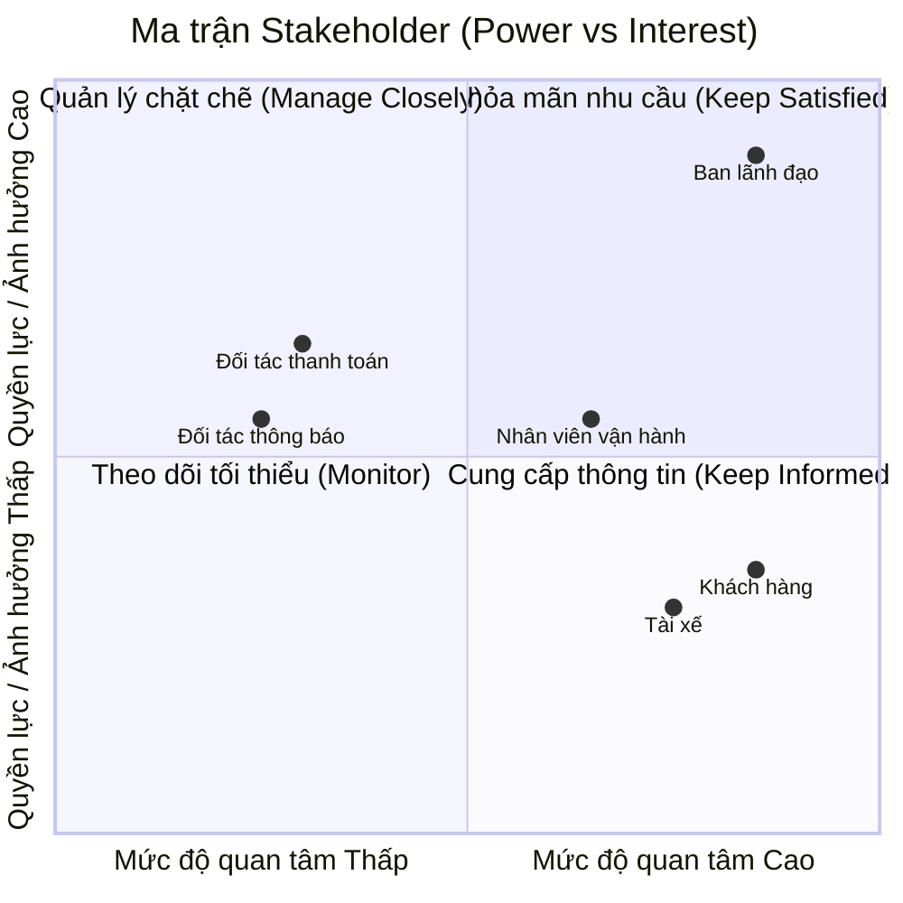

# Software Requirements Specification (SRS) - CAB System
# 1. STAKEHOLDERS

Stakeholders của hệ thống CAB System gồm các bên có liên quan trực tiếp
đến việc sử dụng, vận hành, quản lý và cung cấp dịch vụ cho hệ thống.

| STT | Stakeholder | Vai trò / Mối quan tâm |
|---|---|---|
| 1 | Khách hàng | Đăng ký tài khoản, đặt xe, theo dõi chuyến đi, thanh toán và đánh giá tài xế. |
| 2 | Tài xế | Nhận và thực hiện chuyến xe, cập nhật trạng thái chuyến, thông tin phương tiện và vị trí. |
| 3 | Nhân viên vận hành | Quản lý khách hàng, tài xế, phương tiện và chuyến đi; theo dõi và xử lý các trường hợp phát sinh. |
| 4 | Ban lãnh đạo Công ty ABC | Theo dõi doanh thu, số lượng chuyến, tỷ lệ hoàn thành, tỷ lệ hủy và hiệu quả hoạt động của tài xế. |
| 5 | Nhà cung cấp thanh toán | Xử lý các giao dịch thanh toán điện tử cho hệ thống CAB. |
| 6 | Nhà cung cấp dịch vụ thông báo | Cung cấp các kênh gửi thông báo đến khách hàng và tài xế. |
## 2. STAKEHOLDER MATRIX (Ma trận Bên liên quan)

## 3. BUSINESS GOALS (Mục tiêu Kinh doanh)

| STT | Business Goal | Mục tiêu |
|---|---|---|
| 1 | **Nâng cao trải nghiệm đặt xe** | Xây dựng nền tảng CAB giúp khách hàng dễ dàng đăng ký, đặt xe, theo dõi chuyến đi, thanh toán và đánh giá tài xế. |
| 2 | **Tự động hóa việc tìm và phân công tài xế** | Tự động tìm tài xế phù hợp dựa trên vị trí, trạng thái sẵn sàng và các tiêu chí vận hành; tiếp tục tìm tài xế khác khi tài xế được đề xuất không phản hồi hoặc từ chối. |
| 3 | **Nâng cao hiệu quả vận hành** | Cung cấp công cụ để nhân viên vận hành quản lý khách hàng, tài xế, phương tiện và chuyến đi; theo dõi và xử lý các trường hợp phát sinh. |
| 4 | **Quản lý thanh toán và doanh thu** | Hỗ trợ tính cước và thanh toán bằng tiền mặt hoặc phương thức điện tử, đồng thời quản lý thông tin giao dịch và doanh thu. |
| 5 | **Cung cấp thông tin và theo dõi hoạt động** | Cung cấp thông báo về trạng thái chuyến đi, thanh toán và các sự kiện liên quan; hỗ trợ báo cáo về số chuyến, doanh thu, tỷ lệ hoàn thành, tỷ lệ hủy và hiệu quả tài xế. |
| 6 | **Đảm bảo khả năng mở rộng của nền tảng** | Xây dựng hệ thống có khả năng phục vụ số lượng lớn khách hàng và tài xế, cho phép mở rộng từng thành phần và bổ sung chức năng mới trong tương lai. |
| 7 | **Đảm bảo an toàn và bảo mật** | Bảo vệ thông tin cá nhân, thông tin phương tiện, dữ liệu vị trí và dữ liệu giao dịch; kiểm soát quyền truy cập và lưu vết các thao tác quan trọng. |
| 8 | **Đảm bảo tính ổn định và liên tục của hệ thống** | Hạn chế việc lỗi ở một thành phần như thanh toán hoặc thông báo làm ảnh hưởng đến toàn bộ nền tảng đặt xe. |
## 4. MINIMUM VIABLE PRODUCT (MVP) MODULES

| STT | Module | Mô tả |
|---|---|---|
| 1 | Quản lý tài khoản & hồ sơ | Đăng ký, đăng nhập, cập nhật thông tin cá nhân cho Khách hàng và Tài xế; Tài xế cập nhật hồ sơ phương tiện. |
| 2 | Đặt xe & Theo dõi chuyến | Nhập điểm đón, điểm đến, chọn loại xe, gửi yêu cầu đặt xe; theo dõi trạng thái chuyến theo thời gian thực; xem lịch sử chuyến đi. |
| 3 | Tìm & Phân công tài xế | Tự động tìm tài xế phù hợp theo vị trí và trạng thái sẵn sàng; xử lý khi tài xế không phản hồi/từ chối; thông báo khi không tìm được tài xế. |
| 4 | Thực hiện chuyến đi | Tài xế cập nhật trạng thái chuyến: đã đến điểm đón, đã đón khách, đang di chuyển, hoàn thành chuyến. |
| 5 | Tính cước & Thanh toán | Tính cước sau khi hoàn thành chuyến; thanh toán bằng tiền mặt hoặc tích hợp thanh toán điện tử bên ngoài; xử lý khi giao dịch thất bại. |
| 6 | Thông báo | Gửi thông báo cho khách hàng và tài xế theo các sự kiện của chuyến đi. |
| 7 | Đánh giá tài xế | Khách hàng đánh giá tài xế sau khi hoàn thành chuyến. |
| 8 | Quản trị vận hành | Giao diện cho Nhân viên vận hành quản lý khách hàng, tài xế, phương tiện, chuyến đi và xem báo cáo. |
## 5. ACTORS

| STT | Actor | Mô tả |
|---|---|---|
| 1 | Khách hàng (Customer) | Đăng ký/đăng nhập, cập nhật hồ sơ, tạo yêu cầu đặt xe, theo dõi chuyến, xem lịch sử, thanh toán và đánh giá tài xế. |
| 2 | Tài xế (Driver) | Đăng ký/cập nhật hồ sơ và phương tiện, chuyển trạng thái sẵn sàng, nhận/từ chối chuyến, cập nhật trạng thái chuyến và vị trí. |
| 3 | Nhân viên vận hành (Operator) | Quản lý khách hàng, tài xế, phương tiện, chuyến đi; xử lý sự cố; tra cứu lịch sử và xem báo cáo. |
| 4 | Ban lãnh đạo (Manager) | Xem báo cáo doanh thu, số chuyến, tỷ lệ hoàn thành/hủy và hiệu quả tài xế. |

| 5 | Nhà cung cấp thanh toán (Payment Gateway) | Xử lý giao dịch thanh toán điện tử và trả kết quả giao dịch về hệ thống CAB. |
| 6 | Nhà cung cấp dịch vụ thông báo (Notification Provider) | Gửi thông báo đến khách hàng và tài xế theo yêu cầu của hệ thống. |
