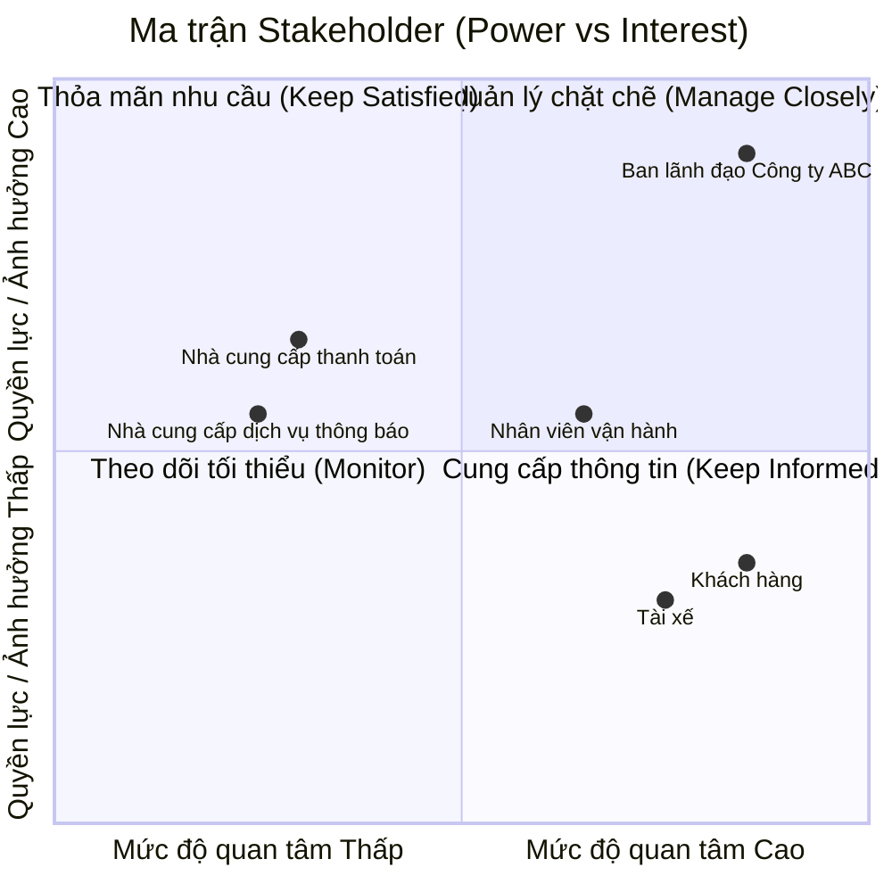
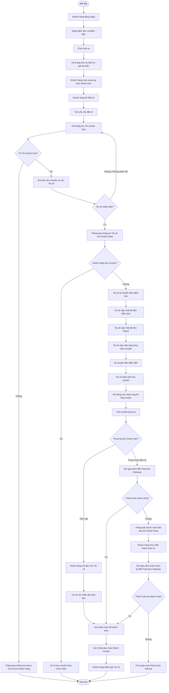
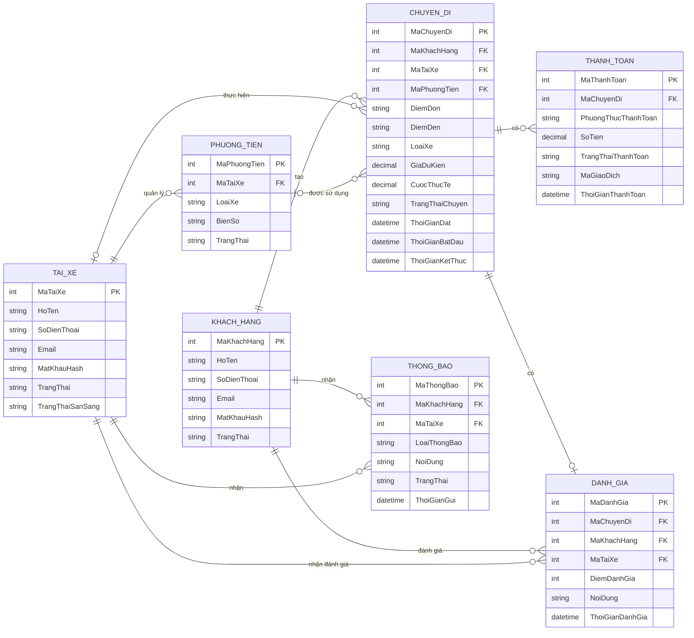
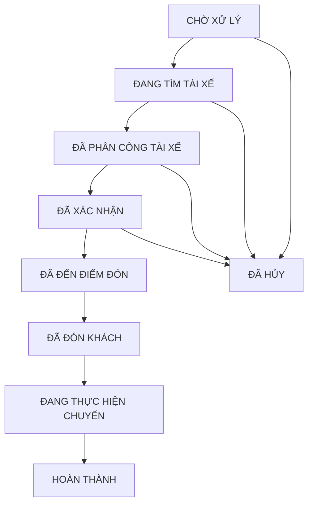
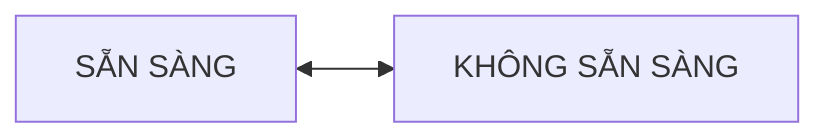
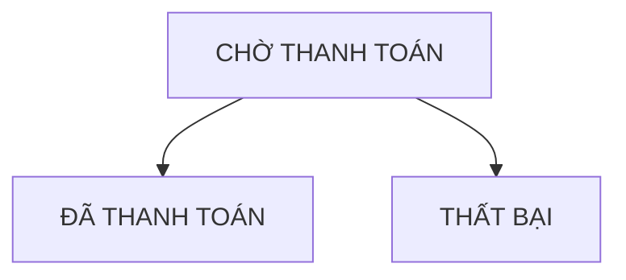
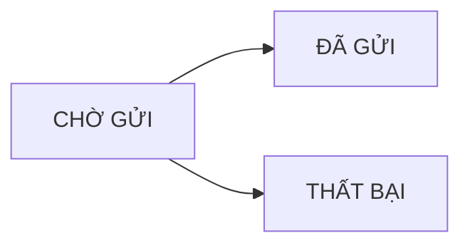
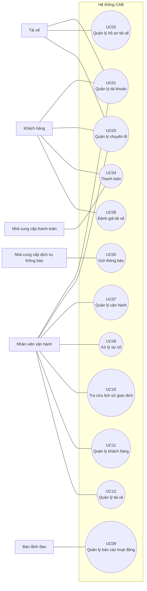

# Software Requirements Specification (SRS) - CAB System
# 1. STAKEHOLDERS

Stakeholders của hệ thống CAB System gồm các bên có liên quan trực tiếp
đến việc sử dụng, vận hành, quản lý và cung cấp dịch vụ cho hệ thống.

| STT | Stakeholder | Vai trò / Mối quan tâm |
|---|---|---|
| 1 | Khách hàng | Đăng ký tài khoản, đặt xe, theo dõi chuyến đi, thanh toán và đánh giá tài xế. |
| 2 | Tài xế | Nhận và thực hiện chuyến xe, cập nhật trạng thái chuyến, thông tin phương tiện và vị trí. |
| 3 | Nhân viên vận hành | Quản lý khách hàng, tài xế, phương tiện và chuyến đi; theo dõi và xử lý các trường hợp phát sinh. |
| 4 | Ban lãnh đạo Công ty ABC | Theo dõi doanh thu, số lượng chuyến, tỷ lệ hoàn thành, tỷ lệ hủy và hiệu quả hoạt động của tài xế. |
| 5 | Nhà cung cấp thanh toán | Xử lý các giao dịch thanh toán điện tử cho hệ thống CAB. |
| 6 | Nhà cung cấp dịch vụ thông báo | Cung cấp các kênh gửi thông báo đến khách hàng và tài xế. |
## 2. STAKEHOLDER MATRIX (Ma trận Bên liên quan)

```mermaid
quadrantChart
    title Ma trận Stakeholder (Power vs Interest)

    x-axis "Mức độ quan tâm Thấp" --> "Mức độ quan tâm Cao"
    y-axis "Quyền lực / Ảnh hưởng Thấp" --> "Quyền lực / Ảnh hưởng Cao"

    quadrant-1 "Quản lý chặt chẽ (Manage Closely)"
    quadrant-2 "Thỏa mãn nhu cầu (Keep Satisfied)"
    quadrant-3 "Theo dõi tối thiểu (Monitor)"
    quadrant-4 "Cung cấp thông tin (Keep Informed)"

    "Ban lãnh đạo Công ty ABC": [0.85, 0.90]
    "Nhân viên vận hành": [0.65, 0.55]
    "Nhà cung cấp thanh toán": [0.30, 0.65]
    "Nhà cung cấp dịch vụ thông báo": [0.25, 0.55]
    "Khách hàng": [0.85, 0.35]
    "Tài xế": [0.75, 0.30]

```

## 3. BUSINESS GOALS (Mục tiêu Kinh doanh)

| STT | Business Goal | Mục tiêu |
|---|---|---|
| 1 | **Nâng cao trải nghiệm đặt xe** | Xây dựng nền tảng CAB giúp khách hàng dễ dàng đăng ký, đặt xe, theo dõi chuyến đi, thanh toán và đánh giá tài xế. |
| 2 | **Tự động hóa việc tìm và phân công tài xế** | Tự động tìm tài xế phù hợp dựa trên vị trí, trạng thái sẵn sàng và các tiêu chí vận hành; tiếp tục tìm tài xế khác khi tài xế được đề xuất không phản hồi hoặc từ chối. |
| 3 | **Nâng cao hiệu quả vận hành** | Cung cấp công cụ để nhân viên vận hành quản lý khách hàng, tài xế, phương tiện và chuyến đi; theo dõi và xử lý các trường hợp phát sinh. |
| 4 | **Quản lý thanh toán và doanh thu** | Hỗ trợ tính cước và thanh toán bằng tiền mặt hoặc phương thức điện tử; quản lý lịch sử giao dịch và cung cấp dữ liệu doanh thu. |
| 5 | **Cung cấp thông tin và theo dõi hoạt động** | Cung cấp dữ liệu và báo cáo về số chuyến, doanh thu, tỷ lệ hoàn thành, tỷ lệ hủy và hiệu quả tài xế, giúp ban lãnh đạo và nhân viên vận hành theo dõi tình hình hoạt động và hỗ trợ ra quyết định. |
| 6 | **Đảm bảo khả năng mở rộng của nền tảng** | Xây dựng hệ thống có khả năng phục vụ số lượng lớn khách hàng và tài xế, cho phép mở rộng từng thành phần và bổ sung chức năng mới trong tương lai. |
| 7 | **Đảm bảo an toàn và bảo mật** | Bảo vệ thông tin cá nhân, thông tin phương tiện, dữ liệu vị trí và dữ liệu giao dịch; kiểm soát quyền truy cập và lưu vết các thao tác quan trọng. |
| 8 | **Đảm bảo tính ổn định và liên tục của hệ thống** | Hạn chế việc lỗi ở một thành phần như thanh toán hoặc thông báo làm ảnh hưởng đến toàn bộ nền tảng đặt xe. |
## 4. MINIMUM VIABLE PRODUCT (MVP) MODULES

| STT | Module | Mô tả |
|---|---|---|
| 1 | Quản lý tài khoản & hồ sơ |Đăng ký, đăng nhập, cập nhật thông tin cá nhân cho Khách hàng và Tài xế; Tài xế cập nhật thông tin phương tiện và trạng thái hoạt động. |
| 2 | Đặt xe & Theo dõi chuyến | Nhập điểm đón, điểm đến, chọn loại xe, gửi yêu cầu đặt xe; theo dõi trạng thái chuyến; xem tài xế đã nhận chuyến, thời gian dự kiến đến và lịch sử chuyến đi.|
| 3 | Tìm & Phân công tài xế | Tự động tìm tài xế phù hợp dựa trên vị trí, trạng thái sẵn sàng và các tiêu chí vận hành; nếu tài xế không phản hồi hoặc từ chối thì tiếp tục tìm tài xế khác; thông báo khi không tìm được tài xế. |
| 4 | Thực hiện chuyến đi | Tài xế cập nhật trạng thái chuyến: đã đến điểm đón, đã đón khách, đang di chuyển và hoàn thành chuyến. |
| 5 | Tính cước & Thanh toán | Tính số tiền phải trả sau khi hoàn thành chuyến; hỗ trợ thanh toán bằng tiền mặt hoặc thanh toán điện tử thông qua nhà cung cấp bên ngoài; thông báo và cho phép xử lý lại khi giao dịch điện tử thất bại theo chính sách. |
| 6 | Thông báo |Gửi thông báo cho Khách hàng và Tài xế về các sự kiện của chuyến đi như nhận yêu cầu đặt xe, tài xế nhận chuyến, tài xế đến điểm đón, hoàn thành chuyến và kết quả thanh toán. |
| 7 | Đánh giá tài xế | Khách hàng đánh giá Tài xế sau khi chuyến đi hoàn thành. |
| 8 | Quản trị vận hành | Giao diện cho Nhân viên vận hành quản lý khách hàng, tài xế, phương tiện, chuyến đi; theo dõi chuyến đang diễn ra, trạng thái tài xế, xử lý các trường hợp lỗi, tra cứu lịch sử giao dịch và xem báo cáo.|
## 5. ACTORS

| STT | Actor | Mô tả |
|---|---|---|
| 1 | Khách hàng (Customer) |Đăng ký/đăng nhập, cập nhật hồ sơ, tạo yêu cầu đặt xe, theo dõi chuyến, xem lịch sử chuyến đi, thanh toán và đánh giá tài xế. |
| 2 | Tài xế (Driver) | Đăng ký hoặc được Nhân viên vận hành tạo tài khoản; cập nhật hồ sơ và thông tin phương tiện, chuyển trạng thái sẵn sàng, nhận/từ chối chuyến, cập nhật trạng thái chuyến và vị trí.|
| 3 | Nhân viên vận hành (Operator) |Quản lý khách hàng, tài xế, phương tiện, chuyến đi; theo dõi chuyến đang diễn ra, trạng thái tài xế, xử lý các trường hợp lỗi, tra cứu lịch sử giao dịch và xem báo cáo.|
| 4 | Ban lãnh đạo (Manager) | Xem báo cáo về doanh thu, số chuyến, tỷ lệ hoàn thành, tỷ lệ hủy và hiệu quả hoạt động của tài xế.|
| 5 | Nhà cung cấp thanh toán (Payment Gateway) | Xử lý giao dịch thanh toán điện tử và trả kết quả giao dịch về hệ thống CAB. |
| 6 | Nhà cung cấp dịch vụ thông báo (Notification Provider) | Thực hiện gửi thông báo đến Khách hàng và Tài xế khi nhận yêu cầu từ hệ thống CAB. |
## 6. BUSINESS REQUIREMENTS

| ID | Business Requirement | Mô tả |
|---|---|---|
| BR-01 | Quản lý tài khoản khách hàng | Hệ thống phải cho phép Khách hàng đăng ký, đăng nhập và quản lý thông tin cá nhân để sử dụng dịch vụ đặt xe. |
| BR-02 | Tạo yêu cầu đặt xe | Hệ thống phải cho phép Khách hàng tạo yêu cầu đặt xe bằng cách cung cấp điểm đón, điểm đến và loại xe. |
| BR-03 | Tự động tìm và phân công tài xế |Hệ thống phải tự động tìm Tài xế phù hợp dựa trên vị trí, trạng thái sẵn sàng và các tiêu chí vận hành. |
| BR-04 | Xử lý từ chối hoặc không phản hồi | Hệ thống phải tiếp tục tìm Tài xế khác khi Tài xế được đề xuất không phản hồi hoặc từ chối chuyến. |
| BR-05 | Theo dõi và cập nhật chuyến đi |Hệ thống phải cho phép Khách hàng theo dõi trạng thái chuyến đi và cho phép Tài xế cập nhật trạng thái chuyến trong suốt quá trình thực hiện. |
| BR-06 | Tính cước và thanh toán | Hệ thống phải tính số tiền phải trả sau khi chuyến đi hoàn thành và hỗ trợ thanh toán bằng tiền mặt hoặc phương thức thanh toán điện tử. |
| BR-07 | Tích hợp thanh toán điện tử |Hệ thống phải tích hợp với nhà cung cấp thanh toán bên ngoài để xử lý giao dịch điện tử và nhận kết quả giao dịch. |
| BR-08 | Thông báo sự kiện chuyến đi | Hệ thống phải gửi thông báo đến Khách hàng và Tài xế khi xảy ra các sự kiện của chuyến đi và hỗ trợ mở rộng thêm các kênh thông báo trong tương lai. |
| BR-09 | Đánh giá tài xế | Hệ thống phải cho phép Khách hàng đánh giá Tài xế sau khi chuyến đi hoàn thành. |
| BR-10 | Quản lý vận hành |Hệ thống phải cung cấp cho Nhân viên vận hành các chức năng quản lý khách hàng, tài xế, phương tiện và chuyến đi. |
| BR-11 | Báo cáo hoạt động |Hệ thống phải cung cấp báo cáo về số chuyến, doanh thu, tỷ lệ hoàn thành, tỷ lệ hủy và hiệu quả hoạt động của Tài xế để Ban lãnh đạo theo dõi hoạt động kinh doanh.|
| BR-12 |Tra cứu lịch sử giao dịch | Hệ thống phải cho phép Ban lãnh đạo truy cập các báo cáo cần thiết để theo dõi và đánh giá hoạt động kinh doanh.Hệ thống phải cho phép Nhân viên vận hành tra cứu lịch sử giao dịch. |
| BR-13 |Bảo vệ dữ liệu và kiểm soát truy cập |Hệ thống phải xác thực người dùng trước các chức năng yêu cầu tài khoản, kiểm soát quyền truy cập của Nhân viên vận hành, bảo vệ thông tin cá nhân, dữ liệu phương tiện, vị trí và giao dịch, đồng thời ghi nhận các hành động quan trọng để phục vụ kiểm tra và truy vết. |
| BR-14 | Khả năng mở rộng | Hệ thống phải có khả năng mở rộng để đáp ứng số lượng lớn Khách hàng và Tài xế trong tương lai. |
| BR-15 | Quản lý hồ sơ tài xế |Hệ thống phải cho phép Tài xế đăng ký hoặc Nhân viên vận hành tạo tài khoản cho Tài xế; Tài xế có thể cập nhật thông tin cá nhân, thông tin phương tiện và trạng thái sẵn sàng nhận chuyến.|
| BR-16 | Theo dõi và xử lý sự cố | Hệ thống phải cho phép Nhân viên vận hành theo dõi các chuyến đang diễn ra, trạng thái Tài xế và xử lý các trường hợp phát sinh trong quá trình vận hành.|
| BR-17 | Thông báo khi không tìm được tài xế |Hệ thống phải thông báo cho Khách hàng khi không tìm được Tài xế phù hợp cho yêu cầu đặt xe. |
| BR-18 | Xử lý thanh toán thất bại | Hệ thống phải thông báo cho Khách hàng khi giao dịch thanh toán điện tử thất bại và cho phép thử lại hoặc xử lý lại giao dịch theo chính sách nghiệp vụ. |

##7 . BUSINESS PROCESS MODELING

```mermaid
flowchart TD
    A([Bắt đầu]) --> B[Khách hàng đăng nhập]
    B --> C[Nhập điểm đón và điểm đến]
    C --> D[Chọn loại xe]
    D --> E[Hệ thống tính và hiển thị giá dự kiến]
    E --> F[Khách hàng chọn phương thức thanh toán]
    F --> G[Khách hàng ấn Đặt xe]

    G --> H[Tạo yêu cầu đặt xe]
    H --> I[Hệ thống tìm Tài xế phù hợp]
    I --> J{Có Tài xế phù hợp?}

    J -- Không --> K[Thông báo không tìm được Tài xế cho Khách hàng]
    K --> Z([Kết thúc])

    J -- Có --> L[Gửi yêu cầu chuyến xe cho Tài xế]
    L --> M{Tài xế chấp nhận?}

    M -- Không / Không phản hồi --> I
    M -- Có --> N[Thông báo thông tin Tài xế cho Khách hàng]

    N --> O{Khách hàng hủy chuyến?}

    O -- Có --> P[Xử lý hủy chuyến theo chính sách]
    P --> Z

    O -- Không --> Q[Tài xế di chuyển đến điểm đón]
    Q --> R[Tài xế cập nhật đã đến điểm đón]
    R --> S[Tài xế cập nhật đã đón khách]
    S --> T[Tài xế cập nhật đang thực hiện chuyến]
    T --> U[Di chuyển đến điểm đến]
    U --> V[Tài xế nhấn Kết thúc chuyến]

    V --> W[Hệ thống xác nhận chuyến hoàn thành]
    W --> X[Tính số tiền phải trả]

    X --> Y{Phương thức thanh toán?}

    Y -- Tiền mặt --> AA[Khách hàng trả tiền cho Tài xế]
    AA --> AB[Tài xế xác nhận đã nhận tiền]
    AB --> AC[Ghi nhận hoàn tất thanh toán]

    Y -- Thanh toán điện tử --> AD[Gửi giao dịch đến Payment Gateway]
    AD --> AE{Thanh toán thành công?}

    AE -- Có --> AC
    AE -- Không --> AF[Thông báo thanh toán thất bại cho Khách hàng]
    AF --> AG[Khách hàng thực hiện thanh toán lại]
    AG --> AH[Gửi giao dịch thanh toán lại đến Payment Gateway]
    AH --> AI{Thanh toán lại thành công?}

    AI -- Có --> AC
    AI -- Không --> AJ[Xử lý giao dịch thanh toán thất bại]
    AJ --> Z

    AC --> AK[Gửi thông báo hoàn thành chuyến]
    AK --> AL[Khách hàng đánh giá Tài xế]
    AL --> Z
```

  
    
## 8. FUNCTIONAL REQUIREMENTS

### 8.1. Quản lý tài khoản và hồ sơ

| ID | Functional Requirement | Mô tả |
|---|---|---|
| FR-01 | Đăng ký tài khoản | Hệ thống phải cho phép Khách hàng và Tài xế đăng ký tài khoản, đồng thời cho phép Nhân viên vận hành tạo tài khoản cho Tài xế. |
| FR-02 | Đăng nhập |Hệ thống phải cho phép Khách hàng, Tài xế và Nhân viên vận hành đăng nhập bằng tài khoản hợp lệ. |
| FR-03 | Quản lý thông tin cá nhân | Hệ thống phải cho phép người dùng xem và cập nhật thông tin cá nhân. |
| FR-04 | Quản lý hồ sơ Tài xế | Hệ thống phải cho phép Tài xế cập nhật thông tin phương tiện và trạng thái sẵn sàng nhận chuyến. |

### 8.2. Đặt xe và theo dõi chuyến

| ID | Functional Requirement | Mô tả |
|---|---|---|
| FR-05 | Nhập thông tin chuyến xe | Hệ thống phải cho phép Khách hàng nhập điểm đón, điểm đến và lựa chọn loại xe. |
| FR-06 | Tính giá dự kiến | Hệ thống phải tính và hiển thị giá dự kiến của chuyến xe trước khi Khách hàng xác nhận đặt xe. |
| FR-07 | Chọn phương thức thanh toán | Hệ thống phải cho phép Khách hàng lựa chọn phương thức thanh toán tiền mặt hoặc thanh toán điện tử trước khi đặt xe. |
| FR-08 | Xác nhận đặt xe | Hệ thống phải tiếp nhận yêu cầu khi Khách hàng ấn Đặt xe và tạo yêu cầu đặt xe theo thông tin đã cung cấp. |
| FR-09 | Theo dõi trạng thái chuyến | Hệ thống phải cho phép Khách hàng theo dõi trạng thái chuyến xe từ khi tìm Tài xế đến khi hoàn thành chuyến. |
| FR-10 | Xem lịch sử chuyến | Hệ thống phải cho phép Khách hàng xem lịch sử các chuyến xe đã thực hiện. |

### 8.3. Tìm và phân công Tài xế

| ID | Functional Requirement | Mô tả |
|---|---|---|
| FR-11 | Tìm Tài xế phù hợp | Hệ thống phải tự động tìm Tài xế phù hợp dựa trên vị trí và trạng thái sẵn sàng nhận chuyến. |
| FR-12 | Gửi yêu cầu chuyến xe | Hệ thống phải gửi yêu cầu chuyến xe đến Tài xế phù hợp. |
| FR-13 | Xử lý không tìm được Tài xế| Hệ thống phải xử lý trường hợp không tìm được Tài xế phù hợp cho yêu cầu đặt xe. |
| FR-14 | Xử lý Tài xế từ chối hoặc không phản hồi | Hệ thống phải tiếp tục tìm Tài xế khác khi Tài xế được gửi yêu cầu từ chối hoặc không phản hồi. |
| FR-15 | Thông báo thông tin Tài xế | Hệ thống phải thông báo thông tin Tài xế cho Khách hàng sau khi Tài xế chấp nhận chuyến. |

### 8.4. Thực hiện chuyến đi

| ID | Functional Requirement | Mô tả |
|---|---|---|
| FR-16 | Cập nhật trạng thái chuyến | Hệ thống phải cho phép Tài xế cập nhật trạng thái chuyến gồm: đã đến điểm đón, đã đón khách, đang thực hiện chuyến và hoàn thành chuyến. |
| FR-17 | Cập nhật vị trí Tài xế | Hệ thống phải cập nhật vị trí của Tài xế để Khách hàng theo dõi trong quá trình thực hiện chuyến. |
| FR-18 | Hủy chuyến | Hệ thống phải cho phép Khách hàng hủy chuyến và xử lý việc hủy theo chính sách của doanh nghiệp. |
| FR-19 | Ghi nhận hoàn thành chuyến | Hệ thống phải ghi nhận chuyến xe hoàn thành khi Tài xế kết thúc chuyến. |

### 8.5. Tính cước và thanh toán

| ID | Functional Requirement | Mô tả |
|---|---|---|
| FR-20 | Tính cước thực tế | Hệ thống phải tính cước thực tế của chuyến xe sau khi chuyến xe hoàn thành. |
| FR-21 | Thanh toán tiền mặt | Hệ thống phải cho phép Khách hàng thanh toán tiền mặt cho Tài xế sau khi hoàn thành chuyến. |
| FR-22 | Xác nhận thanh toán tiền mặt | Hệ thống phải cho phép Tài xế xác nhận đã nhận tiền từ Khách hàng. |
| FR-23 | Gửi yêu cầu thanh toán điện tử | Hệ thống phải gửi giao dịch đến Payment Gateway sau khi chuyến xe hoàn thành và số tiền phải trả đã được xác định, nếu Khách hàng đã chọn phương thức thanh toán điện tử.|
| FR-24 | Xử lý kết quả thanh toán điện tử | Hệ thống phải kiểm tra và ghi nhận kết quả thanh toán điện tử thành công hoặc thất bại. |
| FR-25 | Xử lý thanh toán thất bại | Hệ thống phải thông báo cho Khách hàng khi thanh toán điện tử thất bại và cho phép thử lại hoặc xử lý lại giao dịch theo chính sách nghiệp vụ.|
| FR-26 | Ghi nhận thanh toán | Hệ thống phải ghi nhận trạng thái thanh toán của chuyến xe, bao gồm kết quả thanh toán thành công hoặc thất bại. |

### 8.6. Thông báo

| ID | Functional Requirement | Mô tả |
|---|---|---|
| FR-27 | Thông báo không tìm được Tài xế |Hệ thống phải thông báo cho Khách hàng khi không tìm được Tài xế phù hợp cho yêu cầu đặt xe.|
| FR-28 | Thông báo Tài xế nhận chuyến | Hệ thống phải thông báo cho Khách hàng thông tin Tài xế khi Tài xế chấp nhận chuyến. |
| FR-29 | Thông báo kết quả thanh toán | Hệ thống phải thông báo cho Khách hàng kết quả thanh toán điện tử thành công hoặc thất bại. |
| FR-30 | Thông báo hoàn thành chuyến | Hệ thống phải thông báo cho Khách hàng khi chuyến xe hoàn thành. |

### 8.7. Đánh giá Tài xế

| ID | Functional Requirement | Mô tả |
|---|---|---|
| FR-31 | Đánh giá Tài xế | Hệ thống phải cho phép Khách hàng đánh giá Tài xế sau khi chuyến xe hoàn thành. |
| FR-32 | Lưu đánh giá | Hệ thống phải lưu kết quả đánh giá gắn với chuyến xe tương ứng. |

### 8.8. Quản trị vận hành

| ID | Functional Requirement | Mô tả |
|---|---|---|
| FR-33 | Quản lý Khách hàng | Hệ thống phải cho phép Nhân viên vận hành tra cứu và quản lý thông tin Khách hàng. |
| FR-34 | Quản lý Tài xế | Hệ thống phải cho phép Nhân viên vận hành tra cứu và quản lý thông tin Tài xế. |
| FR-35 | Quản lý phương tiện | Hệ thống phải cho phép Nhân viên vận hành tra cứu và quản lý thông tin phương tiện. |
| FR-36 | Quản lý chuyến đi | Hệ thống phải cho phép Nhân viên vận hành tra cứu và theo dõi thông tin chuyến đi. |
| FR-37 | Xử lý sự cố | Hệ thống phải hỗ trợ Nhân viên vận hành theo dõi và xử lý các trường hợp phát sinh trong quá trình vận hành. |
| FR-38 | Báo cáo hoạt động |Hệ thống phải cung cấp báo cáo về số chuyến, doanh thu, tỷ lệ hoàn thành, tỷ lệ hủy và hiệu quả hoạt động của Tài xế. |
| FR-39 | Xem báo cáo quản lý | Hệ thống phải cho phép Ban lãnh đạo xem các báo cáo phục vụ theo dõi và đánh giá hoạt động kinh doanh. |
| FR-40 | Tra cứu lịch sử giao dịch| Hệ thống phải cho phép Nhân viên vận hành tra cứu lịch sử giao dịch. |

### 8.9 Kiểm soát truy cập và truy vết
| ID | Functional Requirement | Mô tả |
|---|---|---|
| FR-41 | Kiểm soát quyền truy cập| Hệ thống phải kiểm soát quyền truy cập của Nhân viên vận hành đối với các chức năng theo quyền được cấp. |
| FR-42|Ghi nhận hành động quan trọng| Hệ thống phải ghi nhận các hành động quan trọng để phục vụ kiểm tra và truy vết khi cần thiết. |
### 8.10. Mapping Business Requirements và Functional Requirements

| BR ID | Business Requirement | Functional Requirements liên quan |
|---|---|---|
| BR-01 | Quản lý tài khoản khách hàng | FR-01, FR-02, FR-03 |
| BR-02 | Tạo yêu cầu đặt xe | FR-05, FR-06, FR-07, FR-08 |
| BR-03 | Tự động tìm và phân công tài xế | FR-11, FR-12 |
| BR-04 | Xử lý từ chối hoặc không phản hồi | FR-14 |
| BR-05 | Theo dõi và cập nhật chuyến đi | FR-09, FR-16, FR-17, FR-19 |
| BR-06 | Tính cước và thanh toán | FR-20, FR-21, FR-22, FR-26 |
| BR-07 | Tích hợp thanh toán điện tử | FR-23, FR-24 |
| BR-08 | Thông báo sự kiện chuyến đi |  FR-28, FR-29, FR-30 |
| BR-09 | Đánh giá tài xế | FR-31, FR-32 |
| BR-10 | Quản lý vận hành | FR-33, FR-34, FR-35, FR-36, FR-37 |
| BR-11 | Báo cáo hoạt động | FR-38 |
| BR-12 | Tra cứu lịch sử giao dịch và báo cáo cho Ban lãnh đạo | FR-39, FR-40|
| BR-13 | Bảo vệ dữ liệu và kiểm soát truy cập | FR-02, FR-03, FR-41, FR-42|
| BR-14 | Khả năng mở rộng | Yêu cầu phi chức năng, không ánh xạ trực tiếp đến FR |
| BR-15 | Quản lý hồ sơ tài xế | FR-01, FR-03, FR-04 |
| BR-16 | Theo dõi và xử lý sự cố | FR-36, FR-37 |
| BR-17 | Thông báo khi không tìm được tài xế | FR-13, FR-27 |
| BR-18 | Xử lý thanh toán thất bại | FR-24, FR-25, FR-29 |
## 9. BUSINESS RULES

### 9.1. Quản lý tài khoản và quyền

| ID | Business Rule | Mô tả |
|---|---|---|
| BRL-01 | Đăng nhập trước khi đặt xe | Khách hàng phải đăng nhập vào hệ thống trước khi có thể tạo yêu cầu đặt xe. |
| BRL-02 | Quản lý trạng thái Tài xế | Tài xế phải cập nhật trạng thái sẵn sàng nhận chuyến trước khi có thể nhận yêu cầu đặt xe. |
| BRL-03 | Phân quyền người dùng | Người dùng chỉ được thực hiện các chức năng phù hợp với vai trò và quyền được cấp. |
| BRL-04 | Bảo vệ thông tin người dùng | Hệ thống phải bảo vệ thông tin cá nhân, dữ liệu vị trí và thông tin giao dịch của Khách hàng và Tài xế. |

### 9.2. Đặt xe và tìm Tài xế

| ID | Business Rule | Mô tả |
|---|---|---|
| BRL-05 | Thông tin đặt xe bắt buộc | Khách hàng phải cung cấp điểm đón, điểm đến và loại xe trước khi đặt xe. |
| BRL-06 | Hiển thị giá dự kiến | Hệ thống phải tính và hiển thị giá dự kiến cho Khách hàng trước khi xác nhận đặt xe. |
| BRL-07 | Chọn phương thức thanh toán | Khách hàng phải lựa chọn phương thức thanh toán tiền mặt hoặc thanh toán điện tử trước khi ấn Đặt xe. |
| BRL-08 | Tạo yêu cầu đặt xe| Sau khi Khách hàng ấn Đặt xe, hệ thống phải tạo yêu cầu đặt xe theo thông tin đã cung cấp. |
| BRL-09 | Tìm Tài xế phù hợp |Hệ thống chỉ gửi yêu cầu chuyến xe đến Tài xế đang ở trạng thái sẵn sàng và phù hợp với yêu cầu đặt xe. |
| BRL-10 | Xử lý không tìm được Tài xế | Nếu không tìm được Tài xế phù hợp, hệ thống phải thông báo cho Khách hàng và kết thúc việc xử lý yêu cầu đặt xe. |
| BRL-11 | Tiếp tục tìm Tài xế khác | Nếu Tài xế được đề xuất từ chối hoặc không phản hồi yêu cầu, hệ thống phải tiếp tục tìm Tài xế khác. |
| BRL-12 | Xác nhận chuyến | Chuyến xe chỉ được xác nhận khi có Tài xế chấp nhận yêu cầu. |

### 9.3. Thực hiện và hủy chuyến

| ID | Business Rule | Mô tả |
|---|---|---|
| BRL-13 | Hủy chuyến | Khách hàng được phép hủy chuyến và việc hủy chuyến phải được xử lý theo chính sách của Công ty ABC. |
| BRL-14 | Cập nhật trạng thái chuyến | Tài xế phải cập nhật trạng thái chuyến theo trình tự: đã đến điểm đón → đã đón khách → đang thực hiện chuyến → hoàn thành chuyến. |
| BRL-15 | Cập nhật vị trí Tài xế | Hệ thống phải cập nhật vị trí của Tài xế trong quá trình thực hiện chuyến để hỗ trợ tìm Tài xế phù hợp và cung cấp thời gian dự kiến đến. |
| BRL-16 | Ghi nhận hoàn thành chuyến | Hệ thống phải ghi nhận chuyến xe hoàn thành khi Tài xế kết thúc chuyến. |

### 9.4. Tính cước và thanh toán

| ID | Business Rule | Mô tả |
|---|---|---|
| BRL-17 | Tính cước thực tế |Sau khi chuyến xe hoàn thành, hệ thống phải tính cước thực tế của chuyến xe. |
| BRL-18 | Thanh toán tiền mặt sau chuyến | Với phương thức tiền mặt, Khách hàng phải thanh toán cho Tài xế sau khi chuyến xe hoàn thành. |
| BRL-19 | Xác nhận thanh toán tiền mặt | Tài xế phải xác nhận đã nhận tiền từ Khách hàng sau khi thanh toán tiền mặt. |
| BRL-20 | Ghi nhận thanh toán điện tử | Với phương thức thanh toán điện tử, hệ thống phải ghi nhận giao dịch đã thanh toán sau khi Payment Gateway trả về kết quả thành công. |
| BRL-21 | Ghi nhận trạng thái thanh toán | Hệ thống phải ghi nhận trạng thái thanh toán của từng chuyến xe. |
| BRL-22 | Xử lý thanh toán điện tử thất bại |Khi giao dịch thanh toán điện tử thất bại, hệ thống phải thông báo cho Khách hàng và cho phép thử lại hoặc xử lý lại giao dịch theo chính sách nghiệp vụ.|
### 9.5. Thông báo và đánh giá

| ID | Business Rule | Mô tả |
|---|---|---|
| BRL-23 | Thông báo sự kiện chuyến đi | Hệ thống phải gửi thông báo cho Khách hàng và Tài xế khi xảy ra các sự kiện quan trọng như đang tìm Tài xế, Tài xế nhận chuyến, thanh toán và hoàn thành chuyến. |
| BRL-24 | Đánh giá sau chuyến | Khách hàng chỉ được đánh giá Tài xế sau khi chuyến xe đã hoàn thành. |
## 10. NON-FUNCTIONAL REQUIREMENTS

### 10.1. Hiệu năng (Performance)

| ID | Non-Functional Requirement | Mô tả |
|---|---|---|
| NFR-01 | Thời gian phản hồi | Hệ thống phải duy trì thời gian phản hồi phù hợp khi số lượng Khách hàng và Tài xế tăng cao. |
| NFR-02 | Tốc độ xử lý đặt xe | Hệ thống phải xử lý ổn định các yêu cầu đặt xe khi có nhiều yêu cầu được gửi đồng thời. |
| NFR-03 | Cập nhật trạng thái chuyến |Hệ thống phải cập nhật trạng thái chuyến kịp thời để hỗ trợ theo dõi quá trình thực hiện chuyến. |
| NFR-04 | Cập nhật vị trí | Hệ thống phải cập nhật vị trí Tài xế để hỗ trợ tìm Tài xế phù hợp và cung cấp thời gian dự kiến đến. |

### 10.2. Tính khả dụng và ổn định (Availability & Reliability)

| ID | Non-Functional Requirement | Mô tả |
|---|---|---|
| NFR-05 | Xử lý lỗi dịch vụ | Khi dịch vụ thanh toán hoặc dịch vụ thông báo gặp lỗi, hệ thống phải hạn chế ảnh hưởng đến các chức năng khác của hệ thống. |
| NFR-06 | Cô lập lỗi giữa các thành phần| Hệ thống phải cô lập lỗi giữa các thành phần để khi một thành phần gặp sự cố, các chức năng không liên quan vẫn có thể tiếp tục hoạt động. |

### 10.3. Bảo mật (Security)

| ID | Non-Functional Requirement | Mô tả |
|---|---|---|
| NFR-7| Xác thực người dùng | Hệ thống phải xác thực người dùng trước khi cho phép truy cập các chức năng yêu cầu đăng nhập. |
| NFR-8 |Kiểm soát quyền truy cập| Hệ thống phải kiểm soát quyền truy cập của Nhân viên vận hành đối với các chức năng theo quyền được cấp. |
| NFR-9 | Bảo vệ dữ liệu cá nhân| Hệ thống phải bảo vệ thông tin cá nhân của Khách hàng và Tài xế khỏi truy cập trái phép. |
| NFR-10 | Bảo vệ dữ liệu phương tiện và vị trí |Hệ thống phải bảo vệ dữ liệu phương tiện và vị trí của Tài xế khỏi truy cập trái phép. |
| NFR-11 | Bảo vệ dữ liệu giao dịch |Hệ thống phải bảo vệ dữ liệu giao dịch khỏi truy cập trái phép. |
| NFR-12 | Bảo vệ thông tin thanh toán | Hệ thống không được trực tiếp lưu trữ thông tin thẻ hoặc thông tin tài khoản thanh toán nhạy cảm của Khách hàng.|
| NFR-13 | Nhật ký hoạt động | Hệ thống phải ghi nhận các thao tác quan trọng để phục vụ kiểm tra, theo dõi và truy vết khi cần thiết. |

### 10.4. Khả năng mở rộng (Scalability)

| ID | Non-Functional Requirement | Mô tả |
|---|---|---|
| NFR-14 | Mở rộng quy mô người dùng| Hệ thống phải có khả năng đáp ứng số lượng Khách hàng và Tài xế tăng lên trong tương lai mà không cần xây dựng lại toàn bộ hệ thống. |
| NFR-15 | Mở rộng độc lập các thành phần| Các thành phần của hệ thống phải có khả năng được mở rộng độc lập theo nhu cầu sử dụng. |
| NFR-16 | Bổ sung chức năng mới| Hệ thống phải cho phép bổ sung chức năng mới với ảnh hưởng hạn chế đến các chức năng đang hoạt động.|
| NFR-17 |Mở rộng nhà cung cấp dịch vụ |Hệ thống phải có khả năng bổ sung hoặc thay đổi nhà cung cấp thanh toán và nhà cung cấp dịch vụ thông báo trong tương lai mà không cần xây dựng lại toàn bộ hệ thống. |

### 10.5. Khả năng tích hợp (Integration)

| ID | Non-Functional Requirement | Mô tả |
|---|---|---|
| NFR-18 | Tích hợp Payment Gateway| Hệ thống phải hỗ trợ tích hợp với nhà cung cấp thanh toán bên ngoài để xử lý thanh toán điện tử và nhận kết quả giao dịch. |
| NFR-19 | Tích hợp Notification Provider | Hệ thống phải hỗ trợ tích hợp với nhà cung cấp dịch vụ thông báo để gửi thông báo đến Khách hàng và Tài xế. |

### 10.6. Khả năng bảo trì (Maintainability)

| ID | Non-Functional Requirement | Mô tả |
|---|---|---|
| NFR-20 | Dễ bảo trì và nâng cấp |Hệ thống phải được thiết kế theo các thành phần có chức năng rõ ràng để thuận tiện cho việc sửa đổi, bảo trì và nâng cấp. |

### 10.7. Khả năng sử dụng (Usability)

| ID | Non-Functional Requirement | Mô tả |
|---|---|---|
| NFR-21 | Dễ sử dụng | Hệ thống phải cung cấp giao diện rõ ràng và dễ sử dụng cho Khách hàng, Tài xế và Nhân viên vận hành. |
### 10.8 Tương thích (Compatibility)

| ID | Non-Functional Requirement | Mô tả |
|---|---|---|
| NFR-22 | Tương thích thiết bị | Hệ thống phải có giao diện phù hợp với các thiết bị phổ biến mà Khách hàng và Tài xế sử dụng. |
| NFR-23| Tương thích trình duyệt | Giao diện quản trị phải hoạt động ổn định trên các trình duyệt web phổ biến.|

## 10.9 TỔNG HỢP NON-FUNCTIONAL REQUIREMENTS
| Nhóm | Các NFR |
|---|---|
| **Hiệu năng (Performance)** | NFR-01, NFR-02, NFR-03, NFR-04 |
| **Tính khả dụng và ổn định (Availability & Reliability)** | NFR-05, NFR-06|
| **Bảo mật (Security)** | NFR-07, NFR-08, NFR-09, NFR-10, NFR-11, NFR-12, NFR-13 |
| **Khả năng mở rộng (Scalability)** | NFR-14, NFR-15, NFR-16, NFR-17 |
| **Khả năng tích hợp (Integration)** | NFR-18, NFR-19|
| **Khả năng bảo trì (Maintainability)** | NFR-20 |
| **Khả năng sử dụng (Usability)** | NFR-21|
| **Tương thích (Compatibility)** | NFR-22, NFR-23 |
## 11. EXCEPTION CASES
### 11.1. Đặt xe

| ID | Exception Case | Điều kiện xảy ra | Hệ thống xử lý |
|---|---|---|---|
| EC-01 | Thông tin đặt xe không hợp lệ | Khách hàng chưa nhập đầy đủ điểm đón, điểm đến hoặc chưa chọn loại xe. | Hệ thống thông báo thông tin chưa hợp lệ và yêu cầu Khách hàng bổ sung hoặc chỉnh sửa thông tin trước khi tiếp tục đặt xe. |
| EC-02 | Không tính được giá dự kiến | Hệ thống không thể xác định giá dự kiến. | Hệ thống thông báo không thể tính giá dự kiến và không cho phép Khách hàng tiếp tục đặt xe cho đến khi giá được xác định. |

### 11.2. Thanh toán điện tử

| ID | Exception Case | Điều kiện xảy ra | Hệ thống xử lý |
|---|---|---|---|
| EC-03 | Thanh toán điện tử thất bại |Payment Gateway trả về kết quả giao dịch thất bại sau khi chuyến xe hoàn thành. | Hệ thống thông báo thanh toán thất bại cho Khách hàng và cho phép thử lại hoặc xử lý lại giao dịch theo chính sách nghiệp vụ.|
| EC-04 | Payment Gateway không phản hồi | Payment Gateway không trả về kết quả giao dịch hoặc xảy ra lỗi kết nối trong quá trình xử lý thanh toán điện tử. | Hệ thống ghi nhận trạng thái giao dịch chưa được xác nhận và thông báo cho Khách hàng theo trạng thái giao dịch. |

### 11.3. Tìm và phân công Tài xế

| ID | Exception Case | Điều kiện xảy ra | Hệ thống xử lý |
|---|---|---|---|
| EC-05 | Không tìm được Tài xế | Không có Tài xế phù hợp tại thời điểm hệ thống tìm kiếm. | Hệ thống thông báo cho Khách hàng rằng không tìm được Tài xế phù hợp và kết thúc xử lý yêu cầu đặt xe. |
| EC-06 | Tài xế từ chối chuyến | Tài xế được gửi yêu cầu nhưng từ chối chuyến. | Hệ thống ghi nhận Tài xế từ chối và tiếp tục tìm Tài xế khác. |
| EC-07 | Tài xế không phản hồi | Tài xế được gửi yêu cầu nhưng không phản hồi trong thời gian xử lý của hệ thống. | Hệ thống kết thúc yêu cầu gửi đến Tài xế đó và tiếp tục tìm Tài xế khác. |

### 11.4. Thực hiện và hủy chuyến

| ID | Exception Case | Điều kiện xảy ra | Hệ thống xử lý |
|---|---|---|---|
| EC-08 | Khách hàng hủy chuyến | Khách hàng yêu cầu hủy chuyến sau khi Tài xế đã chấp nhận. | Hệ thống ghi nhận trạng thái hủy và xử lý việc hủy theo chính sách của Công ty ABC. |
| EC-09 | Mất kết nối trong quá trình thực hiện chuyến|Tài xế hoặc hệ thống mất kết nối khi chuyến xe đang được thực hiện. | Hệ thống lưu trạng thái và dữ liệu chuyến đã ghi nhận trước khi mất kết nối, đồng thời thông báo hoặc chuyển trường hợp cho Nhân viên vận hành xử lý khi cần. |
| EC-10 | Không cập nhật được vị trí Tài xế | Hệ thống không nhận được dữ liệu vị trí mới từ Tài xế. | Hệ thống giữ lại vị trí gần nhất đã nhận được và hiển thị trạng thái phù hợp cho Khách hàng. |
| EC-11 | Không cập nhật được trạng thái chuyến | Tài xế không thể cập nhật trạng thái chuyến do lỗi kết nối hoặc lỗi hệ thống. | Hệ thống giữ trạng thái gần nhất đã ghi nhận và cho phép cập nhật lại khi kết nối hoặc hệ thống hoạt động bình thường. |

### 11.5. Tính cước và thanh toán

| ID | Exception Case | Điều kiện xảy ra | Hệ thống xử lý |
|---|---|---|---|
| EC-12 | Không tính được cước thực tế | Hệ thống không thể tính cước sau khi chuyến xe hoàn thành. | Hệ thống ghi nhận chuyến đã hoàn thành, đánh dấu giao dịch cần xử lý và thông báo cho Nhân viên vận hành. |
| EC-13 | Khách hàng chưa thanh toán tiền mặt | Khách hàng chưa thanh toán cho Tài xế sau khi chuyến xe hoàn thành. | Hệ thống ghi nhận trạng thái thanh toán chưa hoàn tất và cho phép Nhân viên vận hành kiểm tra, xử lý theo chính sách của Công ty ABC. |
| EC-14 | Tài xế chưa xác nhận thanh toán tiền mặt | Tài xế chưa xác nhận đã nhận tiền từ Khách hàng. | Hệ thống giữ trạng thái thanh toán chưa hoàn tất và ghi nhận trường hợp cần kiểm tra. |

### 11.6. Thông báo và đánh giá

| ID | Exception Case | Điều kiện xảy ra | Hệ thống xử lý |
|---|---|---|---|
| EC-15 | Gửi thông báo thất bại | Notification Provider không thể gửi thông báo đến Khách hàng hoặc Tài xế. | Hệ thống ghi nhận lỗi gửi thông báo và thực hiện gửi lại khi dịch vụ hoạt động bình thường; không làm mất dữ liệu hoặc trạng thái chuyến. |
| EC-16 | Đánh giá không hợp lệ | Khách hàng cố gắng đánh giá khi chuyến chưa hoàn thành | Hệ thống từ chối yêu cầu đánh giá và thông báo cho Khách hàng rằng chỉ có thể đánh giá sau khi chuyến xe hoàn thành.|

### 11.7. Hệ thống và tài khoản

| ID | Exception Case | Điều kiện xảy ra | Hệ thống xử lý |
|---|---|---|---|
| EC-17 |Người dùng chưa xác thực|Người dùng truy cập chức năng yêu cầu đăng nhập nhưng chưa xác thực. | Hệ thống yêu cầu người dùng xác thực trước khi tiếp tục thực hiện chức năng. |
| EC-18 |Thành phần hệ thống gặp sự cố| Một thành phần của hệ thống gặp sự cố trong quá trình xử lý.| Hệ thống cô lập lỗi để hạn chế ảnh hưởng đến các chức năng không liên quan và ghi nhận sự cố để phục vụ xử lý, truy vết. |

### 11.8. Tổng hợp Exception Cases

| Nhóm | Các Exception Cases |
|---|---|
| **Đặt xe** | EC-01, EC-02 |
| **Thanh toán điện tử** | EC-03, EC-04 |
| **Tìm và phân công Tài xế** | EC-05, EC-06, EC-07 |
| **Thực hiện và hủy chuyến** | EC-08, EC-09, EC-10, EC-11 |
| **Tính cước và thanh toán** | EC-12, EC-13, EC-14 |
| **Thông báo và đánh giá** | EC-15, EC-16 |
| **Hệ thống và tài khoản** | EC-17, EC-18 |
## 12. OPEN QUESTIONS / TBD
| ID | Open Question / TBD | Liên quan | Nội dung cần xác định |
|---|---|---|---|
| TBD-01 | Công thức tính giá dự kiến | FR-06, BRL-06 |Cần xác định các yếu tố và công thức dùng để tính giá dự kiến trước khi Khách hàng đặt xe. |
| TBD-02 | Công thức tính cước thực tế |FR-20, BRL-17 | Cần xác định cách tính cước thực tế sau khi chuyến xe hoàn thành và các yếu tố có thể làm thay đổi cước. |
| TBD-03 | Mối quan hệ giữa giá dự kiến và cước thực tế | FR-06, FR-20, FR-23, BRL-06, BRL-17 | Cần xác định mối quan hệ giữa giá dự kiến được hiển thị trước khi đặt xe và cước thực tế được tính sau khi chuyến xe hoàn thành, cũng như cách xử lý thanh toán điện tử theo cước thực tế.|
| TBD-04 | Tiêu chí lựa chọn Tài xế | FR-11, BRL-09 | Cần xác định cụ thể tiêu chí hệ thống dùng để lựa chọn Tài xế phù hợp, ngoài điều kiện vị trí và trạng thái sẵn sàng. |
| TBD-05 | Thời gian chờ phản hồi của Tài xế | FR-14, BRL-11, EC-07 | Cần xác định khoảng thời gian Tài xế được phép phản hồi trước khi hệ thống chuyển sang tìm Tài xế khác. |
| TBD-06 | Chính sách hủy chuyến | FR-18, BRL-13, EC-08 | Cần xác định thời điểm Khách hàng được hủy chuyến, các trường hợp có thể phát sinh phí và cách xử lý tương ứng.. |
| TBD-07 | Xử lý thanh toán điện tử khi chuyến bị hủy | FR-18, BRL-13, BRL-20, EC-08 | Cần xác định cách xử lý giao dịch điện tử nếu chuyến xe bị hủy sau khi giao dịch đã được thực hiện. |
| TBD-08 | Cơ chế cập nhật vị trí Tài xế | FR-17, BRL-15, NFR-04| Cần xác định cách thức và tần suất cập nhật vị trí Tài xế trong quá trình thực hiện chuyến. |
| TBD-09 | Kênh gửi thông báo | FR-27, FR-28, FR-29, FR-30, NFR-19 | Cần xác định các kênh thông báo được sử dụng như Push Notification, SMS hoặc Email. |
| TBD-10 | Quy trình xử lý sự cố vận hành | BR-16, FR-37, EC-09, EC-12, EC-13 | Cần xác định cách Nhân viên vận hành tiếp nhận, xử lý và kết thúc các trường hợp phát sinh trong quá trình vận hành. |
# 13. ENTITY RELATIONSHIP DIAGRAM (MÔ HÌNH DỮ LIỆU ERD)
## 13.1. ERD

```mermaid
erDiagram
  direction LR
    KHACH_HANG {
        int MaKhachHang PK
        string HoTen
        string SoDienThoai
        string Email
        string MatKhauHash
        string TrangThai
    }

    TAI_XE {
        int MaTaiXe PK
        string HoTen
        string SoDienThoai
        string Email
        string MatKhauHash
        string TrangThai
        string TrangThaiSanSang
    }

    PHUONG_TIEN {
        int MaPhuongTien PK
        int MaTaiXe FK
        string LoaiXe
        string BienSo
        string TrangThai
    }

    CHUYEN_DI {
        int MaChuyenDi PK
        int MaKhachHang FK
        int MaTaiXe FK
        int MaPhuongTien FK
        string DiemDon
        string DiemDen
        string LoaiXe
        decimal GiaDuKien
        decimal CuocThucTe
        string TrangThaiChuyen
        datetime ThoiGianDat
        datetime ThoiGianBatDau
        datetime ThoiGianKetThuc
    }

    THANH_TOAN {
        int MaThanhToan PK
        int MaChuyenDi FK
        string PhuongThucThanhToan
        decimal SoTien
        string TrangThaiThanhToan
        string MaGiaoDich
        datetime ThoiGianThanhToan
    }

    DANH_GIA {
        int MaDanhGia PK
        int MaChuyenDi FK
        int MaKhachHang FK
        int MaTaiXe FK
        int DiemDanhGia
        string NoiDung
        datetime ThoiGianDanhGia
    }

    THONG_BAO {
        int MaThongBao PK
        int MaKhachHang FK
        int MaTaiXe FK
        string LoaiThongBao
        string NoiDung
        string TrangThai
        datetime ThoiGianGui
    }

    KHACH_HANG ||--o{ CHUYEN_DI : "tạo"
    TAI_XE o|--o{ CHUYEN_DI : "thực hiện"
    TAI_XE ||--o{ PHUONG_TIEN : "quản lý"
    PHUONG_TIEN o|--o{ CHUYEN_DI : "được sử dụng"
    CHUYEN_DI ||--o{ THANH_TOAN : "có"
    CHUYEN_DI ||--o| DANH_GIA : "có"
    KHACH_HANG ||--o{ DANH_GIA : "đánh giá"
    TAI_XE ||--o{ DANH_GIA : "nhận đánh giá"
    KHACH_HANG ||--o{ THONG_BAO : "nhận"
    TAI_XE ||--o{ THONG_BAO : "nhận"
```
## 13.2. Mô tả các Entity chính

| Entity | Mô tả |
|---|---|
| KHACH_HANG | Lưu thông tin tài khoản và hồ sơ của Khách hàng; dùng để tạo yêu cầu đặt xe, thực hiện thanh toán, nhận thông báo và đánh giá Tài xế. |
| TAI_XE|Lưu thông tin tài khoản, hồ sơ và trạng thái sẵn sàng nhận chuyến của Tài xế. |
| PHUONG_TIEN |Lưu thông tin phương tiện do Tài xế quản lý, gồm loại xe, biển số và trạng thái phương tiện. |
| CHUYEN_DI | Lưu thông tin yêu cầu đặt xe và quá trình thực hiện chuyến, gồm điểm đón, điểm đến, loại xe, giá dự kiến, cước thực tế và trạng thái chuyến. |
| THANH_TOAN | Lưu thông tin các giao dịch thanh toán bằng tiền mặt hoặc thanh toán điện tử, bao gồm các lần thực hiện hoặc xử lý lại giao dịch khi cần.|
| DANH_GIA|Lưu đánh giá của Khách hàng đối với Tài xế sau khi chuyến xe hoàn thành.|
| THONG_BAO | Lưu các thông báo được gửi đến Khách hàng hoặc Tài xế về trạng thái chuyến đi, thanh toán và các sự kiện liên quan. |
## 13.3. Các quan hệ nghiệp vụ chính

| STT | Quan hệ | Mô tả |
|---|---|---|
| 1 |KHACH_HANG – CHUYEN_DI | Một Khách hàng có thể tạo nhiều chuyến đi; mỗi chuyến đi thuộc về đúng một Khách hàng. |
| 2 | TAI_XE – CHUYEN_DI | Một Tài xế có thể thực hiện nhiều chuyến đi; một chuyến đi có thể chưa có Tài xế trong quá trình hệ thống tìm và phân công Tài xế. |
| 3 | TAI_XE – PHUONG_TIEN | Một Tài xế có thể chưa có phương tiện hoặc có nhiều phương tiện được quản lý trong hệ thống|
| 4 |PHUONG_TIEN – CHUYEN_DI| Một phương tiện có thể được sử dụng cho nhiều chuyến đi; một chuyến đi có thể chưa được gán phương tiện khi chưa phân công Tài xế và phương tiện.|
| 5 | CHUYEN_DI – THANH_TOAN | Một chuyến đi có thể chưa có giao dịch thanh toán; sau khi chuyến hoàn thành và xác định cước thực tế, hệ thống xử lý thanh toán theo phương thức đã chọn. Với thanh toán tiền mặt, Khách hàng thanh toán cho Tài xế và Tài xế xác nhận; với thanh toán điện tử, hệ thống gửi giao dịch đến Nhà cung cấp thanh toán để xử lý. |
| 6 | CHUYEN_DI – DANH_GIA | Một chuyến đi có thể có tối đa một đánh giá sau khi hoàn thành. |
| 7 |KHACH_HANG – DANH_GIA | Một Khách hàng có thể tạo nhiều đánh giá cho các chuyến đi đã hoàn thành của mình. |
| 8 | TAI_XE – DANH_GIA | Một Tài xế có thể nhận nhiều đánh giá từ Khách hàng. |
| 9 | KHACH_HANG – THONG_BAO| Một Khách hàng có thể nhận nhiều thông báo từ hệ thống. |
| 10|TAI_XE – THONG_BAO| Một Tài xế có thể nhận nhiều thông báo từ hệ thống. |
## 13.4. Trạng thái chính
### 13.4.1. Trạng thái CHUYEN_DI

```mermaid
flowchart TD
    A[CHỜ XỬ LÝ] --> B[ĐANG TÌM TÀI XẾ]
    B --> C[ĐÃ PHÂN CÔNG TÀI XẾ]
    C --> D[ĐÃ XÁC NHẬN]
    D --> E[ĐÃ ĐẾN ĐIỂM ĐÓN]
    E --> F[ĐÃ ĐÓN KHÁCH]
    F --> G[ĐANG THỰC HIỆN CHUYẾN]
    G --> H[HOÀN THÀNH]
    
    A --> I[ĐÃ HỦY]
    B --> I
    C --> I
    D --> I
```
### 13.4.2. Trạng thái TAI_XE

```mermaid
flowchart LR
    A[SẴN SÀNG] <--> B[KHÔNG SẴN SÀNG]
```

### 13.4.3. Trạng thái THANH_TOAN

```mermaid
flowchart TD
    A[CHỜ THANH TOÁN] --> B[ĐÃ THANH TOÁN]
    A --> C[THẤT BẠI]
```

### 13.4.4. Trạng thái THONG_BAO

```mermaid
flowchart LR
    A[CHỜ GỬI] --> B[ĐÃ GỬI]
    A --> C[THẤT BẠI]
```
### 13.5. Quy tắc toàn vẹn dữ liệu

| Mã | Quy tắc |
|---|---|
| RI-01 | Mỗi thực thể phải có khóa chính duy nhất và không được để trống. |
| RI-02 |Khóa ngoại phải tham chiếu đến bản ghi tồn tại trong thực thể liên quan. |
| RI-03 |Mỗi CHUYEN_DI phải thuộc về đúng một KHACH_HANG. |
| RI-04 | MaTaiXe của CHUYEN_DI có thể để trống khi hệ thống chưa tìm hoặc chưa phân công được Tài xế. |
| RI-05 | MaPhuongTien của CHUYEN_DI có thể để trống khi chưa phân công Tài xế và phương tiện. |
| RI-06 | PHUONG_TIEN được sử dụng cho CHUYEN_DI phải thuộc về TAI_XE được phân công cho CHUYEN_DI đó. |
| RI-07 | CHUYEN_DI phải có điểm đón, điểm đến và loại xe khi tạo yêu cầu đặt xe. |
| RI-08 | GiaDuKien phải được xác định trước khi CHUYEN_DI được xác nhận. |
| RI-09 | CuocThucTe chỉ được ghi nhận khi CHUYEN_DI hoàn thành. |
| RI-10 | Thanh toán điện tử chỉ được thực hiện sau khi CHUYEN_DI hoàn thành và hệ thống đã xác định cước thực tế.|
| RI-11 | Thanh toán tiền mặt chỉ được ghi nhận sau khi CHUYEN_DI hoàn thành và Tài xế xác nhận đã nhận tiền. |
| RI-12 |Một CHUYEN_DI có thể có nhiều THANH_TOAN tương ứng với các lần thực hiện hoặc xử lý lại giao dịch thanh toán. |
| RI-13 | DANH_GIA chỉ được tạo cho CHUYEN_DI đã hoàn thành và mỗi CHUYEN_DI có tối đa một DANH_GIA. |
| RI-14 | DANH_GIA phải thuộc về KHACH_HANG và TAI_XE tương ứng với CHUYEN_DI được đánh giá. |
| RI-15 | THONG_BAO phải xác định đúng một người nhận thông báo, là KHACH_HANG hoặc TAI_XE; không được đồng thời xác định cả hai. |
## 14. Use Case Diagram (Mô hình Use Case)
## 14.1 Mô hình Use Case

```mermaid
flowchart LR

    %% =========================
    %% ACTOR
    %% =========================
    KHACHHANG[Khách hàng]
    TAIXE[Tài xế]
    NHANVIENVANHANH[Nhân viên vận hành]

    BANLANHDAO[Ban lãnh đạo]
    NHACUNGCAPTHANHTOAN[Nhà cung cấp thanh toán]
    NHACUNGCAPTHONGBAO[Nhà cung cấp dịch vụ thông báo]


    %% =========================
    %% HỆ THỐNG CAB
    %% =========================
    subgraph CAB["Hệ thống CAB"]

        UC01(("UC01<br/>Quản lý tài khoản"))
        UC02(("UC02<br/>Quản lý hồ sơ tài xế"))
        UC03(("UC03<br/>Quản lý chuyến đi"))
        UC04(("UC04<br/>Thanh toán"))
        UC05(("UC05<br/>Gửi thông báo"))
        UC06(("UC06<br/>Đánh giá tài xế"))
        UC07(("UC07<br/>Quản lý vận hành"))
        UC08(("UC08<br/>Xử lý sự cố"))
        UC09(("UC09<br/>Quản lý báo cáo hoạt động"))
        UC10(("UC10<br/>Tra cứu lịch sử giao dịch"))
        UC11(("UC11<br/>Quản lý khách hàng"))
        UC12(("UC12<br/>Quản lý tài xế"))

    end


    %% =========================
    %% KHÁCH HÀNG
    %% =========================
    KHACHHANG --- UC01
    KHACHHANG --- UC03
    KHACHHANG --- UC04
    KHACHHANG --- UC06


    %% =========================
    %% TÀI XẾ
    %% =========================
    TAIXE --- UC01
    TAIXE --- UC02
    TAIXE --- UC03


    %% =========================
    %% NHÂN VIÊN VẬN HÀNH
    %% =========================
    NHANVIENVANHANH --- UC01
    NHANVIENVANHANH --- UC03
    NHANVIENVANHANH --- UC07
    NHANVIENVANHANH --- UC08
    NHANVIENVANHANH --- UC10
    NHANVIENVANHANH --- UC11
    NHANVIENVANHANH --- UC12


    %% =========================
    %% BAN LÃNH ĐẠO
    %% =========================
    BANLANHDAO --- UC09


    %% =========================
    %% NHÀ CUNG CẤP THANH TOÁN
    %% =========================
    NHACUNGCAPTHANHTOAN --- UC04


    %% =========================
    %% NHÀ CUNG CẤP DỊCH VỤ THÔNG BÁO
    %% =========================
    NHACUNGCAPTHONGBAO --- UC05
```
## 14.2. Mapping Use Case với Business Requirements

| STT | Use Case | Tên Use Case              | Business Requirement              |
| --- | -------- | ------------------------- | --------------------------------- |
| 1   | UC01     | Quản lý tài khoản         | BR-01, BR-13, BR-15               |
| 2   | UC02     | Quản lý hồ sơ tài xế      | BR-15                             |
| 3   | UC03     | Quản lý chuyến đi         | BR-02, BR-03, BR-04, BR-05, BR-17 |
| 4   | UC04     | Thanh toán                | BR-06, BR-07, BR-18               |
| 5   | UC05     | Gửi thông báo             | BR-08, BR-17, BR-18               |
| 6   | UC06     | Đánh giá tài xế           | BR-09                             |
| 7   | UC07     | Quản lý vận hành          | BR-10                             |
| 8   | UC08     | Xử lý sự cố               | BR-10, BR-16                      |
| 9   | UC09     | Quản lý báo cáo hoạt động | BR-11, BR-12                      |
| 10  | UC10     | Tra cứu lịch sử giao dịch | BR-12                             |
| 11  | UC11     | Quản lý khách hàng        | BR-10                             |
| 12  | UC12     | Quản lý tài xế            | BR-10                             |

## 15. ACCEPTANCE CRITERIA

| Mã    | Yêu cầu kiểm thử                 | Tiêu chí chấp nhận                                                                                                                                                                       |
| ----- | -------------------------------- | ---------------------------------------------------------------------------------------------------------------------------------------------------------------------------------------- |
| AC-01 | Quản lý tài khoản                | Người dùng đăng ký hoặc được tạo tài khoản hợp lệ, đăng nhập thành công và được truy cập các chức năng phù hợp với quyền.                                                                |
| AC-02 | Quản lý hồ sơ tài xế             | Tài xế có thể cập nhật thông tin cá nhân, thông tin phương tiện và trạng thái sẵn sàng nhận chuyến.                                                                                      |
| AC-03 | Đặt xe                           | Khách hàng nhập điểm đón, điểm đến, chọn loại xe và xác nhận đặt xe thì hệ thống tạo yêu cầu đặt xe hợp lệ.                                                                              |
| AC-04 | Tính giá dự kiến                 | Hệ thống hiển thị giá dự kiến trước khi khách hàng xác nhận đặt xe.                                                                                                                      |
| AC-05 | Tìm tài xế                       | Sau khi tạo yêu cầu đặt xe, hệ thống tìm tài xế phù hợp và đang sẵn sàng nhận chuyến.                                                                                                    |
| AC-06 | Không tìm được tài xế            | Nếu không còn tài xế phù hợp, hệ thống thông báo cho khách hàng và kết thúc quá trình tìm tài xế.                                                                                        |
| AC-07 | Tài xế từ chối / không phản hồi  | Khi tài xế từ chối hoặc không phản hồi, hệ thống tiếp tục tìm tài xế khác mà khách hàng không phải tạo lại yêu cầu.                                                                      |
| AC-08 | Tài xế chấp nhận                 | Khi tài xế chấp nhận chuyến, hệ thống xác nhận chuyến và thông báo thông tin cần thiết cho khách hàng.                                                                                   |
| AC-09 | Theo dõi chuyến                  | Khách hàng có thể theo dõi trạng thái chuyến và vị trí tài xế trong quá trình thực hiện chuyến.                                                                                          |
| AC-10 | Hủy chuyến                       | Khách hàng có thể hủy chuyến theo chính sách hủy chuyến của công ty.                                                                                                                     |
| AC-11 | Hoàn thành chuyến                | Khi tài xế hoàn thành chuyến, hệ thống ghi nhận chuyến ở trạng thái hoàn thành.                                                                                                          |
| AC-12 | Tính cước thực tế                | Sau khi chuyến hoàn thành, hệ thống tính và ghi nhận cước thực tế của chuyến đi.                                                                                                         |
| AC-13 | Thanh toán tiền mặt              | Sau khi chuyến hoàn thành, khách hàng thanh toán tiền mặt cho tài xế và tài xế xác nhận đã nhận tiền.                                                                                    |
| AC-14 | Thanh toán điện tử thành công    | Sau khi chuyến hoàn thành, hệ thống gửi yêu cầu thanh toán đến Payment Gateway, nhận kết quả thành công và ghi nhận trạng thái thanh toán tương ứng.                                     |
| AC-15 | Thanh toán điện tử thất bại      | Khi thanh toán điện tử thất bại, hệ thống thông báo cho khách hàng và cho phép thực hiện lại hoặc xử lý lại theo chính sách của công ty.                                                 |
| AC-16 | Thông báo                        | Hệ thống gửi thông báo đến đúng đối tượng khi xảy ra các sự kiện quan trọng như tài xế chấp nhận, tài xế đến điểm đón, hoàn thành chuyến, kết quả thanh toán hoặc không tìm được tài xế. |
| AC-17 | Đánh giá tài xế                  | Khách hàng chỉ có thể đánh giá tài xế sau khi chuyến hoàn thành và đánh giá được lưu thành công.                                                                                         |
| AC-18 | Quản lý vận hành                 | Nhân viên vận hành có thể quản lý khách hàng, tài xế, phương tiện, chuyến đi và xử lý sự cố theo quyền được cấp.                                                                         |
| AC-19 | Báo cáo và tra cứu giao dịch     | Ban lãnh đạo có thể truy cập các báo cáo cần thiết để theo dõi hoạt động kinh doanh và Nhân viên vận hành có thể tra cứu lịch sử giao dịch theo quyền được cấp.                          |
| AC-20 | Bảo mật và kiểm soát truy cập    | Người dùng phải được xác thực khi thực hiện các chức năng yêu cầu đăng nhập và chỉ được truy cập các chức năng phù hợp với vai trò.                                                      |
| AC-21 | Tính ổn định và bảo toàn dữ liệu | Khi một thành phần thanh toán hoặc thông báo gặp sự cố, hệ thống không làm dừng toàn bộ chức năng đặt xe và không làm mất dữ liệu giao dịch đã được ghi nhận.                            |

## 16. Requirements Traceability Matrix (RTM)

| BR    | Business Requirement                                  | FR                                | Use Case         | Acceptance Criteria |
| ----- | ----------------------------------------------------- | --------------------------------- | ---------------- | ------------------- |
| BR-01 | Quản lý tài khoản khách hàng                          | FR-01, FR-02, FR-03               | UC01             | AC-01               |
| BR-02 | Tạo yêu cầu đặt xe                                    | FR-05, FR-06, FR-07, FR-08        | UC03             | AC-03, AC-04        |
| BR-03 | Tự động tìm và phân công tài xế                       | FR-11, FR-12                      | UC03             | AC-05               |
| BR-04 | Xử lý từ chối hoặc không phản hồi                     | FR-14                             | UC03             | AC-07               |
| BR-05 | Theo dõi và cập nhật chuyến đi                        | FR-09, FR-16, FR-17, FR-18, FR-19 | UC03             | AC-09, AC-10, AC-11 |
| BR-06 | Tính cước và thanh toán                               | FR-20, FR-21, FR-22, FR-26        | UC04             | AC-12, AC-13        |
| BR-07 | Tích hợp thanh toán điện tử                           | FR-23, FR-24                      | UC04             | AC-14               |
| BR-08 | Thông báo sự kiện chuyến đi                           | FR-28, FR-29, FR-30               | UC05             | AC-08, AC-16        |
| BR-09 | Đánh giá tài xế                                       | FR-31, FR-32                      | UC06             | AC-17               |
| BR-10 | Quản lý vận hành                                      | FR-33, FR-34, FR-35, FR-36, FR-37 | UC07, UC11, UC12 | AC-18               |
| BR-11 | Báo cáo hoạt động                                     | FR-38                             | UC09             | AC-19               |
| BR-12 | Báo cáo cho Ban lãnh đạo và tra cứu lịch sử giao dịch | FR-39, FR-40                      | UC09, UC10       | AC-19               |
| BR-13 | Bảo vệ dữ liệu và kiểm soát truy cập                  | FR-02, FR-03, FR-41, FR-42        | UC01, UC07       | AC-20               |
| BR-14 | Khả năng mở rộng                                      | NFR-14, NFR-15, NFR-16, NFR-17    | —                | —                   |
| BR-15 | Quản lý hồ sơ tài xế                                  | FR-01, FR-03, FR-04               | UC01, UC02       | AC-01, AC-02        |
| BR-16 | Theo dõi và xử lý sự cố                               | FR-36, FR-37                      | UC07, UC08       | AC-18, AC-21        |
| BR-17 | Thông báo khi không tìm được tài xế                   | FR-13, FR-27                      | UC03, UC05       | AC-06, AC-16        |
| BR-18 | Xử lý thanh toán điện tử thất bại                     | FR-24, FR-25, FR-29               | UC04, UC05       | AC-15               |

