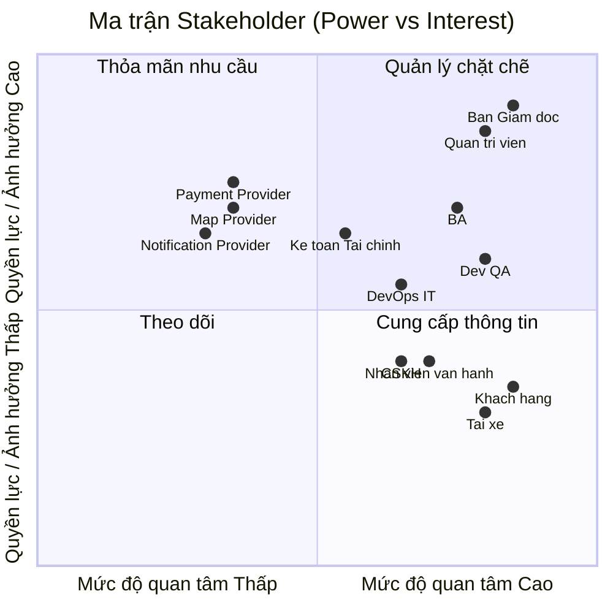
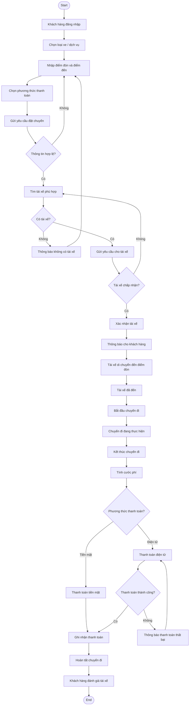
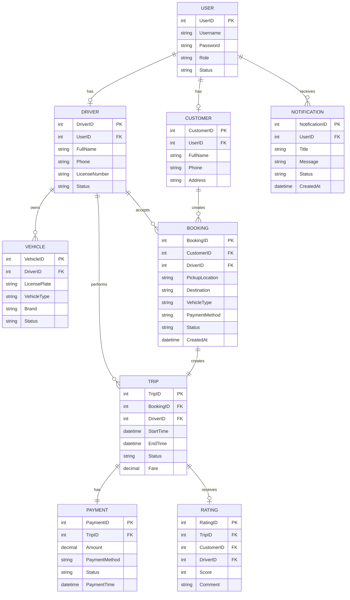
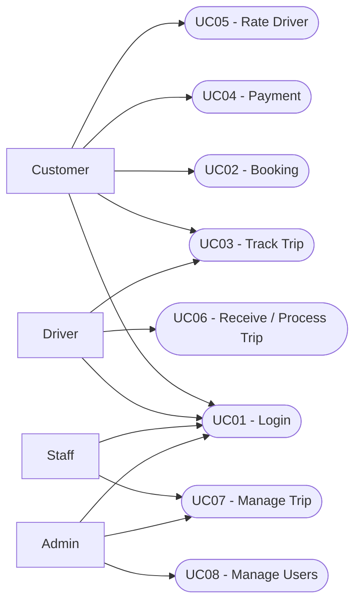

```mermaid
flowchart TB

    CAB(("CAB System"))

    M01["M01<br/>Authentication & User Management"]
    M02["M02<br/>Customer Management"]
    M03["M03<br/>Driver & Vehicle Management"]
    M04["M04<br/>Booking Management"]
    M05["M05<br/>Driver Matching & Dispatch"]
    M06["M06<br/>Trip Management & Tracking"]
    M07["M07<br/>Fare & Payment"]
    M08["M08<br/>Notification"]
    M09["M09<br/>Rating & Review"]
    M10["M10<br/>Operation & Administration"]

    CAB --> M01
    CAB --> M02
    CAB --> M03
    CAB --> M04
    CAB --> M05
    CAB --> M06
    CAB --> M07
    CAB --> M08
    CAB --> M09
    CAB --> M10

    style CAB fill:#2563EB,color:#FFFFFF,stroke:#1E40AF,stroke-width:3px

    style M01 fill:#FFFFFF,stroke:#2563EB
    style M02 fill:#FFFFFF,stroke:#2563EB
    style M03 fill:#FFFFFF,stroke:#2563EB
    style M04 fill:#FFFFFF,stroke:#2563EB
    style M05 fill:#FFFFFF,stroke:#2563EB
    style M06 fill:#FFFFFF,stroke:#2563EB
    style M07 fill:#FFFFFF,stroke:#2563EB
    style M08 fill:#FFFFFF,stroke:#2563EB
    style M09 fill:#FFFFFF,stroke:#2563EB
    style M10 fill:#FFFFFF,stroke:#2563EB
```

# CAB System - Business Goals

```mermaid
flowchart TB

    CAB(("CAB System"))

    %% =========================
    %% BUSINESS GOALS
    %% =========================
    subgraph BG["Business Goals"]
        BG01["BG-01<br/>Số hóa quy trình đặt xe"]
        BG02["BG-02<br/>Tự động tìm & phân công tài xế"]
        BG03["BG-03<br/>Nâng cao trải nghiệm khách hàng"]
        BG04["BG-04<br/>Quản lý thanh toán tập trung"]
        BG05["BG-05<br/>Nâng cao hiệu quả vận hành"]
        BG06["BG-06<br/>Quản trị & phân quyền"]
        BG07["BG-07<br/>Báo cáo & phân tích"]
        BG08["BG-08<br/>Khả năng mở rộng"]
        BG09["BG-09<br/>Khả năng tích hợp"]
        BG10["BG-10<br/>Bảo mật dữ liệu"]
    end

    %% =========================
    %% SYSTEM CAPABILITIES
    %% =========================
    subgraph CAP["System Capabilities"]
        C01["Booking Management"]
        C02["Driver Matching"]
        C03["Trip Tracking"]
        C04["Fare & Payment"]
        C05["Operation Management"]
        C06["RBAC & Audit Log"]
        C07["Reporting"]
        C08["Scalable Architecture"]
        C09["External Integration"]
        C10["Security"]
    end

    %% =========================
    %% RELATIONSHIPS
    %% =========================

    BG01 --> C01
    BG02 --> C02
    BG03 --> C03
    BG04 --> C04
    BG05 --> C05
    BG06 --> C06
    BG07 --> C07
    BG08 --> C08
    BG09 --> C09
    BG10 --> C10

    C01 --> CAB
    C02 --> CAB
    C03 --> CAB
    C04 --> CAB
    C05 --> CAB
    C06 --> CAB
    C07 --> CAB
    C08 --> CAB
    C09 --> CAB
    C10 --> CAB

    %% =========================
    %% STYLES
    %% =========================

    style CAB fill:#2563EB,color:#FFFFFF,stroke:#1E40AF,stroke-width:3px

    style BG fill:#DCFCE7,stroke:#16A34A,stroke-width:2px
    style CAP fill:#DBEAFE,stroke:#2563EB,stroke-width:2px

    style BG01 fill:#FFFFFF,stroke:#16A34A
    style BG02 fill:#FFFFFF,stroke:#16A34A
    style BG03 fill:#FFFFFF,stroke:#16A34A
    style BG04 fill:#FFFFFF,stroke:#16A34A
    style BG05 fill:#FFFFFF,stroke:#16A34A
    style BG06 fill:#FFFFFF,stroke:#16A34A
    style BG07 fill:#FFFFFF,stroke:#16A34A
    style BG08 fill:#FFFFFF,stroke:#16A34A
    style BG09 fill:#FFFFFF,stroke:#16A34A
    style BG10 fill:#FFFFFF,stroke:#16A34A

    style C01 fill:#FFFFFF,stroke:#2563EB
    style C02 fill:#FFFFFF,stroke:#2563EB
    style C03 fill:#FFFFFF,stroke:#2563EB
    style C04 fill:#FFFFFF,stroke:#2563EB
    style C05 fill:#FFFFFF,stroke:#2563EB
    style C06 fill:#FFFFFF,stroke:#2563EB
    style C07 fill:#FFFFFF,stroke:#2563EB
    style C08 fill:#FFFFFF,stroke:#2563EB
    style C09 fill:#FFFFFF,stroke:#2563EB
    style C10 fill:#FFFFFF,stroke:#2563EB
```

# 1. STAKEHOLDERS
| STT | Stakeholder | Vai trò / Mối quan tâm |
|---|---|---|
| 1 | Khách hàng | Đăng ký tài khoản, đặt xe, theo dõi chuyến đi, thanh toán và đánh giá tài xế. |
| 2 | Tài xế | Nhận và thực hiện chuyến xe, cập nhật trạng thái chuyến, thông tin phương tiện và vị trí. |
| 3 | Nhân viên vận hành | Quản lý khách hàng, tài xế, phương tiện và chuyến đi; theo dõi và xử lý các trường hợp phát sinh. |
| 4 | Ban lãnh đạo Công ty ABC | Theo dõi doanh thu, số lượng chuyến, tỷ lệ hoàn thành, tỷ lệ hủy và hiệu quả hoạt động của tài xế. |
| 5 | Nhà cung cấp thanh toán | Xử lý các giao dịch thanh toán điện tử cho hệ thống CAB. |
| 6 | Nhà cung cấp dịch vụ thông báo | Cung cấp các kênh gửi thông báo đến khách hàng và tài xế. |

## 2. Stakeholder Matrix



## 3. Business Goals



### Business Goals Description

- **BG-01:** Số hóa quy trình đặt xe, giúp khách hàng thực hiện đặt xe nhanh chóng.
- **BG-02:** Tự động tìm kiếm và phân công tài xế phù hợp.
- **BG-03:** Nâng cao trải nghiệm khách hàng thông qua theo dõi chuyến đi và trạng thái tài xế.
- **BG-04:** Quản lý tập trung quá trình tính cước và thanh toán.
- **BG-05:** Nâng cao hiệu quả vận hành và khả năng giám sát chuyến đi.
- **BG-06:** Đảm bảo người dùng được phân quyền phù hợp với vai trò.
- **BG-07:** Cung cấp báo cáo phục vụ quản lý hoạt động và doanh thu.
- **BG-08:** Đảm bảo hệ thống có khả năng mở rộng khi số lượng người dùng tăng.
- **BG-09:** Hỗ trợ tích hợp với các dịch vụ bên ngoài.
- **BG-10:** Bảo vệ dữ liệu người dùng, dữ liệu vị trí và dữ liệu giao dịch.

## 4. Minimum Viable Product (MVP) Modules



## 5. Business Requirements

```mermaid
flowchart TB

    BR01["BR-01<br/>Hệ thống phải cho phép khách hàng lựa chọn loại xe/dịch vụ"]

    BR02["BR-02<br/>Hệ thống phải cho phép khách hàng nhập điểm đón và điểm đến"]

    BR03["BR-03<br/>Hệ thống phải cho phép khách hàng gửi yêu cầu đặt xe"]

    BR04["BR-04<br/>Hệ thống phải cho phép khách hàng theo dõi trạng thái chuyến"]

    BR05["BR-05<br/>Hệ thống phải cho phép khách hàng lựa chọn phương thức thanh toán"]

    BR06["BR-06<br/>Hệ thống phải cho phép khách hàng xem lịch sử chuyến đi"]

    BR07["BR-07<br/>Hệ thống phải cho phép khách hàng đánh giá tài xế"]

    BR08["BR-08<br/>Hệ thống phải tự động tìm và phân công tài xế phù hợp"]

    BR09["BR-09<br/>Hệ thống phải cho phép tài xế chấp nhận hoặc từ chối chuyến"]

    BR10["BR-10<br/>Hệ thống phải cho phép tài xế cập nhật trạng thái chuyến"]

    BR11["BR-11<br/>Hệ thống phải hỗ trợ tính cước chuyến đi"]

    BR12["BR-12<br/>Hệ thống phải hỗ trợ thanh toán tiền mặt và điện tử"]

    BR13["BR-13<br/>Hệ thống phải gửi thông báo cho khách hàng và tài xế"]

    BR14["BR-14<br/>Hệ thống phải cho phép nhân viên vận hành quản lý và giám sát chuyến"]

    BR15["BR-15<br/>Hệ thống phải hỗ trợ báo cáo hoạt động và doanh thu"]

    BR16["BR-16<br/>Hệ thống phải kiểm soát quyền truy cập theo vai trò"]

    BR17["BR-17<br/>Hệ thống phải lưu vết các thao tác quan trọng"]

    style BR01 fill:#FFFFFF,stroke:#2563EB
    style BR02 fill:#FFFFFF,stroke:#2563EB
    style BR03 fill:#FFFFFF,stroke:#2563EB
    style BR04 fill:#FFFFFF,stroke:#2563EB
    style BR05 fill:#FFFFFF,stroke:#2563EB
    style BR06 fill:#FFFFFF,stroke:#2563EB
    style BR07 fill:#FFFFFF,stroke:#2563EB
    style BR08 fill:#FFFFFF,stroke:#2563EB
    style BR09 fill:#FFFFFF,stroke:#2563EB
    style BR10 fill:#FFFFFF,stroke:#2563EB
    style BR11 fill:#FFFFFF,stroke:#2563EB
    style BR12 fill:#FFFFFF,stroke:#2563EB
    style BR13 fill:#FFFFFF,stroke:#2563EB
    style BR14 fill:#FFFFFF,stroke:#2563EB
    style BR15 fill:#FFFFFF,stroke:#2563EB
    style BR16 fill:#FFFFFF,stroke:#2563EB
    style BR17 fill:#FFFFFF,stroke:#2563EB
```



## 6. Xây dựng mô hình quy trình nghiệp vụ



---

## 7. Functional Requirements

### FR01 - Đăng nhập

```text
FR01:
Hệ thống cho phép khách hàng, tài xế và nhân viên đăng nhập.
Hệ thống kiểm tra thông tin tài khoản trước khi cho phép truy cập.
```

### FR02 - Đặt chuyến

```text
FR02:
Khách hàng chọn loại xe/dịch vụ.
Khách hàng nhập điểm đón và điểm đến.
Khách hàng chọn phương thức thanh toán.
Khách hàng gửi yêu cầu đặt chuyến.
```

### FR03 - Phân công tài xế

```text
FR03:
Hệ thống tìm tài xế phù hợp.
Hệ thống gửi yêu cầu chuyến đến tài xế.
Hệ thống ghi nhận tài xế chấp nhận chuyến.
```

### FR04 - Theo dõi chuyến

```text
FR04:
Hệ thống hiển thị trạng thái chuyến.
Hệ thống cập nhật vị trí tài xế.
Hệ thống cập nhật trạng thái chuyến.
```

### FR05 - Thanh toán

```text
FR05:
Hệ thống tính cước chuyến đi.
Hệ thống hỗ trợ thanh toán tiền mặt và thanh toán điện tử.
Hệ thống ghi nhận kết quả thanh toán.
```

### FR06 - Thông báo

```text
FR06:
Hệ thống gửi thông báo khi tài xế nhận chuyến.
Hệ thống gửi thông báo khi trạng thái chuyến thay đổi.
Hệ thống gửi thông báo kết quả thanh toán.
```

### FR07 - Đánh giá

```text
FR07:
Khách hàng được đánh giá tài xế sau khi chuyến đi hoàn thành.
Hệ thống lưu điểm đánh giá và nhận xét.
```

### FR08 - Quản lý vận hành

```text
FR08:
Nhân viên vận hành có thể theo dõi chuyến đi.
Nhân viên có thể quản lý trạng thái chuyến.
Nhân viên có thể xem báo cáo hoạt động và doanh thu.
```

---

## 8. Business Rules & Exceptions

### 8.1. Business Rules

```text
BRULE-01:
Khách hàng phải đăng nhập trước khi đặt chuyến.

BRULE-02:
Điểm đón và điểm đến phải hợp lệ trước khi gửi yêu cầu.

BRULE-03:
Chỉ tài xế đang ở trạng thái sẵn sàng mới được phân công chuyến.

BRULE-04:
Tài xế phải chấp nhận chuyến trước khi chuyến được xác nhận.

BRULE-05:
Cước chuyến được tính dựa trên thông tin của chuyến đi.

BRULE-06:
Thanh toán được thực hiện sau khi chuyến đi hoàn thành.

BRULE-07:
Khách hàng chỉ được đánh giá tài xế sau khi chuyến đi hoàn thành.
```

### 8.2. Exceptions

```text
EX-01:
Không tìm thấy tài xế.
Hệ thống thông báo cho khách hàng và cho phép thử lại.

EX-02:
Tài xế từ chối chuyến.
Hệ thống tiếp tục tìm tài xế khác.

EX-03:
Khách hàng hủy chuyến.
Hệ thống cập nhật trạng thái chuyến thành Cancelled.

EX-04:
Thanh toán điện tử thất bại.
Hệ thống thông báo lỗi và cho phép thanh toán lại.

EX-05:
Mất kết nối mạng.
Hệ thống giữ trạng thái hiện tại và cập nhật dữ liệu khi kết nối lại.
```

---

## 9. Non-Functional Requirements

```text
NFR01 - Performance:
Hệ thống phải phản hồi các thao tác chính trong thời gian hợp lý.

NFR02 - Availability:
Hệ thống phải hoạt động ổn định và hạn chế thời gian gián đoạn.

NFR03 - Security:
Hệ thống phải bảo vệ tài khoản, dữ liệu cá nhân và dữ liệu giao dịch.

NFR04 - Scalability:
Hệ thống phải có khả năng mở rộng khi số lượng người dùng và chuyến đi tăng.

NFR05 - Reliability:
Hệ thống phải đảm bảo dữ liệu không bị mất hoặc sai lệch trong quá trình xử lý.

NFR06 - Maintainability:
Hệ thống phải dễ bảo trì, nâng cấp và sửa lỗi.

NFR07 - Compatibility:
Hệ thống phải hỗ trợ các môi trường và thiết bị được xác định trong phạm vi dự án.
```

---

## 10. Mô hình hóa dữ liệu

### 10.1. Entity

```text
User:
Lưu thông tin tài khoản người dùng.

Customer:
Lưu thông tin khách hàng.

Driver:
Lưu thông tin tài xế.

Vehicle:
Lưu thông tin phương tiện.

Booking:
Lưu thông tin yêu cầu đặt chuyến.

Trip:
Lưu thông tin chuyến đi.

Payment:
Lưu thông tin thanh toán.

Rating:
Lưu thông tin đánh giá tài xế.

Notification:
Lưu thông tin thông báo.
```

### 10.2. Entity Relationship Diagram



---

## 11. Use Case Diagram


## 12. Acceptance Criteria

### AC01 - Đăng nhập và xác thực người dùng
**Tương ứng: FR01 - Đăng nhập và xác thực người dùng**

- Người dùng nhập đúng tài khoản và mật khẩu.
- Hệ thống xác thực thông tin đăng nhập thành công.
- Người dùng được chuyển vào hệ thống sau khi đăng nhập thành công.
- Người dùng nhập sai tài khoản hoặc mật khẩu.
- Hệ thống hiển thị thông báo đăng nhập thất bại.
- Người dùng chưa nhập đầy đủ thông tin.
- Hệ thống yêu cầu người dùng nhập đầy đủ thông tin.

### AC02 - Đặt xe
**Tương ứng: FR02 - Đặt xe**

- Khách hàng chọn loại xe hoặc dịch vụ.
- Khách hàng nhập đầy đủ điểm đón và điểm đến.
- Khách hàng chọn phương thức thanh toán.
- Hệ thống kiểm tra thông tin đặt xe.
- Nếu thông tin hợp lệ, hệ thống tạo yêu cầu đặt xe thành công.
- Nếu thông tin không hợp lệ, hệ thống hiển thị thông báo lỗi.

### AC03 - Tìm và phân công tài xế
**Tương ứng: FR03 - Tìm và phân công tài xế**

- Hệ thống tìm kiếm tài xế đang sẵn sàng.
- Hệ thống lựa chọn tài xế phù hợp với yêu cầu chuyến đi.
- Hệ thống gửi yêu cầu chuyến đến tài xế.
- Tài xế chấp nhận chuyến.
- Hệ thống xác nhận và phân công tài xế cho chuyến.
- Tài xế từ chối chuyến.
- Hệ thống tiếp tục tìm tài xế khác.

### AC04 - Theo dõi chuyến đi
**Tương ứng: FR04 - Theo dõi chuyến đi**

- Khách hàng xem được trạng thái hiện tại của chuyến.
- Hệ thống cập nhật trạng thái khi tài xế nhận chuyến.
- Hệ thống cập nhật trạng thái khi tài xế đang đến điểm đón.
- Hệ thống cập nhật trạng thái khi tài xế đã đến điểm đón.
- Hệ thống cập nhật trạng thái khi chuyến bắt đầu.
- Hệ thống cập nhật trạng thái khi chuyến hoàn thành.

### AC05 - Tính cước và thanh toán
**Tương ứng: FR05 - Tính cước và thanh toán**

- Hệ thống tính cước dựa trên thông tin chuyến đi.
- Khách hàng có thể chọn thanh toán bằng tiền mặt.
- Khách hàng có thể chọn thanh toán điện tử.
- Khi thanh toán thành công, hệ thống ghi nhận giao dịch.
- Khi thanh toán điện tử thất bại, hệ thống thông báo lỗi.
- Hệ thống cho phép khách hàng thực hiện thanh toán lại.

### AC06 - Quản lý lịch sử và đánh giá
**Tương ứng: FR06 - Quản lý lịch sử chuyến đi và đánh giá**

- Khách hàng xem được lịch sử các chuyến đã thực hiện.
- Thông tin lịch sử chuyến được lưu đầy đủ.
- Khách hàng chỉ được đánh giá sau khi chuyến hoàn thành.
- Khách hàng có thể nhập điểm đánh giá.
- Khách hàng có thể nhập nhận xét.
- Hệ thống lưu đánh giá thành công.

### AC07 - Thông báo
**Tương ứng: FR07 - Gửi và nhận thông báo**

- Hệ thống gửi thông báo khi tài xế nhận chuyến.
- Hệ thống gửi thông báo khi tài xế đến điểm đón.
- Hệ thống gửi thông báo khi chuyến bắt đầu.
- Hệ thống gửi thông báo khi chuyến hoàn thành.
- Hệ thống gửi thông báo về kết quả thanh toán.

### AC08 - Quản lý và giám sát vận hành
**Tương ứng: FR08 - Quản lý và giám sát vận hành**

- Nhân viên vận hành xem được danh sách chuyến.
- Nhân viên vận hành xem được trạng thái của từng chuyến.
- Nhân viên vận hành theo dõi được hoạt động của tài xế.
- Nhân viên vận hành có thể quản lý các chuyến đang hoạt động.
- Hệ thống cung cấp báo cáo hoạt động.
- Hệ thống cung cấp báo cáo doanh thu.
## 13. Requirements Traceability Matrix

| BG ID | Business Goal | BR ID | Business Requirement | FR ID | Functional Requirement | AC ID | Acceptance Criteria |
|:---:|---|:---:|---|:---:|---|:---:|---|
| BG-01 | Số hóa quy trình đặt xe | BR-01 | Lựa chọn loại xe/dịch vụ | FR-02 | Đặt xe | AC-02 | Khách hàng chọn xe, nhập điểm đón/đến và tạo yêu cầu đặt xe thành công |
| BG-01 | Số hóa quy trình đặt xe | BR-02 | Nhập điểm đón và điểm đến | FR-02 | Đặt xe | AC-02 | Hệ thống kiểm tra và tiếp nhận thông tin điểm đón, điểm đến |
| BG-01 | Số hóa quy trình đặt xe | BR-03 | Tạo yêu cầu đặt xe | FR-02 | Đặt xe | AC-02 | Yêu cầu đặt xe được tạo thành công khi thông tin hợp lệ |
| BG-02 | Tự động tìm và phân công tài xế | BR-08 | Tự động tìm và phân công tài xế | FR-03 | Tìm và phân công tài xế | AC-03 | Hệ thống tìm tài xế phù hợp và gửi yêu cầu chuyến |
| BG-02 | Tự động tìm và phân công tài xế | BR-09 | Tài xế chấp nhận hoặc từ chối chuyến | FR-03 | Tìm và phân công tài xế | AC-03 | Tài xế chấp nhận thì được phân công, từ chối thì hệ thống tìm tài xế khác |
| BG-03 | Nâng cao trải nghiệm khách hàng | BR-04 | Theo dõi trạng thái chuyến | FR-04 | Theo dõi chuyến đi | AC-04 | Khách hàng xem được trạng thái chuyến và các trạng thái được cập nhật |
| BG-03 | Nâng cao trải nghiệm khách hàng | BR-06 | Xem lịch sử chuyến đi | FR-06 | Quản lý lịch sử chuyến đi và đánh giá | AC-06 | Khách hàng xem được lịch sử các chuyến đã thực hiện |
| BG-03 | Nâng cao trải nghiệm khách hàng | BR-07 | Đánh giá tài xế | FR-06 | Quản lý lịch sử chuyến đi và đánh giá | AC-06 | Khách hàng chỉ được đánh giá sau khi chuyến hoàn thành |
| BG-03 | Nâng cao trải nghiệm khách hàng | BR-13 | Gửi thông báo cho khách hàng và tài xế | FR-07 | Gửi và nhận thông báo | AC-07 | Hệ thống gửi thông báo theo các sự kiện của chuyến |
| BG-04 | Quản lý thanh toán tập trung | BR-05 | Lựa chọn phương thức thanh toán | FR-05 | Tính cước và thanh toán | AC-05 | Khách hàng chọn được tiền mặt hoặc thanh toán điện tử |
| BG-04 | Quản lý thanh toán tập trung | BR-11 | Tính cước chuyến đi | FR-05 | Tính cước và thanh toán | AC-05 | Hệ thống tính cước dựa trên thông tin chuyến đi |
| BG-04 | Quản lý thanh toán tập trung | BR-12 | Thanh toán tiền mặt và điện tử | FR-05 | Tính cước và thanh toán | AC-05 | Hệ thống ghi nhận thanh toán thành công và xử lý thanh toán thất bại |
| BG-05 | Nâng cao hiệu quả vận hành | BR-10 | Cập nhật trạng thái chuyến | FR-04 | Theo dõi chuyến đi | AC-04 | Trạng thái chuyến được cập nhật theo tiến trình thực tế |
| BG-05 | Nâng cao hiệu quả vận hành | BR-14 | Quản lý và giám sát chuyến | FR-08 | Quản lý và giám sát vận hành | AC-08 | Nhân viên vận hành xem và theo dõi được các chuyến |
| BG-06 | Quản trị và phân quyền | BR-03 | Phân quyền người dùng | FR-01 | Đăng nhập và xác thực người dùng | AC-01 | Người dùng được truy cập chức năng theo vai trò được cấp |
| BG-06 | Quản trị và phân quyền | BR-16 | Kiểm soát quyền truy cập theo vai trò | FR-01 | Đăng nhập và xác thực người dùng | AC-01 | Hệ thống kiểm soát quyền truy cập theo vai trò |
| BG-06 | Quản trị và phân quyền | BR-17 | Lưu vết các thao tác quan trọng | FR-08 | Quản lý và giám sát vận hành | AC-08 | Hệ thống lưu vết các thao tác quan trọng |
| BG-07 | Báo cáo và phân tích | BR-15 | Báo cáo hoạt động và doanh thu | FR-08 | Quản lý và giám sát vận hành | AC-08 | Hệ thống cung cấp báo cáo hoạt động và doanh thu |
| BG-09 | Khả năng tích hợp | BR-12 | Thanh toán tiền mặt và điện tử | FR-05 | Tính cước và thanh toán | AC-05 | Thanh toán điện tử được xử lý thông qua hệ thống thanh toán |
| BG-10 | Bảo mật dữ liệu | BR-01 | Quản lý và xác thực người dùng | FR-01 | Đăng nhập và xác thực người dùng | AC-01 | Hệ thống xác thực người dùng trước khi cho phép truy cập |
