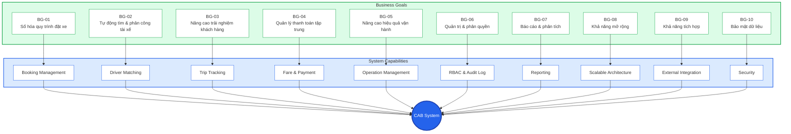

# CAB System - Business Goals

```mermaid
flowchart TB

    CAB(("CAB System"))

    %% =========================
    %% BUSINESS GOALS
    %% =========================
    subgraph BG["Business Goals"]
        BG01["BG-01<br/>Số hóa quy trình đặt xe"]
        BG02["BG-02<br/>Tự động tìm & phân công tài xế"]
        BG03["BG-03<br/>Nâng cao trải nghiệm khách hàng"]
        BG04["BG-04<br/>Quản lý thanh toán tập trung"]
        BG05["BG-05<br/>Nâng cao hiệu quả vận hành"]
        BG06["BG-06<br/>Quản trị & phân quyền"]
        BG07["BG-07<br/>Báo cáo & phân tích"]
        BG08["BG-08<br/>Khả năng mở rộng"]
        BG09["BG-09<br/>Khả năng tích hợp"]
        BG10["BG-10<br/>Bảo mật dữ liệu"]
    end

    %% =========================
    %% SYSTEM CAPABILITIES
    %% =========================
    subgraph CAP["System Capabilities"]
        C01["Booking Management"]
        C02["Driver Matching"]
        C03["Trip Tracking"]
        C04["Fare & Payment"]
        C05["Operation Management"]
        C06["RBAC & Audit Log"]
        C07["Reporting"]
        C08["Scalable Architecture"]
        C09["External Integration"]
        C10["Security"]
    end

    %% =========================
    %% RELATIONSHIPS
    %% =========================

    BG01 --> C01
    BG02 --> C02
    BG03 --> C03
    BG04 --> C04
    BG05 --> C05
    BG06 --> C06
    BG07 --> C07
    BG08 --> C08
    BG09 --> C09
    BG10 --> C10

    C01 --> CAB
    C02 --> CAB
    C03 --> CAB
    C04 --> CAB
    C05 --> CAB
    C06 --> CAB
    C07 --> CAB
    C08 --> CAB
    C09 --> CAB
    C10 --> CAB

    %% =========================
    %% STYLES
    %% =========================

    style CAB fill:#2563EB,color:#FFFFFF,stroke:#1E40AF,stroke-width:3px

    style BG fill:#DCFCE7,stroke:#16A34A,stroke-width:2px
    style CAP fill:#DBEAFE,stroke:#2563EB,stroke-width:2px

    style BG01 fill:#FFFFFF,stroke:#16A34A
    style BG02 fill:#FFFFFF,stroke:#16A34A
    style BG03 fill:#FFFFFF,stroke:#16A34A
    style BG04 fill:#FFFFFF,stroke:#16A34A
    style BG05 fill:#FFFFFF,stroke:#16A34A
    style BG06 fill:#FFFFFF,stroke:#16A34A
    style BG07 fill:#FFFFFF,stroke:#16A34A
    style BG08 fill:#FFFFFF,stroke:#16A34A
    style BG09 fill:#FFFFFF,stroke:#16A34A
    style BG10 fill:#FFFFFF,stroke:#16A34A

    style C01 fill:#FFFFFF,stroke:#2563EB
    style C02 fill:#FFFFFF,stroke:#2563EB
    style C03 fill:#FFFFFF,stroke:#2563EB
    style C04 fill:#FFFFFF,stroke:#2563EB
    style C05 fill:#FFFFFF,stroke:#2563EB
    style C06 fill:#FFFFFF,stroke:#2563EB
    style C07 fill:#FFFFFF,stroke:#2563EB
    style C08 fill:#FFFFFF,stroke:#2563EB
    style C09 fill:#FFFFFF,stroke:#2563EB
    style C10 fill:#FFFFFF,stroke:#2563EB
```
