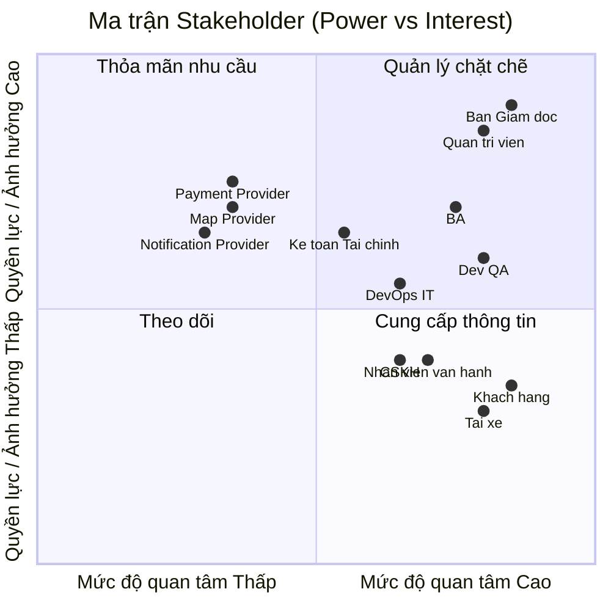
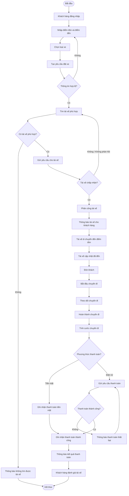

```mermaid
flowchart TB

    CAB(("CAB System"))

    M01["M01<br/>Authentication & User Management"]
    M02["M02<br/>Customer Management"]
    M03["M03<br/>Driver & Vehicle Management"]
    M04["M04<br/>Booking Management"]
    M05["M05<br/>Driver Matching & Dispatch"]
    M06["M06<br/>Trip Management & Tracking"]
    M07["M07<br/>Fare & Payment"]
    M08["M08<br/>Notification"]
    M09["M09<br/>Rating & Review"]
    M10["M10<br/>Operation & Administration"]

    CAB --> M01
    CAB --> M02
    CAB --> M03
    CAB --> M04
    CAB --> M05
    CAB --> M06
    CAB --> M07
    CAB --> M08
    CAB --> M09
    CAB --> M10

    style CAB fill:#2563EB,color:#FFFFFF,stroke:#1E40AF,stroke-width:3px

    style M01 fill:#FFFFFF,stroke:#2563EB
    style M02 fill:#FFFFFF,stroke:#2563EB
    style M03 fill:#FFFFFF,stroke:#2563EB
    style M04 fill:#FFFFFF,stroke:#2563EB
    style M05 fill:#FFFFFF,stroke:#2563EB
    style M06 fill:#FFFFFF,stroke:#2563EB
    style M07 fill:#FFFFFF,stroke:#2563EB
    style M08 fill:#FFFFFF,stroke:#2563EB
    style M09 fill:#FFFFFF,stroke:#2563EB
    style M10 fill:#FFFFFF,stroke:#2563EB
```

# CAB System - Business Goals

```mermaid
flowchart TB

    CAB(("CAB System"))

    %% =========================
    %% BUSINESS GOALS
    %% =========================
    subgraph BG["Business Goals"]
        BG01["BG-01<br/>Số hóa quy trình đặt xe"]
        BG02["BG-02<br/>Tự động tìm & phân công tài xế"]
        BG03["BG-03<br/>Nâng cao trải nghiệm khách hàng"]
        BG04["BG-04<br/>Quản lý thanh toán tập trung"]
        BG05["BG-05<br/>Nâng cao hiệu quả vận hành"]
        BG06["BG-06<br/>Quản trị & phân quyền"]
        BG07["BG-07<br/>Báo cáo & phân tích"]
        BG08["BG-08<br/>Khả năng mở rộng"]
        BG09["BG-09<br/>Khả năng tích hợp"]
        BG10["BG-10<br/>Bảo mật dữ liệu"]
    end

    %% =========================
    %% SYSTEM CAPABILITIES
    %% =========================
    subgraph CAP["System Capabilities"]
        C01["Booking Management"]
        C02["Driver Matching"]
        C03["Trip Tracking"]
        C04["Fare & Payment"]
        C05["Operation Management"]
        C06["RBAC & Audit Log"]
        C07["Reporting"]
        C08["Scalable Architecture"]
        C09["External Integration"]
        C10["Security"]
    end

    %% =========================
    %% RELATIONSHIPS
    %% =========================

    BG01 --> C01
    BG02 --> C02
    BG03 --> C03
    BG04 --> C04
    BG05 --> C05
    BG06 --> C06
    BG07 --> C07
    BG08 --> C08
    BG09 --> C09
    BG10 --> C10

    C01 --> CAB
    C02 --> CAB
    C03 --> CAB
    C04 --> CAB
    C05 --> CAB
    C06 --> CAB
    C07 --> CAB
    C08 --> CAB
    C09 --> CAB
    C10 --> CAB

    %% =========================
    %% STYLES
    %% =========================

    style CAB fill:#2563EB,color:#FFFFFF,stroke:#1E40AF,stroke-width:3px

    style BG fill:#DCFCE7,stroke:#16A34A,stroke-width:2px
    style CAP fill:#DBEAFE,stroke:#2563EB,stroke-width:2px

    style BG01 fill:#FFFFFF,stroke:#16A34A
    style BG02 fill:#FFFFFF,stroke:#16A34A
    style BG03 fill:#FFFFFF,stroke:#16A34A
    style BG04 fill:#FFFFFF,stroke:#16A34A
    style BG05 fill:#FFFFFF,stroke:#16A34A
    style BG06 fill:#FFFFFF,stroke:#16A34A
    style BG07 fill:#FFFFFF,stroke:#16A34A
    style BG08 fill:#FFFFFF,stroke:#16A34A
    style BG09 fill:#FFFFFF,stroke:#16A34A
    style BG10 fill:#FFFFFF,stroke:#16A34A

    style C01 fill:#FFFFFF,stroke:#2563EB
    style C02 fill:#FFFFFF,stroke:#2563EB
    style C03 fill:#FFFFFF,stroke:#2563EB
    style C04 fill:#FFFFFF,stroke:#2563EB
    style C05 fill:#FFFFFF,stroke:#2563EB
    style C06 fill:#FFFFFF,stroke:#2563EB
    style C07 fill:#FFFFFF,stroke:#2563EB
    style C08 fill:#FFFFFF,stroke:#2563EB
    style C09 fill:#FFFFFF,stroke:#2563EB
    style C10 fill:#FFFFFF,stroke:#2563EB
```

## 1. Stakeholder List & Roles

| Stakeholder | Vai trò chính |
| :--- | :--- |
| **Ban Giám đốc** | Ra quyết định chiến lược, phê duyệt ngân sách và định hướng phát triển hệ thống. |
| **Khách hàng** | Đăng ký, đặt xe, theo dõi chuyến đi, thanh toán và đánh giá tài xế. |
| **Tài xế** | Nhận chuyến, chấp nhận/từ chối chuyến và cập nhật trạng thái chuyến đi. |
| **Nhân viên vận hành** | Theo dõi, giám sát chuyến đi và xử lý các tình huống phát sinh. |
| **Quản trị viên hệ thống** | Quản lý tài khoản, phân quyền và cấu hình hệ thống. |
| **Kế toán / Tài chính** | Theo dõi giao dịch, thanh toán và doanh thu. |
| **Chăm sóc khách hàng** | Hỗ trợ khách hàng và xử lý các vấn đề phát sinh. |
| **Business Analyst (BA)** | Phân tích, đặc tả và quản lý yêu cầu nghiệp vụ. |
| **Nhóm Phát triển (Dev/QA)** | Thiết kế, phát triển và kiểm thử hệ thống. |
| **DevOps / IT** | Triển khai, vận hành và đảm bảo tính ổn định của hệ thống. |
| **Payment Provider** | Cung cấp dịch vụ thanh toán điện tử. |
| **Map / Location Provider** | Cung cấp dữ liệu bản đồ, vị trí và hỗ trợ tính toán ETA. |
| **Notification Provider** | Cung cấp dịch vụ gửi thông báo. |

## 2. Stakeholder Matrix

## 3. Business Goals

### Business Goals Description

- **BG-01:** Số hóa quy trình đặt xe, giúp khách hàng thực hiện đặt xe nhanh chóng.
- **BG-02:** Tự động tìm kiếm và phân công tài xế phù hợp.
- **BG-03:** Nâng cao trải nghiệm khách hàng thông qua theo dõi chuyến đi và trạng thái tài xế.
- **BG-04:** Quản lý tập trung quá trình tính cước và thanh toán.
- **BG-05:** Nâng cao hiệu quả vận hành và khả năng giám sát chuyến đi.
- **BG-06:** Đảm bảo người dùng được phân quyền phù hợp với vai trò.
- **BG-07:** Cung cấp báo cáo phục vụ quản lý hoạt động và doanh thu.
- **BG-08:** Đảm bảo hệ thống có khả năng mở rộng khi số lượng người dùng tăng.
- **BG-09:** Hỗ trợ tích hợp với các dịch vụ bên ngoài.
- **BG-10:** Bảo vệ dữ liệu người dùng, dữ liệu vị trí và dữ liệu giao dịch.

## 4. System Modules

## 5. Business Requirements

```mermaid
flowchart TB

    BR01["BR-01<br/>Hệ thống phải cho phép khách hàng lựa chọn loại xe/dịch vụ"]

    BR02["BR-02<br/>Hệ thống phải cho phép khách hàng nhập điểm đón và điểm đến"]

    BR03["BR-03<br/>Hệ thống phải cho phép khách hàng gửi yêu cầu đặt xe"]

    BR04["BR-04<br/>Hệ thống phải cho phép khách hàng theo dõi trạng thái chuyến"]

    BR05["BR-05<br/>Hệ thống phải cho phép khách hàng lựa chọn phương thức thanh toán"]

    BR06["BR-06<br/>Hệ thống phải cho phép khách hàng xem lịch sử chuyến đi"]

    BR07["BR-07<br/>Hệ thống phải cho phép khách hàng đánh giá tài xế"]

    BR08["BR-08<br/>Hệ thống phải tự động tìm và phân công tài xế phù hợp"]

    BR09["BR-09<br/>Hệ thống phải cho phép tài xế chấp nhận hoặc từ chối chuyến"]

    BR10["BR-10<br/>Hệ thống phải cho phép tài xế cập nhật trạng thái chuyến"]

    BR11["BR-11<br/>Hệ thống phải hỗ trợ tính cước chuyến đi"]

    BR12["BR-12<br/>Hệ thống phải hỗ trợ thanh toán tiền mặt và điện tử"]

    BR13["BR-13<br/>Hệ thống phải gửi thông báo cho khách hàng và tài xế"]

    BR14["BR-14<br/>Hệ thống phải cho phép nhân viên vận hành quản lý và giám sát chuyến"]

    BR15["BR-15<br/>Hệ thống phải hỗ trợ báo cáo hoạt động và doanh thu"]

    BR16["BR-16<br/>Hệ thống phải kiểm soát quyền truy cập theo vai trò"]

    BR17["BR-17<br/>Hệ thống phải lưu vết các thao tác quan trọng"]

    style BR01 fill:#FFFFFF,stroke:#2563EB
    style BR02 fill:#FFFFFF,stroke:#2563EB
    style BR03 fill:#FFFFFF,stroke:#2563EB
    style BR04 fill:#FFFFFF,stroke:#2563EB
    style BR05 fill:#FFFFFF,stroke:#2563EB
    style BR06 fill:#FFFFFF,stroke:#2563EB
    style BR07 fill:#FFFFFF,stroke:#2563EB
    style BR08 fill:#FFFFFF,stroke:#2563EB
    style BR09 fill:#FFFFFF,stroke:#2563EB
    style BR10 fill:#FFFFFF,stroke:#2563EB
    style BR11 fill:#FFFFFF,stroke:#2563EB
    style BR12 fill:#FFFFFF,stroke:#2563EB
    style BR13 fill:#FFFFFF,stroke:#2563EB
    style BR14 fill:#FFFFFF,stroke:#2563EB
    style BR15 fill:#FFFFFF,stroke:#2563EB
    style BR16 fill:#FFFFFF,stroke:#2563EB
    style BR17 fill:#FFFFFF,stroke:#2563EB
```

### Business Requirements Table

| ID | Business Requirement | Module | Priority |
| :--- | :--- | :--- | :--- |
| **BR-01** | Lựa chọn loại xe/dịch vụ | Customer Management | Must Have |
| **BR-02** | Nhập điểm đón và điểm đến | Booking Management | Must Have |
| **BR-03** | Tạo yêu cầu đặt xe | Booking Management | Must Have |
| **BR-04** | Theo dõi trạng thái chuyến | Trip Management & Tracking | Must Have |
| **BR-05** | Lựa chọn phương thức thanh toán | Fare & Payment | Must Have |
| **BR-06** | Xem lịch sử chuyến đi | Trip Management & Tracking | Must Have |
| **BR-07** | Đánh giá tài xế | Rating & Review | Should Have |
| **BR-08** | Tự động tìm và phân công tài xế | Driver Matching & Dispatch | Must Have |
| **BR-09** | Chấp nhận hoặc từ chối chuyến | Driver Matching & Dispatch | Must Have |
| **BR-10** | Cập nhật trạng thái chuyến | Trip Management & Tracking | Must Have |
| **BR-11** | Tính cước chuyến đi | Fare & Payment | Must Have |
| **BR-12** | Thanh toán tiền mặt và điện tử | Fare & Payment | Must Have |
| **BR-13** | Gửi thông báo | Notification | Must Have |
| **BR-14** | Quản lý và giám sát chuyến | Operation & Administration | Must Have |
| **BR-15** | Báo cáo hoạt động và doanh thu | Operation & Administration | Should Have |
| **BR-16** | Kiểm soát quyền truy cập theo vai trò | Authentication & User Management | Must Have |
| **BR-17** | Lưu vết các thao tác quan trọng | Operation & Administration | Should Have |
## 6. Mô hình nghiệp vụ

