# CAB System - Business Goals

```mermaid
flowchart TB

    CAB(("CAB System"))

    %% =========================
    %% BUSINESS GOALS
    %% =========================
    subgraph BG["Business Goals"]
        BG01["BG-01<br/>Số hóa quy trình đặt xe"]
        BG02["BG-02<br/>Tự động tìm & phân công tài xế"]
        BG03["BG-03<br/>Nâng cao trải nghiệm khách hàng"]
        BG04["BG-04<br/>Quản lý thanh toán tập trung"]
        BG05["BG-05<br/>Nâng cao hiệu quả vận hành"]
        BG06["BG-06<br/>Quản trị & phân quyền"]
        BG07["BG-07<br/>Báo cáo & phân tích"]
        BG08["BG-08<br/>Khả năng mở rộng"]
        BG09["BG-09<br/>Khả năng tích hợp"]
        BG10["BG-10<br/>Bảo mật dữ liệu"]
    end

    %% =========================
    %% SYSTEM CAPABILITIES
    %% =========================
    subgraph CAP["System Capabilities"]
        C01["Booking Management"]
        C02["Driver Matching"]
        C03["Trip Tracking"]
        C04["Fare & Payment"]
        C05["Operation Management"]
        C06["RBAC & Audit Log"]
        C07["Reporting"]
        C08["Scalable Architecture"]
        C09["External Integration"]
        C10["Security"]
    end

    %% =========================
    %% RELATIONSHIPS
    %% =========================

    BG01 --> C01
    BG02 --> C02
    BG03 --> C03
    BG04 --> C04
    BG05 --> C05
    BG06 --> C06
    BG07 --> C07
    BG08 --> C08
    BG09 --> C09
    BG10 --> C10

    C01 --> CAB
    C02 --> CAB
    C03 --> CAB
    C04 --> CAB
    C05 --> CAB
    C06 --> CAB
    C07 --> CAB
    C08 --> CAB
    C09 --> CAB
    C10 --> CAB

    %% =========================
    %% STYLES
    %% =========================

    style CAB fill:#2563EB,color:#FFFFFF,stroke:#1E40AF,stroke-width:3px

    style BG fill:#DCFCE7,stroke:#16A34A,stroke-width:2px
    style CAP fill:#DBEAFE,stroke:#2563EB,stroke-width:2px

    style BG01 fill:#FFFFFF,stroke:#16A34A
    style BG02 fill:#FFFFFF,stroke:#16A34A
    style BG03 fill:#FFFFFF,stroke:#16A34A
    style BG04 fill:#FFFFFF,stroke:#16A34A
    style BG05 fill:#FFFFFF,stroke:#16A34A
    style BG06 fill:#FFFFFF,stroke:#16A34A
    style BG07 fill:#FFFFFF,stroke:#16A34A
    style BG08 fill:#FFFFFF,stroke:#16A34A
    style BG09 fill:#FFFFFF,stroke:#16A34A
    style BG10 fill:#FFFFFF,stroke:#16A34A

    style C01 fill:#FFFFFF,stroke:#2563EB
    style C02 fill:#FFFFFF,stroke:#2563EB
    style C03 fill:#FFFFFF,stroke:#2563EB
    style C04 fill:#FFFFFF,stroke:#2563EB
    style C05 fill:#FFFFFF,stroke:#2563EB
    style C06 fill:#FFFFFF,stroke:#2563EB
    style C07 fill:#FFFFFF,stroke:#2563EB
    style C08 fill:#FFFFFF,stroke:#2563EB
    style C09 fill:#FFFFFF,stroke:#2563EB
    style C10 fill:#FFFFFF,stroke:#2563EB
```


## 2. System Modules

```mermaid
flowchart TB

    CAB(("CAB System"))

    M01["M01<br/>Authentication & User Management"]
    M02["M02<br/>Customer Management"]
    M03["M03<br/>Driver & Vehicle Management"]
    M04["M04<br/>Booking Management"]
    M05["M05<br/>Driver Matching & Dispatch"]
    M06["M06<br/>Trip Management & Tracking"]
    M07["M07<br/>Fare & Payment"]
    M08["M08<br/>Notification"]
    M09["M09<br/>Rating & Review"]
    M10["M10<br/>Operation & Administration"]

    CAB --> M01
    CAB --> M02
    CAB --> M03
    CAB --> M04
    CAB --> M05
    CAB --> M06
    CAB --> M07
    CAB --> M08
    CAB --> M09
    CAB --> M10

    style CAB fill:#2563EB,color:#FFFFFF,stroke:#1E40AF,stroke-width:3px

    style M01 fill:#FFFFFF,stroke:#2563EB
    style M02 fill:#FFFFFF,stroke:#2563EB
    style M03 fill:#FFFFFF,stroke:#2563EB
    style M04 fill:#FFFFFF,stroke:#2563EB
    style M05 fill:#FFFFFF,stroke:#2563EB
    style M06 fill:#FFFFFF,stroke:#2563EB
    style M07 fill:#FFFFFF,stroke:#2563EB
    style M08 fill:#FFFFFF,stroke:#2563EB
    style M09 fill:#FFFFFF,stroke:#2563EB
    style M10 fill:#FFFFFF,stroke:#2563EB
```


## 3. Business Requirements

```mermaid
flowchart TB

    BR01["BR-01<br/>Hệ thống phải cho phép khách hàng lựa chọn loại xe/dịch vụ"]

    BR02["BR-02<br/>Hệ thống phải cho phép khách hàng nhập điểm đón và điểm đến"]

    BR03["BR-03<br/>Hệ thống phải cho phép khách hàng gửi yêu cầu đặt xe"]

    BR04["BR-04<br/>Hệ thống phải cho phép khách hàng theo dõi trạng thái chuyến"]

    BR05["BR-05<br/>Hệ thống phải cho phép khách hàng lựa chọn phương thức thanh toán"]

    BR06["BR-06<br/>Hệ thống phải cho phép khách hàng xem lịch sử chuyến đi"]

    BR07["BR-07<br/>Hệ thống phải cho phép khách hàng đánh giá tài xế"]

    BR08["BR-08<br/>Hệ thống phải tự động tìm và phân công tài xế phù hợp"]

    BR09["BR-09<br/>Hệ thống phải cho phép tài xế chấp nhận hoặc từ chối chuyến"]

    BR10["BR-10<br/>Hệ thống phải cho phép tài xế cập nhật trạng thái chuyến"]

    BR11["BR-11<br/>Hệ thống phải hỗ trợ tính cước chuyến đi"]

    BR12["BR-12<br/>Hệ thống phải hỗ trợ thanh toán tiền mặt và điện tử"]

    BR13["BR-13<br/>Hệ thống phải gửi thông báo cho khách hàng và tài xế"]

    BR14["BR-14<br/>Hệ thống phải cho phép nhân viên vận hành quản lý và giám sát chuyến"]

    BR15["BR-15<br/>Hệ thống phải hỗ trợ báo cáo hoạt động và doanh thu"]

    BR16["BR-16<br/>Hệ thống phải kiểm soát quyền truy cập theo vai trò"]

    BR17["BR-17<br/>Hệ thống phải lưu vết các thao tác quan trọng"]

    style BR01 fill:#FFFFFF,stroke:#2563EB
    style BR02 fill:#FFFFFF,stroke:#2563EB
    style BR03 fill:#FFFFFF,stroke:#2563EB
    style BR04 fill:#FFFFFF,stroke:#2563EB
    style BR05 fill:#FFFFFF,stroke:#2563EB
    style BR06 fill:#FFFFFF,stroke:#2563EB
    style BR07 fill:#FFFFFF,stroke:#2563EB
    style BR08 fill:#FFFFFF,stroke:#2563EB
    style BR09 fill:#FFFFFF,stroke:#2563EB
    style BR10 fill:#FFFFFF,stroke:#2563EB
    style BR11 fill:#FFFFFF,stroke:#2563EB
    style BR12 fill:#FFFFFF,stroke:#2563EB
    style BR13 fill:#FFFFFF,stroke:#2563EB

    style BR14 fill:#FFFFFF,stroke:#2563EB
    style BR15 fill:#FFFFFF,stroke:#2563EB
    style BR16 fill:#FFFFFF,stroke:#2563EB
    style BR17 fill:#FFFFFF,stroke:#2563EB
